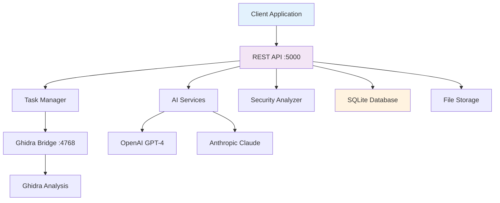

# ShadowSeek - REST API Documentation

## 🔍 **Advanced Binary Security Analysis API**

ShadowSeek provides a comprehensive REST API for AI-powered binary security analysis. This API enables automated binary analysis, vulnerability detection, AI-enhanced explanations, and fuzzing harness generation.

**Current Version**: 2.0.0  
**Base URL**: `http://localhost:5000/api`  
**Interactive Documentation**: `http://localhost:5000/api/docs/`

---

## 🚀 **Quick Start**

### **Start the API Server**
```bash
# Method 1: Full platform startup
start_all.bat  # Windows
./start_all.sh # Linux/macOS

# Method 2: Backend only
python run.py
```

### **Test API Connection**
```bash
# Health check
curl http://localhost:5000/api/system/status

# Expected response
{
  "status": "ok",
  "binaries": 5,
  "ghidra_bridge": "connected",
  "server_time": "2024-01-15T10:30:00Z"
}
```

### **Upload Your First Binary**
```bash
curl -X POST "http://localhost:5000/api/binaries" \
     -H "Content-Type: multipart/form-data" \
     -F "file=@your_binary.exe"
```

---

## 📊 **API Architecture**



---

## 🔧 **System Management**

### **Get System Status**
```http
GET /api/system/status
```

**Response:**
```json
{
  "status": "ok",
  "binaries": 42,
  "tasks": {
    "total": 156,
    "running": 3,
    "queued": 7,
    "completed": 146
  },
  "ghidra_bridge": "connected",
  "ghidra_bridge_connected": true,
  "ai_services": {
    "openai": "available",
    "task_manager": "ready",
    "security_analyzer": "ready"
  },
  "server_time": "2024-01-15T10:30:00Z",
  "version": "2.0.0"
}
```

### **Test Ghidra Bridge Connection**
```http
GET /api/bridge/test
```

**Response:**
```json
{
  "connected": true,
  "status": "Bridge connection successful",
  "ghidra_version": "10.4",
  "port": 4768,
  "response_time_ms": 45
}
```

### **Check AI Service Status**
```http
GET /api/ai/status
```

**Response:**
```json
{
  "task_manager_ai": {
    "initialized": true,
    "api_key_configured": true,
    "model": "gpt-4o-mini"
  },
  "enhanced_security_analyzer_ai": {
    "initialized": true,
    "api_key_configured": true,
    "model": "gpt-4o-mini"
  },
  "overall_status": "ready"
}
```

---

## 📁 **Binary Management**

### **Upload Binary**
```http
POST /api/binaries
Content-Type: multipart/form-data
```

**Parameters:**
- `file`: Binary file (required)
- `analysis_type`: Analysis type (optional, default: "comprehensive")

**Response:**
```json
{
  "success": true,
  "binary": {
    "id": "uuid-here",
    "filename": "example.exe",
    "file_size": 1024000,
    "file_hash": "sha256-hash",
    "analysis_status": "queued",
    "upload_time": "2024-01-15T10:30:00Z"
  },
  "task": {
    "id": "task-uuid",
    "type": "comprehensive_analysis",
    "status": "queued"
  }
}
```

### **List All Binaries**
```http
GET /api/binaries
```

**Query Parameters:**
- `page`: Page number (default: 1)
- `limit`: Results per page (default: 20)
- `status`: Filter by analysis status

**Response:**
```json
{
  "binaries": [
    {
      "id": "uuid-here",
      "filename": "example.exe",
      "file_size": 1024000,
      "analysis_status": "completed",
      "function_count": 157,
      "upload_time": "2024-01-15T10:30:00Z",
      "analysis_time": "2024-01-15T10:35:00Z"
    }
  ],
  "pagination": {
    "page": 1,
    "limit": 20,
    "total": 42,
    "pages": 3
  }
}
```

### **Get Binary Details**
```http
GET /api/binaries/{binary_id}
```

**Response:**
```json
{
  "binary": {
    "id": "uuid-here",
    "filename": "example.exe",
    "file_size": 1024000,
    "file_hash": "sha256-hash",
    "analysis_status": "completed",
    "architecture": "x86_64",
    "file_type": "PE",
    "function_count": 157,
    "decompiled_functions": 134,
    "ai_analyzed_functions": 89,
    "upload_time": "2024-01-15T10:30:00Z"
  },
  "statistics": {
    "total_functions": 157,
    "total_strings": 342,
    "total_symbols": 89,
    "total_imports": 45,
    "total_exports": 12,
    "analysis_duration": 180.5
  }
}
```

### **Delete Binary**
```http
DELETE /api/binaries/{binary_id}
```

**Response:**
```json
{
  "success": true,
  "message": "Binary and all associated data deleted successfully"
}
```

---

## 🔧 **Function Analysis**

### **Get Function Details**
```http
GET /api/functions/{function_id}
```

**Response:**
```json
{
  "function": {
    "id": "function-uuid",
    "name": "validateInput",
    "address": "0x401000",
    "size": 256,
    "signature": "bool validateInput(char* input, int length)",
    "calling_convention": "__fastcall",
    "is_decompiled": true,
    "is_ai_analyzed": true,
    "decompiled_code": "bool validateInput(char* input, int length) {\n  // ... code ...\n}",
    "ai_summary": "This function validates user input but contains a buffer overflow vulnerability...",
    "risk_score": 85
  }
}
```

### **Decompile Function**
```http
POST /api/functions/{function_id}/decompile
```

**Response:**
```json
{
  "success": true,
  "function_id": "function-uuid",
  "decompiled_code": "bool validateInput(char* input, int length) {\n  // ... decompiled code ...\n}",
  "signature": "bool validateInput(char*, int)",
  "cached": false,
  "analysis_time": 3.2
}
```

### **AI Explain Function**
```http
POST /api/functions/{function_id}/explain
```

**Response:**
```json
{
  "success": true,
  "function_id": "function-uuid",
  "ai_summary": "This function validates user input for authentication. It checks input length and content but contains a critical buffer overflow vulnerability when processing inputs longer than the allocated buffer size. The function uses unsafe string operations without proper bounds checking.",
  "risk_score": 85,
  "vulnerabilities": ["buffer_overflow", "input_validation"],
  "cached": false,
  "analysis_time": 8.7,
  "model_used": "gpt-4o-mini"
}
```

### **Bulk Decompile Functions**
```http
POST /api/binaries/{binary_id}/decompile-all
```

**Response:**
```json
{
  "success": true,
  "task_id": "bulk-task-uuid",
  "message": "Bulk decompilation started",
  "total_functions": 157,
  "functions_to_decompile": 89,
  "already_decompiled": 68
}
```

### **Bulk AI Analysis**
```http
POST /api/binaries/{binary_id}/ai-explain-all
```

**Response:**
```json
{
  "success": true,
  "task_id": "ai-task-uuid",
  "message": "Bulk AI analysis started",
  "total_functions": 157,
  "functions_to_analyze": 134,
  "already_analyzed": 23
}
```

---

## 🛡️ **Security Analysis**

### **Analyze Function Security**
```http
POST /api/functions/{function_id}/security-analysis
```

**Response:**
```json
{
  "success": true,
  "total_findings": 3,
  "findings": [
    {
      "id": "finding-uuid",
      "vulnerability": "Buffer Overflow",
      "severity": "HIGH",
      "confidence": 94.2,
      "cwe": "CWE-120",
      "function_name": "validateInput",
      "function_address": "0x401000",
      "evidence": "strcpy() used without bounds checking",
      "ai_explanation": "Function copies user input to fixed buffer without length validation",
      "recommendation": "Use strncpy() or implement proper bounds checking"
    }
  ],
  "risk_assessment": {
    "overall_risk": "HIGH",
    "exploit_difficulty": "LOW",
    "impact_severity": "CRITICAL"
  }
}
```

### **Analyze Binary Security**
```http
POST /api/binaries/{binary_id}/security-analysis
```

**Response:**
```json
{
  "success": true,
  "binary_id": "binary-uuid",
  "analysis_method": "unified_security_analysis",
  "total_findings": 15,
  "findings_by_severity": {
    "CRITICAL": 2,
    "HIGH": 5,
    "MEDIUM": 6,
    "LOW": 2
  },
  "confidence_metrics": {
    "average_confidence": 91.3,
    "high_confidence_findings": 12,
    "validated_by_ai": 15
  },
  "analysis_summary": {
    "buffer_overflows": 3,
    "format_string_bugs": 1,
    "command_injection": 2,
    "crypto_weaknesses": 1,
    "other_vulnerabilities": 8
  }
}
```

### **Enhanced Security Analysis** (for binaries without functions)
```http
POST /api/binaries/{binary_id}/enhanced-security-analysis
```

**Response:**
```json
{
  "success": true,
  "binary_id": "binary-uuid",
  "analysis_method": "enhanced_multi_modal",
  "data_sources": ["exports", "strings", "imports", "memory", "ai_analysis"],
  "total_findings": 8,
  "analysis_phases": {
    "export_analysis": "completed",
    "string_analysis": "completed", 
    "import_analysis": "completed",
    "ai_correlation": "completed"
  }
}
```

---

## 🎯 **Fuzzing Harness Generation**

### **Generate Fuzzing Harness**
```http
POST /api/binaries/{binary_id}/generate-fuzzing-harness
```

**Request Body:**
```json
{
  "target_functions": ["validateInput", "processCommand"],
  "fuzzer_type": "afl++",
  "coverage_guided": true,
  "include_setup": true
}
```

**Response:**
```json
{
  "success": true,
  "harness_id": "harness-uuid",
  "target_functions": ["validateInput", "processCommand"],
  "fuzzer_type": "afl++",
  "files_generated": [
    "fuzzing_harness.c",
    "Makefile",
    "README.md",
    "setup.sh"
  ],
  "ai_rationale": "Selected functions based on high-risk security findings and input processing capabilities"
}
```

### **List Fuzzing Harnesses**
```http
GET /api/binaries/{binary_id}/fuzzing-harnesses
```

**Response:**
```json
{
  "harnesses": [
    {
      "id": "harness-uuid",
      "binary_id": "binary-uuid",
      "target_functions": ["validateInput"],
      "fuzzer_type": "afl++",
      "created_at": "2024-01-15T10:30:00Z",
      "status": "ready",
      "performance_score": 87.3
    }
  ]
}
```

### **Download Harness**
```http
GET /api/fuzzing-harnesses/{harness_id}/download
```

**Response:** ZIP file containing fuzzing harness code and documentation

---

## 📊 **Task Management**

### **Get Task Status**
```http
GET /api/tasks/{task_id}
```

**Response:**
```json
{
  "task": {
    "id": "task-uuid",
    "type": "bulk_ai_explain",
    "status": "running",
    "progress": {
      "current": 45,
      "total": 157,
      "percentage": 28.7
    },
    "created_at": "2024-01-15T10:30:00Z",
    "started_at": "2024-01-15T10:30:15Z",
    "estimated_completion": "2024-01-15T10:45:00Z"
  }
}
```

### **Cancel Task**
```http
DELETE /api/tasks/{task_id}
```

**Response:**
```json
{
  "success": true,
  "message": "Task cancelled successfully"
}
```

### **List Tasks**
```http
GET /api/tasks?status=running&binary_id=uuid-here
```

**Response:**
```json
{
  "tasks": [
    {
      "id": "task-uuid",
      "type": "comprehensive_analysis",
      "status": "running",
      "binary_id": "binary-uuid",
      "created_at": "2024-01-15T10:30:00Z"
    }
  ]
}
```

---

## ⚙️ **Configuration Management**

### **Get Configuration**
```http
GET /api/config
```

**Response:**
```json
{
  "llm_provider": "openai",
  "openai_api_key": "sk-...",
  "openai_model": "gpt-4o-mini",
  "ghidra_install_dir": "/path/to/ghidra",
  "ghidra_bridge_port": 4768,
  "flask_port": 5000,
  "analysis_timeout": 1800,
  "max_file_size": 1073741824
}
```

### **Update Configuration**
```http
POST /api/config
Content-Type: application/json
```

**Request Body:**
```json
{
  "openai_api_key": "sk-new-api-key-here",
  "openai_model": "gpt-4o-mini",
  "analysis_timeout": 2400
}
```

**Response:**
```json
{
  "status": "success",
  "message": "Configuration updated successfully. Updated 3 settings.",
  "updated_keys": ["openai_api_key", "openai_model", "analysis_timeout"],
  "ai_services_reloaded": true
}
```

### **Test AI Connection**
```http
POST /api/config/test-connection
Content-Type: application/json
```

**Request Body:**
```json
{
  "provider": "openai",
  "api_key": "sk-test-key-here",
  "model": "gpt-4o-mini"
}
```

**Response:**
```json
{
  "success": true,
  "message": "OpenAI connection test successful!"
}
```

---

## 📋 **Supported File Types**

| Format | Extensions | Description |
|--------|------------|-------------|
| **Windows PE** | `.exe`, `.dll`, `.sys`, `.obj` | Windows executables and libraries |
| **Linux ELF** | `.so`, `.elf`, `.a`, `.o` | Linux executables and shared objects |
| **macOS Mach-O** | `.dylib`, `.app`, `.framework` | macOS binaries and frameworks |
| **Generic Binary** | `.bin`, `.hex`, `.raw` | Raw binary files |

---

## 🔧 **Error Handling**

### **Standard Error Response**
```json
{
  "error": "Binary not found",
  "error_code": "BINARY_NOT_FOUND",
  "status": 404,
  "timestamp": "2024-01-15T10:30:00Z",
  "request_id": "req-uuid-here"
}
```

### **Common Error Codes**

| Code | Status | Description |
|------|--------|-------------|
| `BINARY_NOT_FOUND` | 404 | Binary ID not found |
| `FUNCTION_NOT_FOUND` | 404 | Function ID not found |
| `ANALYSIS_FAILED` | 500 | Analysis process failed |
| `AI_SERVICE_ERROR` | 503 | AI service unavailable |
| `BRIDGE_DISCONNECTED` | 503 | Ghidra Bridge not connected |
| `INVALID_FILE_TYPE` | 400 | Unsupported file format |
| `FILE_TOO_LARGE` | 413 | File exceeds size limit |

---

## 🚀 **API Usage Examples**

### **Complete Analysis Workflow**
```python
import requests
import time

base_url = "http://localhost:5000/api"

# 1. Upload binary
with open("target.exe", "rb") as f:
    response = requests.post(f"{base_url}/binaries", files={"file": f})
    binary_id = response.json()["binary"]["id"]

# 2. Wait for analysis completion
while True:
    response = requests.get(f"{base_url}/binaries/{binary_id}")
    status = response.json()["binary"]["analysis_status"]
    if status == "completed":
        break
    time.sleep(10)

# 3. Run AI analysis
requests.post(f"{base_url}/binaries/{binary_id}/ai-explain-all")

# 4. Perform security analysis  
security_response = requests.post(f"{base_url}/binaries/{binary_id}/security-analysis")
findings = security_response.json()["findings"]

# 5. Generate fuzzing harness
harness_response = requests.post(f"{base_url}/binaries/{binary_id}/generate-fuzzing-harness")
harness_id = harness_response.json()["harness_id"]

# 6. Download harness
harness_zip = requests.get(f"{base_url}/fuzzing-harnesses/{harness_id}/download")
with open("fuzzing_harness.zip", "wb") as f:
    f.write(harness_zip.content)
```

### **Bulk Function Analysis**
```bash
#!/bin/bash
BINARY_ID="your-binary-uuid"
BASE_URL="http://localhost:5000/api"

# Start bulk decompilation
curl -X POST "$BASE_URL/binaries/$BINARY_ID/decompile-all"

# Wait for completion (check task status)
sleep 300

# Start bulk AI analysis
curl -X POST "$BASE_URL/binaries/$BINARY_ID/ai-explain-all"

# Check progress
curl "$BASE_URL/binaries/$BINARY_ID" | jq '.binary.ai_analyzed_functions'
```

---

## 🎯 **Rate Limits & Performance**

### **API Rate Limits**
- **General API**: 100 requests/minute per IP
- **File Upload**: 10 uploads/minute per IP  
- **AI Analysis**: Limited by configured AI provider
- **Bulk Operations**: 5 concurrent tasks per binary

### **Performance Optimization**
- **Batch Operations**: Use bulk endpoints for multiple functions
- **Caching**: Results cached automatically for repeated requests
- **Async Processing**: Long operations return task IDs for monitoring
- **Connection Pooling**: Reuse connections for better performance

---

## 📊 **API Monitoring**

### **Health Check Endpoint**
```http
GET /api/health
```

**Response:**
```json
{
  "status": "healthy",
  "version": "2.0.0",
  "uptime": 86400,
  "components": {
    "database": "healthy",
    "ghidra_bridge": "healthy", 
    "ai_services": "healthy",
    "file_system": "healthy"
  }
}
```

### **Metrics Endpoint**
```http
GET /api/metrics
```

**Response:**
```json
{
  "requests_total": 15420,
  "requests_per_minute": 45.2,
  "active_tasks": 3,
  "average_response_time": 125.6,
  "binaries_analyzed": 234,
  "functions_decompiled": 12456,
  "ai_analyses_completed": 8901,
  "security_findings": 567
}
```

---

**🎉 Ready to integrate ShadowSeek into your security workflow?** Start with the examples above or explore our [complete API integration guide](../examples/api-examples.md).

---

*ShadowSeek API Documentation - Automate AI-Powered Binary Security Analysis*

**Version**: 2.0.0 | **Status**: ✅ Production Ready | **Support**: Check [troubleshooting guide](../user-docs/administration/troubleshooting.md) 