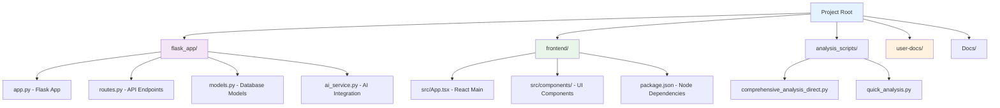
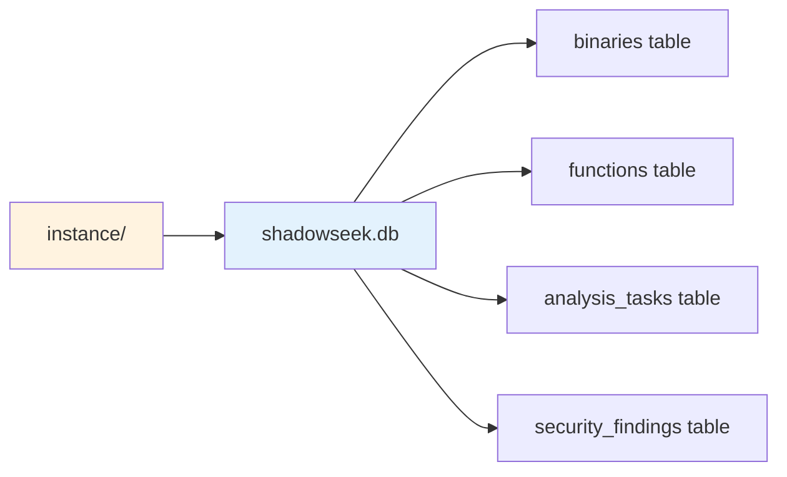
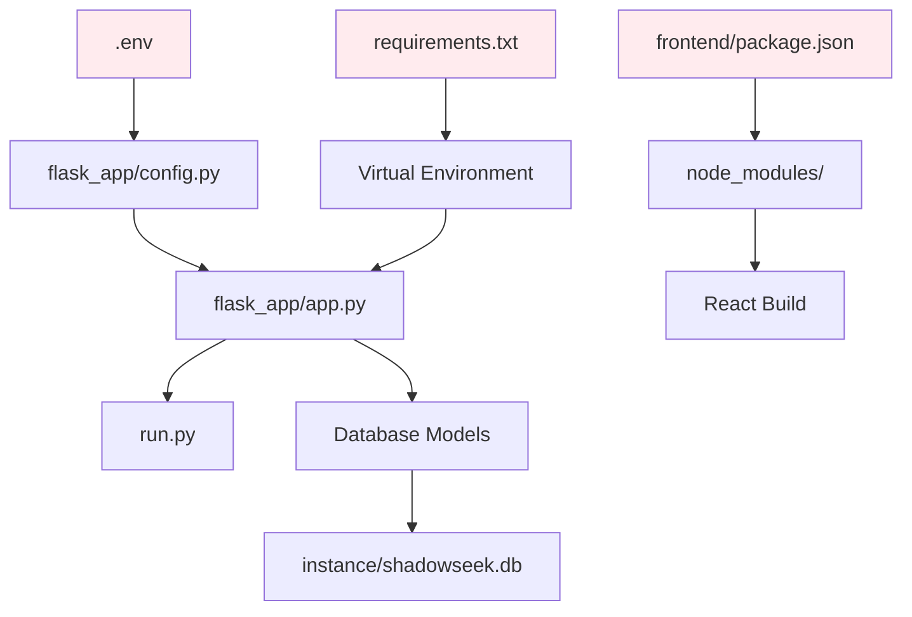

# Essential Files Guide

## 📁 **Core System Files**

This document outlines the essential files in ShadowSeek that users and developers should understand for effective operation and maintenance.

---

## 🚀 **Startup & Control Scripts**

| File | Purpose | Usage |
|------|---------|-------|
| **`start_all.bat`** | Complete system startup (Windows) | `start_all.bat` |
| **`start_all.sh`** | Complete system startup (Linux/macOS) | `./start_all.sh` |
| **`setup-shadowseek.py`** | Enhanced automated installation and setup | `python setup-shadowseek.py --auto` |
| **`run.py`** | Flask backend entry point | `python run.py` |
| **`stop.bat`** | Complete system shutdown | `stop.bat` |

---

## ⚙️ **Configuration Files**

| File | Purpose | Contents |
|------|---------|----------|
| **`.env`** | Environment variables | API keys, Ghidra paths, ports |
| **`.env.backup`** | Configuration template | Default settings and examples |
| **`requirements.txt`** | Python dependencies | All required Python packages |
| **`pyproject.toml`** | Project metadata | Python project configuration |
| **`uv.lock`** | Dependency lock file | Exact package versions |

---

## 🏗️ **Application Structure**



---

## 🛠️ **Backend Core Files**

### **Flask Application (`flask_app/`)**
- **`app.py`**: Main Flask application factory and configuration
- **`routes.py`**: All REST API endpoints and request handlers  
- **`models.py`**: Database models and schemas (SQLAlchemy)
- **`config.py`**: Application configuration management
- **`task_manager.py`**: Background task processing and queue management

### **AI & Analysis Services**
- **`ai_service.py`**: OpenAI/Anthropic integration and AI analysis
- **`unified_security_analyzer.py`**: Advanced vulnerability detection engine
- **`ghidra_bridge_manager.py`**: Ghidra Bridge connection management
- **`vulnerability_engine.py`**: Security pattern detection and scoring

---

## 🌐 **Frontend Core Files**

### **React Application (`frontend/src/`)**
- **`App.tsx`**: Main application component and routing
- **`index.tsx`**: Application entry point and rendering
- **`utils/api.ts`**: API client and HTTP request utilities

### **Key Components (`frontend/src/components/`)**
- **`Dashboard.tsx`**: Main dashboard and binary management
- **`UnifiedSecurityDashboard.tsx`**: Security analysis interface
- **`FuzzingDashboard.tsx`**: Fuzzing harness management
- **`Configuration.tsx`**: System settings and AI configuration
- **`ComprehensiveAnalysisViewer.tsx`**: Detailed analysis results viewer

---

## 🔬 **Analysis Scripts**

| Script | Purpose | Usage |
|--------|---------|-------|
| **`comprehensive_analysis_direct.py`** | Full Ghidra analysis automation | Called by task manager |
| **`quick_analysis.py`** | Fast basic analysis | Quick status checks |
| **`decompile_function.py`** | Single function decompilation | Function-level analysis |
| **`bulk_decompile_functions.py`** | Batch function processing | Bulk operations |

---

## 📚 **Documentation Structure**

### **End-User Documentation (`user-docs/`)**
```
user-docs/
├── getting-started/           # Installation and quick start
├── user-guide/               # Interface and feature guides  
├── security-features/        # Vulnerability detection docs
├── api-reference/           # REST API documentation
├── architecture/            # System design documentation
├── administration/          # System management guides
└── examples/               # Practical usage examples
```

### **Technical Documentation (`Docs/`)**
```
Docs/
├── README.md                      # Main documentation hub
├── API_DOCUMENTATION.md           # Complete REST API reference
├── QUICK_REFERENCE.md            # Daily operations guide
├── GHIDRA_BRIDGE_TROUBLESHOOTING.md  # Bridge connection fixes
└── [Historical files]             # Development summaries
```

---

## 🗄️ **Data & Storage**

| Directory | Purpose | Contents |
|-----------|---------|----------|
| **`uploads/`** | Binary file storage | User-uploaded binaries |
| **`temp/`** | Temporary processing files | Analysis intermediates |
| **`logs/`** | System logs | Application and bridge logs |
| **`instance/`** | Database storage | SQLite database files |
| **`ghidra_projects/`** | Ghidra project files | Analysis project data |

---

## 🧪 **Testing & Validation**

| File | Purpose | Usage |
|------|---------|-------|
| **`quick_test.py`** | System health check | `python quick_test.py` |
| **`test_configuration.py`** | Configuration validation | `python test_configuration.py` |
| **`tests/`** | Unit and integration tests | `pytest tests/` |

---

## 💾 **Database Files**



**Key Database Tables:**
- **`binaries`**: Uploaded binary metadata and analysis status
- **`functions`**: Extracted function information and decompiled code
- **`analysis_tasks`**: Background task tracking and progress
- **`security_findings`**: Vulnerability detection results
- **`ai_analyses`**: AI-generated explanations and insights

---

## 🔧 **Essential Environment Variables**

```bash
# Required Configuration
GHIDRA_INSTALL_DIR=/path/to/ghidra_10.4_PUBLIC
GHIDRA_BRIDGE_PORT=4768

# AI Services (Optional)
OPENAI_API_KEY=sk-your-key-here
OPENAI_MODEL=gpt-4o-mini

# Application Settings
FLASK_PORT=5000
FLASK_ENV=development
SECRET_KEY=your-secret-key
```

---

## 🚨 **Critical Files - Do Not Delete**

**⚠️ These files are essential for system operation:**

- **`.env`** - Contains all system configuration
- **`flask_app/models.py`** - Database schema definitions
- **`flask_app/routes.py`** - All API endpoint definitions
- **`frontend/src/App.tsx`** - Main React application
- **`requirements.txt`** - Python dependency definitions
- **`start_all.bat`** - System startup automation

**🗃️ These directories contain important data:**

- **`instance/`** - Database files (contains all analysis results)
- **`uploads/`** - User binary files
- **`logs/`** - System operation logs

---

## 🔄 **File Dependencies**



---

## 🛠️ **Development Files**

For developers working on ShadowSeek:

- **`memory-bank/`**: Project context and development notes
- **`.cursorrules`**: AI coding assistant configuration
- **`uv.lock`**: Exact dependency versions for reproducible builds
- **`pyproject.toml`**: Python project metadata and build settings

---

## 📋 **File Maintenance**

### **Regular Backups**
- **Database**: `instance/shadowseek.db`
- **Configuration**: `.env` file
- **User Data**: `uploads/` directory

### **Log Rotation** 
- **System Logs**: `logs/` directory (rotated automatically)
- **Analysis Results**: Stored in database (persistent)

### **Cleanup Tasks**
- **Temporary Files**: `temp/` directory can be cleaned periodically
- **Old Logs**: Archive logs older than 30 days
- **Failed Uploads**: Remove incomplete binary uploads

---

**🎯 Understanding these essential files will help you effectively use, maintain, and troubleshoot ShadowSeek.**

---

*For detailed usage of any component, refer to the [complete user documentation](../user-docs/README.md).* 