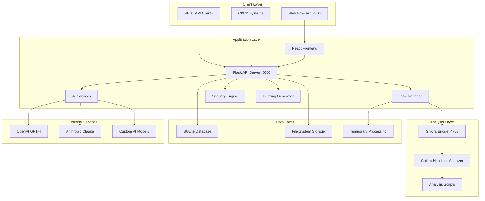
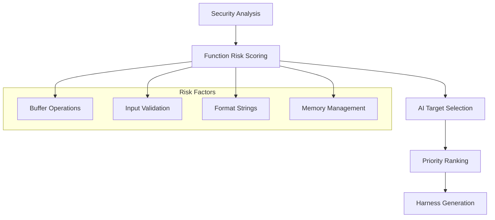

# ShadowSeek — Advanced Binary Security Analysis Platform

🔍 **Enterprise-grade binary security analysis with AI-powered vulnerability detection and intelligent fuzzing harness generation**

---

## 🚨 Why ShadowSeek Matters

ShadowSeek is redefining how security teams and researchers approach binary analysis.  
Built from the ground up with AI-native workflows, it empowers organizations to move from tedious reverse engineering to fast, automated, evidence-based vulnerability detection and fuzzing.

- **93%+ detection confidence** powered by AI and pattern correlation  
- **75+ dangerous function patterns** recognized out-of-the-box  
- **Professional, shareable reports** for audit and compliance  
- **Rapid onboarding:** 5-minute setup, intuitive UI, visual workflow diagrams  
- **Transformative efficiency:** Go from upload to actionable findings in minutes

---

## 📚 Documentation & Diagrams

ShadowSeek documentation is designed to make complex binary security accessible:
- [User Docs](user-docs/): Visual guides, onboarding, and workflow diagrams
- [Documentation Hub](Docs/): Technical deep-dives, architecture, and analysis pipeline

---

## 🏗️ Architecture Overview



---

## 🎯 Transforming Fuzzing with Intelligent Target Selection

ShadowSeek leverages advanced risk scoring and AI-powered decision-making to select the most valuable fuzzing targets:



---

## ✨ Key Features

- 🧠 **AI-Powered Security Analysis** — LLM-enhanced vulnerability detection with confidence scoring
- 🎯 **Intelligent Fuzzing** — AI-driven harness generation for AFL/AFL++/HongFuzz/LibFuzzer
- 🛡️ **Comprehensive Detection** — 75+ function patterns, CWE/CVE classification
- 🔄 **Binary Diff Analysis** — Compare binary versions with ghidriff
- 🎨 **Professional UI** — React dashboard, VS Code-style syntax highlighting
- 📊 **Unified Security Dashboard** — End-to-end workflow in one view
- ⚡ **Production-Ready Output** — Enterprise-quality harnesses and reports

---

## ⚡ Quick Start

### 1. Clone and Auto-Setup (Recommended)
```bash
git clone https://github.com/threatpointer/ShadowSeek.git
cd ShadowSeek

# 🚀 One-command setup - installs everything automatically!
python setup-shadowseek.py
```

### 2. Access Platform
- **Main Interface:** http://localhost:3000
- **API Documentation:** http://localhost:5000/api/docs
- **System Status:** http://localhost:5000/api/status

---

## 🛠️ Requirements

- **Python 3.8+** (required)
- **8GB+ RAM** for binary analysis
- **20GB+ disk space** for projects/results
- **Windows, macOS, or Linux** (Windows recommended)

_Auto-installed by setup script: Ghidra 10.4+, Node.js 16+, Java JDK 11+, Git, Python packages_

---

## 📋 Usage Workflow

Binary Upload → AI Security Analysis → Security Findings →  
Function Navigation → Fuzzing Generation → Code Viewing →  
Download & Deploy → Vulnerability Hunting

---

## 👨‍💻 About the Author

**[Mohammed Tanveer (@threatpointer)](https://github.com/threatpointer)** — Security Researcher & Architect  
**Links:** [GitHub](https://github.com/threatpointer) | [Twitter](https://twitter.com/threatpointer) | [LinkedIn](https://linkedin.com/in/mdtanveer)

---

## 🏆 Acknowledgments

- **ghidriff** — Python command-line Ghidra binary diffing engine ([repo](https://github.com/clearbluejar/ghidriff))
- **Ghidra** — NSA's Software Reverse Engineering Framework
- **AFL/AFL++** — Advanced fuzzing frameworks
- **React** & **Flask** — Frontend and backend frameworks

---

## 📄 License

MIT License — See [LICENSE](LICENSE) file for details

---

## 🤝 Contributing & Support

- **Contributions:** Welcomed, especially from security practitioners
- **Support:**  
    - [Docs](Docs/) and [user-docs](user-docs/)  
    - [GitHub Issues](https://github.com/threatpointer/ShadowSeek/issues)  
    - Security issues: report privately to [@threatpointer](https://github.com/threatpointer)

---

**ShadowSeek** — Transforming binary security analysis through AI-powered intelligence and professional automation.

_Developed with ❤️ by [@threatpointer](https://github.com/threatpointer) for the global cybersecurity community_ 🔍✨