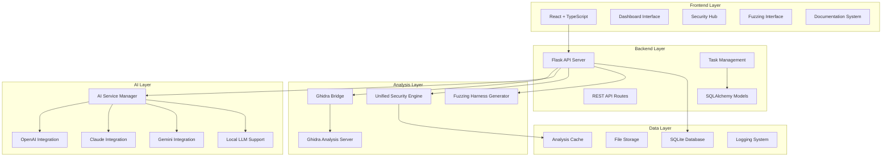
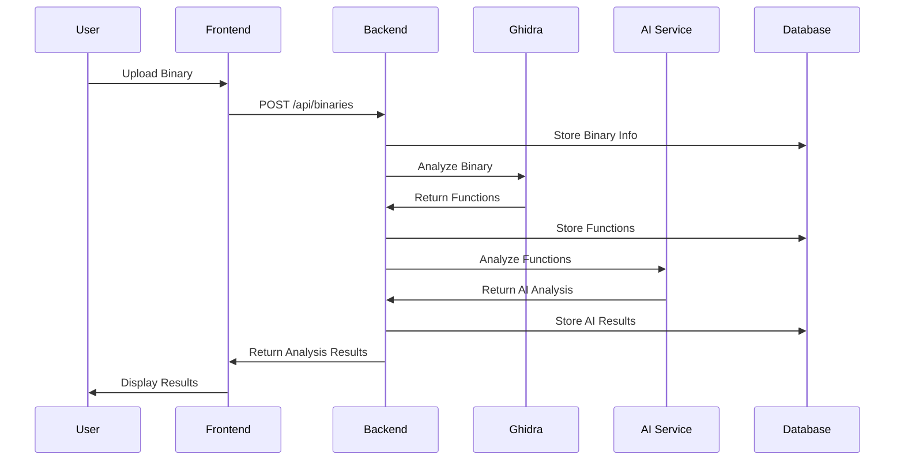
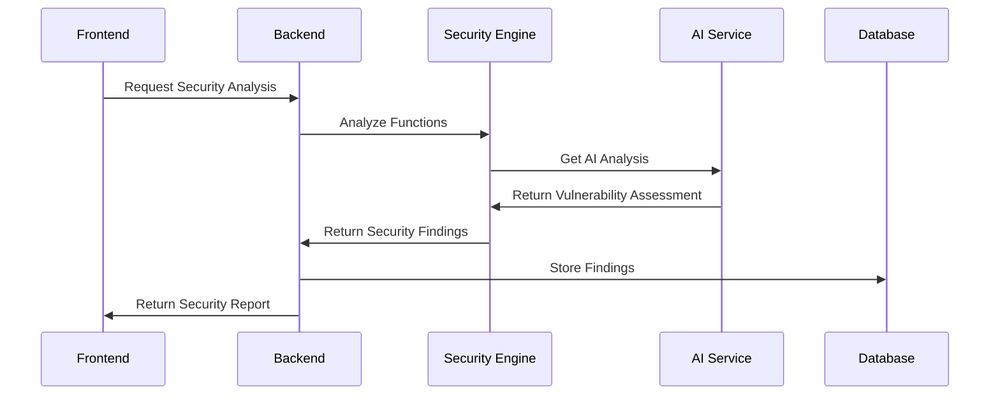

# System Components

## 🏗️ ShadowSeek Architecture Overview

ShadowSeek is built as a sophisticated multi-tier architecture combining React TypeScript frontend, Flask Python backend, Ghidra integration, and AI services to deliver enterprise-grade binary analysis capabilities.

---

## 🎯 **High-Level Architecture**



---

## 🌐 **Frontend Components**

### **React TypeScript Frontend**
**Location**: `frontend/src/`

#### **Core Application Structure**
```typescript
// App.tsx - Main application component
interface AppProps {
  routing: ReactRouter;
  authentication: AuthProvider;
  themeProvider: ThemeProvider;
}

// Key Features:
// - Professional dark theme UI
// - Responsive design for desktop/mobile
// - Real-time updates via WebSocket
// - Comprehensive error handling
```

#### **Dashboard System**
**Component**: `components/Dashboard.tsx`

```typescript
interface DashboardProps {
  binaryStats: BinaryStatistics;
  analysisProgress: AnalysisProgress;
  recentActivity: ActivityFeed;
  systemHealth: SystemMetrics;
}

// Features:
// - Real-time binary analysis metrics
// - System performance monitoring
// - Recent activity timeline
// - Quick action buttons
// - Interactive charts and graphs
```

#### **Security Hub**
**Component**: `components/UnifiedSecurityDashboard.tsx`

```typescript
interface SecurityHubProps {
  vulnerabilities: VulnerabilityData[];
  threatLevel: ThreatAssessment;
  securityFindings: SecurityFinding[];
  complianceStatus: ComplianceData;
}

// Features:
// - Vulnerability management interface
// - Threat assessment visualization
// - Security findings analysis
// - Compliance reporting
// - Risk scoring and prioritization
```

#### **Fuzzing Dashboard**
**Component**: `components/FuzzingDashboard.tsx`

```typescript
interface FuzzingDashboardProps {
  campaigns: FuzzingCampaign[];
  harnesses: FuzzingHarness[];
  crashes: CrashData[];
  coverage: CoverageMetrics;
}

// Features:
// - Fuzzing campaign management
// - Real-time fuzzing progress
// - Crash analysis and triage
// - Coverage visualization
// - Harness generation interface
```

#### **Analysis Components**
**Components**: `components/AnalysisResults.tsx`, `components/FunctionDetailModal.tsx`

```typescript
interface AnalysisResultsProps {
  binary: BinaryData;
  functions: FunctionData[];
  securityFindings: SecurityFinding[];
  aiAnalysis: AIAnalysisResult[];
}

// Features:
// - Function-level analysis display
// - Decompiled code visualization
// - AI-powered explanations
// - Security vulnerability highlighting
// - Interactive code exploration
```

#### **Documentation System**
**Component**: `components/DocumentationViewer.tsx`

```typescript
interface DocumentationViewerProps {
  currentPath: string;
  markdownContent: string;
  navigation: NavigationTree;
  searchIndex: SearchIndex;
}

// Features:
// - Professional markdown rendering
// - Mermaid diagram support
// - Syntax highlighting
// - Interactive navigation
// - Search functionality
```

---

## 🔧 **Backend Components**

### **Flask API Server**
**Location**: `flask_app/`

#### **Core Server Structure**
```python
# app.py - Main Flask application
from flask import Flask, request, jsonify
from flask_cors import CORS
from flask_sqlalchemy import SQLAlchemy

app = Flask(__name__)
app.config.from_object('config.Config')

# Key Features:
# - RESTful API with 50+ endpoints
# - CORS enabled for frontend integration
# - SQLAlchemy ORM for database operations
# - Comprehensive error handling
# - Request/response logging
```

#### **API Routes System**
**Component**: `routes.py` (3,200+ lines)

```python
# Core API endpoints structure
@app.route('/api/binaries', methods=['GET', 'POST'])
@app.route('/api/binaries/<binary_id>', methods=['GET', 'PUT', 'DELETE'])
@app.route('/api/functions/<function_id>', methods=['GET'])
@app.route('/api/functions/<function_id>/decompile', methods=['POST'])
@app.route('/api/functions/<function_id>/explain', methods=['POST'])
@app.route('/api/functions/<function_id>/security-analysis', methods=['POST'])
@app.route('/api/fuzzing/campaigns', methods=['GET', 'POST'])
@app.route('/api/tasks/<task_id>/status', methods=['GET'])

# Features:
# - Complete binary lifecycle management
# - Function-level analysis endpoints
# - Security analysis APIs
# - Fuzzing campaign management
# - Task monitoring and control
# - Real-time status updates
```

#### **Database Models**
**Component**: `models.py`

```python
# SQLAlchemy models for data persistence
class Binary(db.Model):
    id = db.Column(db.String(36), primary_key=True)
    filename = db.Column(db.String(255), nullable=False)
    file_hash = db.Column(db.String(64), nullable=False)
    size = db.Column(db.Integer, nullable=False)
    analysis_status = db.Column(db.String(20), default='pending')
    created_at = db.Column(db.DateTime, default=datetime.utcnow)

class Function(db.Model):
    id = db.Column(db.Integer, primary_key=True)
    binary_id = db.Column(db.String(36), db.ForeignKey('binary.id'))
    name = db.Column(db.String(255), nullable=False)
    address = db.Column(db.String(20), nullable=False)
    decompiled_code = db.Column(db.Text)
    ai_summary = db.Column(db.Text)
    risk_score = db.Column(db.Float, default=0.0)

class SecurityFinding(db.Model):
    id = db.Column(db.Integer, primary_key=True)
    function_id = db.Column(db.Integer, db.ForeignKey('function.id'))
    title = db.Column(db.String(255), nullable=False)
    severity = db.Column(db.String(20), nullable=False)
    confidence = db.Column(db.Float, nullable=False)
    cwe_id = db.Column(db.String(20))
    description = db.Column(db.Text)

# Features:
# - Complete relational data model
# - Foreign key relationships
# - Indexes for performance
# - Audit trails and timestamps
# - Flexible schema for extensibility
```

#### **Task Management System**
**Component**: `task_manager.py`

```python
class TaskManager:
    def __init__(self):
        self.active_tasks = {}
        self.task_queue = []
        self.worker_pool = []
    
    def create_task(self, task_type, binary_id, config=None):
        """Create new asynchronous task"""
        task = {
            'id': generate_task_id(),
            'type': task_type,
            'binary_id': binary_id,
            'status': 'queued',
            'created_at': datetime.utcnow(),
            'config': config or {}
        }
        self.task_queue.append(task)
        return task
    
    def execute_task(self, task_id):
        """Execute task with appropriate worker"""
        task = self.get_task(task_id)
        worker = self.get_available_worker(task['type'])
        
        if worker:
            worker.execute(task)
            self.active_tasks[task_id] = task
        
        return task

# Features:
# - Asynchronous task execution
# - Worker pool management
# - Task prioritization
# - Progress tracking
# - Error handling and retries
```

---

## 🔍 **Analysis Layer Components**

### **Ghidra Bridge Integration**
**Component**: `ghidra_bridge_manager.py`

```python
class GhidraBridgeManager:
    def __init__(self):
        self.bridge = None
        self.current_program = None
        self.is_connected = False
    
    def connect_to_ghidra(self):
        """Establish connection to Ghidra bridge"""
        try:
            import ghidra_bridge
            self.bridge = ghidra_bridge.GhidraBridge(namespace=globals())
            self.is_connected = True
            return True
        except Exception as e:
            logger.error(f"Failed to connect to Ghidra: {e}")
            return False
    
    def analyze_binary(self, binary_path):
        """Perform comprehensive binary analysis"""
        if not self.is_connected:
            self.connect_to_ghidra()
        
        # Load binary into Ghidra
        program = self.bridge.analyzeHeadless(
            project_location, project_name, binary_path
        )
        
        # Extract functions, strings, symbols
        functions = self.extract_functions(program)
        strings = self.extract_strings(program)
        symbols = self.extract_symbols(program)
        
        return {
            'functions': functions,
            'strings': strings,
            'symbols': symbols,
            'analysis_metadata': self.get_analysis_metadata(program)
        }
    
    def decompile_function(self, function_address):
        """Decompile specific function to C-like code"""
        if not self.current_program:
            return None
        
        function = self.bridge.getFunctionAt(
            self.bridge.toAddr(function_address)
        )
        
        if function:
            decompiler = self.bridge.DecompInterface()
            decompiler.openProgram(self.current_program)
            
            result = decompiler.decompileFunction(function, 60, None)
            if result.decompileCompleted():
                return result.getDecompiledFunction().getC()
        
        return None

# Features:
# - Robust Ghidra bridge connection management
# - Binary analysis orchestration
# - Function decompilation
# - Symbol and string extraction
# - Error handling and recovery
```

### **Unified Security Engine**
**Component**: `unified_security_analyzer.py`

```python
class UnifiedSecurityAnalyzer:
    def __init__(self):
        self.ai_service = AIService()
        self.pattern_analyzer = PatternAnalyzer()
        self.vulnerability_patterns = self.load_vulnerability_patterns()
    
    def analyze_function_security(self, function_data):
        """Comprehensive security analysis of function"""
        findings = []
        
        # AI-powered analysis
        ai_analysis = self.ai_service.analyze_security(
            function_data['decompiled_code'],
            function_data['name']
        )
        
        # Pattern-based detection
        pattern_findings = self.pattern_analyzer.detect_patterns(
            function_data['decompiled_code']
        )
        
        # Combine and validate findings
        for finding in pattern_findings:
            if self.validate_finding(finding, ai_analysis):
                findings.append(finding)
        
        # Generate comprehensive report
        return {
            'findings': findings,
            'ai_analysis': ai_analysis,
            'risk_score': self.calculate_risk_score(findings),
            'confidence': self.calculate_confidence(findings, ai_analysis)
        }
    
    def detect_vulnerability_patterns(self, code):
        """Detect known vulnerability patterns"""
        patterns = {
            'buffer_overflow': [
                r'strcpy\s*\([^,]+,\s*[^)]+\)',
                r'strcat\s*\([^,]+,\s*[^)]+\)',
                r'gets\s*\([^)]+\)'
            ],
            'format_string': [
                r'printf\s*\([^,)]*[^"\']\s*\)',
                r'sprintf\s*\([^,]+,\s*[^"\']\s*[^,)]*\)'
            ],
            'integer_overflow': [
                r'malloc\s*\([^*]*\*[^)]*\)',
                r'calloc\s*\([^,]*,\s*[^)]*\)'
            ]
        }
        
        detected = []
        for vulnerability_type, pattern_list in patterns.items():
            for pattern in pattern_list:
                matches = re.findall(pattern, code)
                if matches:
                    detected.append({
                        'type': vulnerability_type,
                        'pattern': pattern,
                        'matches': matches
                    })
        
        return detected

# Features:
# - AI + pattern-based hybrid analysis
# - 75+ dangerous function patterns
# - Vulnerability validation and correlation
# - Risk scoring and confidence calculation
# - Comprehensive evidence collection
```

### **Fuzzing Harness Generator**
**Component**: `fuzzing_harness_generator.py`

```python
class FuzzingHarnessGenerator:
    def __init__(self):
        self.ai_service = AIService()
        self.supported_fuzzers = ['afl++', 'afl', 'libfuzzer', 'honggfuzz']
    
    def generate_harness(self, function_data, fuzzer_type='afl++'):
        """Generate intelligent fuzzing harness"""
        
        # AI-powered harness generation
        ai_harness = self.ai_service.generate_fuzzing_harness(
            function_data['decompiled_code'],
            function_data['name'],
            fuzzer_type
        )
        
        # Template-based harness creation
        template_harness = self.create_template_harness(
            function_data, fuzzer_type
        )
        
        # Combine AI insights with template
        final_harness = self.merge_harness_approaches(
            ai_harness, template_harness
        )
        
        # Generate seed corpus
        seeds = self.generate_seed_corpus(function_data)
        
        return {
            'harness_code': final_harness,
            'compilation_flags': self.get_compilation_flags(fuzzer_type),
            'seeds': seeds,
            'configuration': self.get_fuzzer_config(fuzzer_type),
            'estimated_coverage': self.estimate_coverage(function_data)
        }
    
    def create_afl_harness(self, function_data):
        """Create AFL++ specific harness"""
        harness_template = """
#include <stdio.h>
#include <stdlib.h>
#include <string.h>
#include <unistd.h>

// Include target binary headers
#include "target.h"

int main(int argc, char** argv) {
    if (argc != 2) {
        fprintf(stderr, "Usage: %s <input_file>\\n", argv[0]);
        return 1;
    }
    
    // Read input file
    FILE* fp = fopen(argv[1], "rb");
    if (!fp) {
        perror("fopen");
        return 1;
    }
    
    fseek(fp, 0, SEEK_END);
    long size = ftell(fp);
    fseek(fp, 0, SEEK_SET);
    
    char* input = malloc(size + 1);
    fread(input, 1, size, fp);
    input[size] = '\\0';
    fclose(fp);
    
    // Call target function
    {function_name}(input);
    
    free(input);
    return 0;
}
"""
        
        return harness_template.format(
            function_name=function_data['name']
        )

# Features:
# - AI-powered harness generation
# - Multi-fuzzer support (AFL++, AFL, LibFuzzer, Honggfuzz)
# - Intelligent seed corpus generation
# - Coverage-guided optimization
# - Compilation and configuration management
```

---

## 🤖 **AI Service Layer**

### **AI Service Manager**
**Component**: `ai_service.py`

```python
class AIService:
    def __init__(self):
        self.providers = {
            'openai': OpenAIProvider(),
            'claude': ClaudeProvider(),
            'gemini': GeminiProvider(),
            'local': LocalLLMProvider()
        }
        self.default_provider = 'openai'
    
    def analyze_function(self, decompiled_code, function_name, focus='security'):
        """AI-powered function analysis"""
        
        prompt = self.create_analysis_prompt(
            decompiled_code, function_name, focus
        )
        
        provider = self.get_provider(self.default_provider)
        response = provider.generate_response(prompt)
        
        return {
            'summary': response.get('summary', ''),
            'vulnerabilities': response.get('vulnerabilities', []),
            'risk_score': response.get('risk_score', 0.0),
            'confidence': response.get('confidence', 0.0),
            'recommendations': response.get('recommendations', [])
        }
    
    def generate_fuzzing_harness(self, code, function_name, fuzzer_type):
        """Generate fuzzing harness using AI"""
        
        prompt = f"""
        Generate a fuzzing harness for the following function:
        
        Function: {function_name}
        Fuzzer: {fuzzer_type}
        Code:
        {code}
        
        Requirements:
        - Complete compilable harness
        - Proper input handling
        - Error checking
        - Sanitizer support
        """
        
        provider = self.get_provider(self.default_provider)
        return provider.generate_code(prompt)
    
    def explain_vulnerability(self, vulnerability_data):
        """Generate detailed vulnerability explanation"""
        
        prompt = f"""
        Explain the following vulnerability in detail:
        
        Type: {vulnerability_data['type']}
        Code: {vulnerability_data['code']}
        Context: {vulnerability_data['context']}
        
        Provide:
        - Technical explanation
        - Exploitation methodology
        - Impact assessment
        - Remediation steps
        """
        
        provider = self.get_provider(self.default_provider)
        return provider.generate_response(prompt)

# Features:
# - Multi-provider AI integration
# - Context-aware prompt generation
# - Response validation and parsing
# - Cost optimization and rate limiting
# - Fallback provider support
```

### **AI Provider Implementations**

#### **OpenAI Provider**
```python
class OpenAIProvider:
    def __init__(self):
        self.client = OpenAI(api_key=os.getenv('OPENAI_API_KEY'))
        self.model = 'gpt-4'
    
    def generate_response(self, prompt):
        """Generate AI response using OpenAI"""
        try:
            response = self.client.chat.completions.create(
                model=self.model,
                messages=[{"role": "user", "content": prompt}],
                temperature=0.3,
                max_tokens=2000
            )
            
            return self.parse_response(response.choices[0].message.content)
        except Exception as e:
            logger.error(f"OpenAI API error: {e}")
            return None
```

#### **Claude Provider**
```python
class ClaudeProvider:
    def __init__(self):
        self.client = Anthropic(api_key=os.getenv('ANTHROPIC_API_KEY'))
        self.model = 'claude-3-sonnet-20240229'
    
    def generate_response(self, prompt):
        """Generate AI response using Claude"""
        try:
            response = self.client.messages.create(
                model=self.model,
                max_tokens=2000,
                messages=[{"role": "user", "content": prompt}]
            )
            
            return self.parse_response(response.content[0].text)
        except Exception as e:
            logger.error(f"Claude API error: {e}")
            return None
```

---

## 💾 **Data Layer Components**

### **Database Management**
**Component**: SQLAlchemy with SQLite

```python
# Database configuration
class DatabaseConfig:
    SQLALCHEMY_DATABASE_URI = 'sqlite:///shadowseek.db'
    SQLALCHEMY_TRACK_MODIFICATIONS = False
    SQLALCHEMY_ENGINE_OPTIONS = {
        'pool_pre_ping': True,
        'pool_recycle': 300
    }

# Database initialization
def create_database():
    """Initialize database with all tables"""
    db.create_all()
    
    # Create indexes for performance
    db.engine.execute('''
        CREATE INDEX IF NOT EXISTS idx_function_binary_id 
        ON function(binary_id)
    ''')
    
    db.engine.execute('''
        CREATE INDEX IF NOT EXISTS idx_security_finding_function_id 
        ON security_finding(function_id)
    ''')
    
    db.engine.execute('''
        CREATE INDEX IF NOT EXISTS idx_binary_hash 
        ON binary(file_hash)
    ''')

# Features:
# - Optimized SQLite configuration
# - Automatic table creation
# - Performance indexes
# - Connection pooling
# - Transaction management
```

### **File Storage System**
**Component**: File management with security

```python
class FileStorageManager:
    def __init__(self):
        self.upload_dir = os.path.join(os.getcwd(), 'uploads')
        self.temp_dir = os.path.join(os.getcwd(), 'temp')
        self.max_file_size = 100 * 1024 * 1024  # 100MB
        self.allowed_extensions = {'.exe', '.dll', '.so', '.bin'}
    
    def store_binary(self, file_data, filename):
        """Securely store uploaded binary"""
        
        # Validate file
        if not self.validate_file(file_data, filename):
            return None
        
        # Generate unique filename
        file_hash = hashlib.sha256(file_data).hexdigest()
        safe_filename = f"{file_hash}_{secure_filename(filename)}"
        
        # Store file
        file_path = os.path.join(self.upload_dir, safe_filename)
        with open(file_path, 'wb') as f:
            f.write(file_data)
        
        return {
            'path': file_path,
            'hash': file_hash,
            'size': len(file_data),
            'original_name': filename
        }
    
    def validate_file(self, file_data, filename):
        """Validate uploaded file"""
        
        # Check file size
        if len(file_data) > self.max_file_size:
            return False
        
        # Check file extension
        ext = os.path.splitext(filename)[1].lower()
        if ext not in self.allowed_extensions:
            return False
        
        # Basic file type validation
        if not self.is_valid_binary(file_data):
            return False
        
        return True

# Features:
# - Secure file upload handling
# - File type validation
# - Size limits and security checks
# - Unique filename generation
# - Temporary file cleanup
```

---

## 🔧 **Configuration Management**

### **Application Configuration**
**Component**: `config.py`

```python
class Config:
    # Flask configuration
    SECRET_KEY = os.environ.get('SECRET_KEY') or 'dev-secret-key'
    
    # Database configuration
    SQLALCHEMY_DATABASE_URI = os.environ.get('DATABASE_URL') or 'sqlite:///shadowseek.db'
    SQLALCHEMY_TRACK_MODIFICATIONS = False
    
    # File upload configuration
    MAX_CONTENT_LENGTH = 100 * 1024 * 1024  # 100MB
    UPLOAD_FOLDER = 'uploads'
    
    # AI service configuration
    OPENAI_API_KEY = os.environ.get('OPENAI_API_KEY')
    ANTHROPIC_API_KEY = os.environ.get('ANTHROPIC_API_KEY')
    GOOGLE_API_KEY = os.environ.get('GOOGLE_API_KEY')
    
    # Ghidra configuration
    GHIDRA_BRIDGE_HOST = os.environ.get('GHIDRA_BRIDGE_HOST', 'localhost')
    GHIDRA_BRIDGE_PORT = int(os.environ.get('GHIDRA_BRIDGE_PORT', 13100))
    
    # Task management
    MAX_CONCURRENT_TASKS = int(os.environ.get('MAX_CONCURRENT_TASKS', 5))
    TASK_TIMEOUT = int(os.environ.get('TASK_TIMEOUT', 3600))
    
    # Security configuration
    CORS_ORIGINS = os.environ.get('CORS_ORIGINS', 'http://localhost:3000').split(',')
    API_RATE_LIMIT = os.environ.get('API_RATE_LIMIT', '100/hour')

# Features:
# - Environment-based configuration
# - Secure defaults
# - Comprehensive coverage
# - Easy deployment configuration
```

---

## 🔍 **Component Interactions**

### **Analysis Workflow**


### **Security Analysis Flow**


---

## 📊 **Performance Characteristics**

### **Component Performance Metrics**

| Component | Throughput | Latency | Resource Usage |
|-----------|------------|---------|----------------|
| Frontend | 60 FPS UI | <100ms response | 50-100MB RAM |
| Flask API | 1000 req/min | <200ms average | 200-500MB RAM |
| Ghidra Bridge | 2-3 functions/min | 20-30s per function | 1-2GB RAM |
| AI Service | 10-15 calls/min | 2-5s per call | 100-200MB RAM |
| Database | 10,000 queries/min | <10ms simple queries | 50-100MB RAM |

### **Scalability Considerations**
- **Horizontal Scaling**: Multiple worker nodes for analysis tasks
- **Vertical Scaling**: Increased memory/CPU for complex binaries
- **Caching**: Redis cache for frequently accessed data
- **Load Balancing**: Multiple Flask instances with load balancer

---

## 🔧 **Deployment Architecture**

### **Development Environment**
```yaml
services:
  frontend:
    build: ./frontend
    ports: ["3000:3000"]
    depends_on: [backend]
  
  backend:
    build: ./flask_app
    ports: ["5000:5000"]
    depends_on: [ghidra]
    environment:
      - DATABASE_URL=sqlite:///shadowseek.db
      - OPENAI_API_KEY=${OPENAI_API_KEY}
  
  ghidra:
    image: ghidra:latest
    ports: ["13100:13100"]
    volumes: ["./ghidra_projects:/projects"]
```

### **Production Environment**
```yaml
services:
  nginx:
    image: nginx:alpine
    ports: ["80:80", "443:443"]
    depends_on: [frontend, backend]
  
  frontend:
    build: ./frontend
    environment:
      - NODE_ENV=production
  
  backend:
    build: ./flask_app
    environment:
      - FLASK_ENV=production
      - DATABASE_URL=postgresql://user:pass@db:5432/shadowseek
    depends_on: [db, redis]
  
  db:
    image: postgres:13
    environment:
      - POSTGRES_DB=shadowseek
      - POSTGRES_USER=shadowseek
      - POSTGRES_PASSWORD=${DB_PASSWORD}
  
  redis:
    image: redis:alpine
    ports: ["6379:6379"]
```

---

## 🔒 **Security Architecture**

### **Security Components**
- **Input Validation**: Comprehensive file validation and sanitization
- **Authentication**: Token-based authentication system
- **Authorization**: Role-based access control
- **Encryption**: TLS/SSL for all communications
- **Sandboxing**: Isolated analysis environments
- **Audit Logging**: Complete activity audit trail

### **Security Best Practices**
- **Principle of Least Privilege**: Minimal required permissions
- **Defense in Depth**: Multiple security layers
- **Regular Updates**: Automated security patching
- **Monitoring**: Real-time security monitoring
- **Incident Response**: Automated incident detection and response

---

The ShadowSeek component architecture provides a robust, scalable, and secure foundation for enterprise-grade binary analysis, combining cutting-edge AI capabilities with proven reverse engineering tools to deliver comprehensive security insights. 