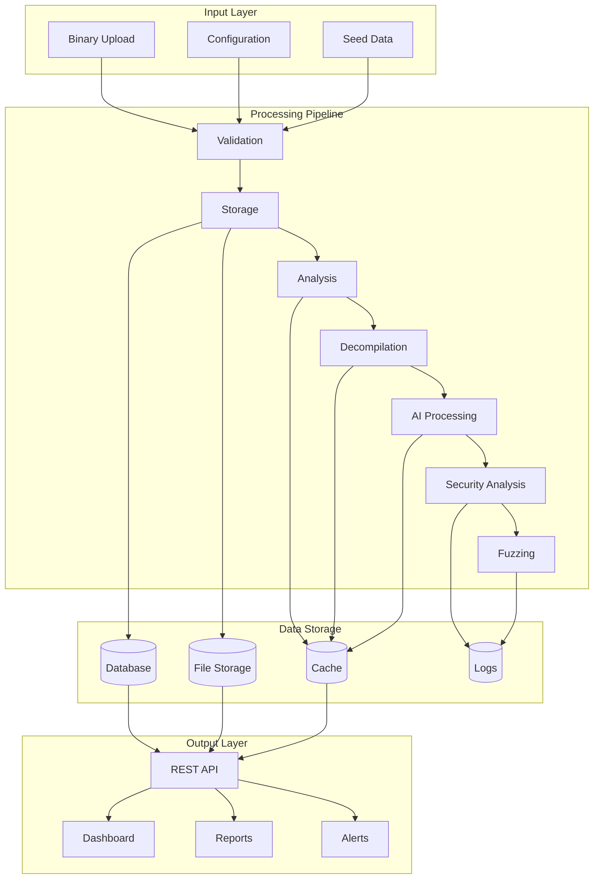
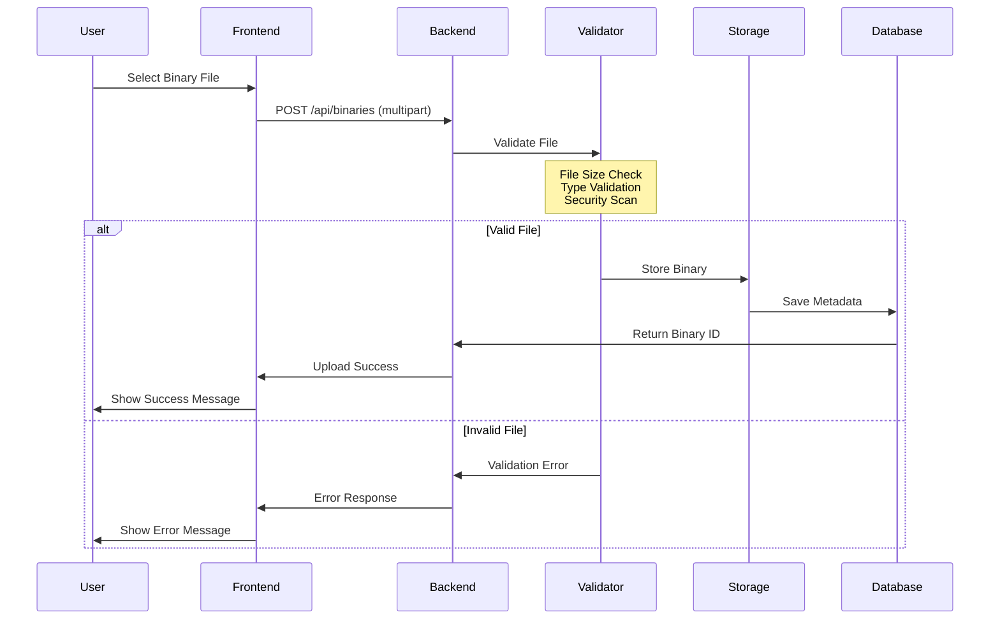
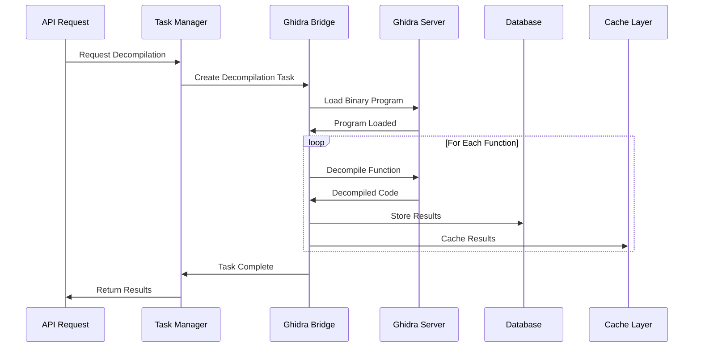
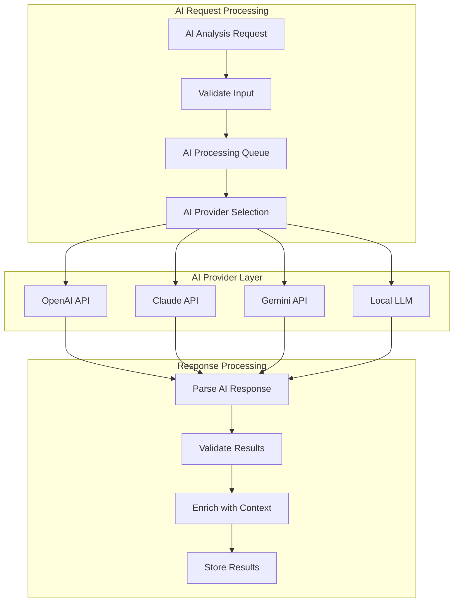
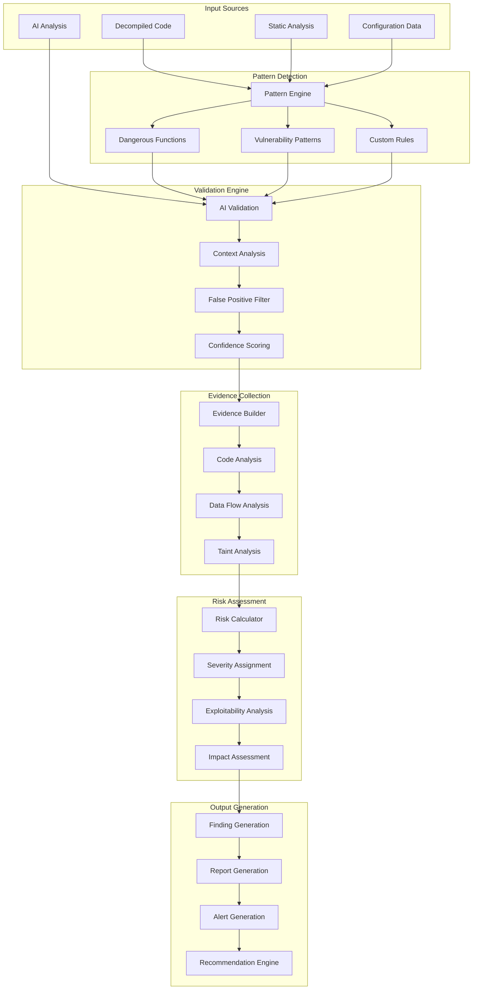
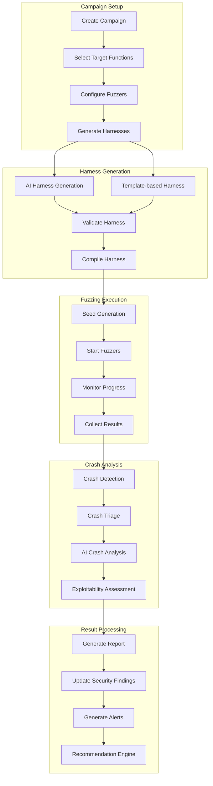
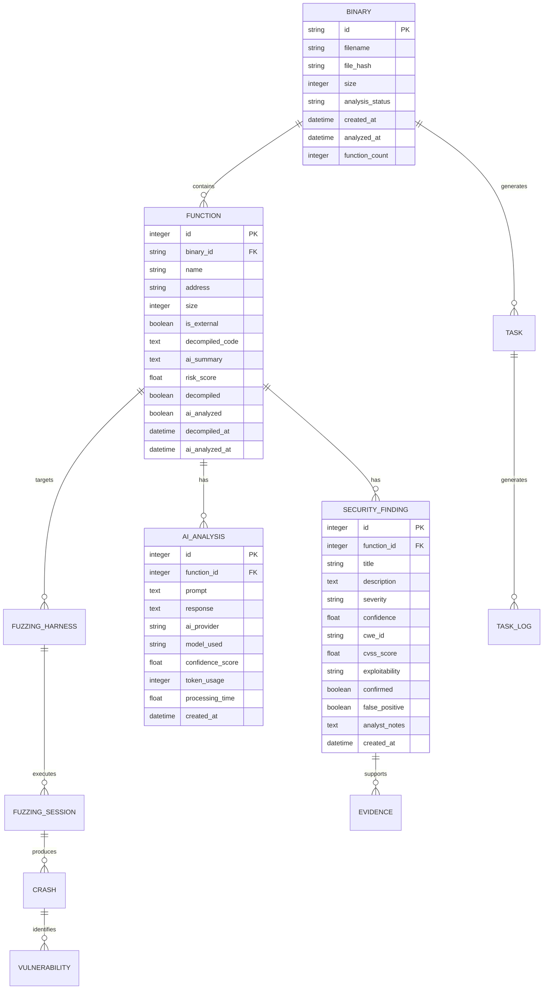
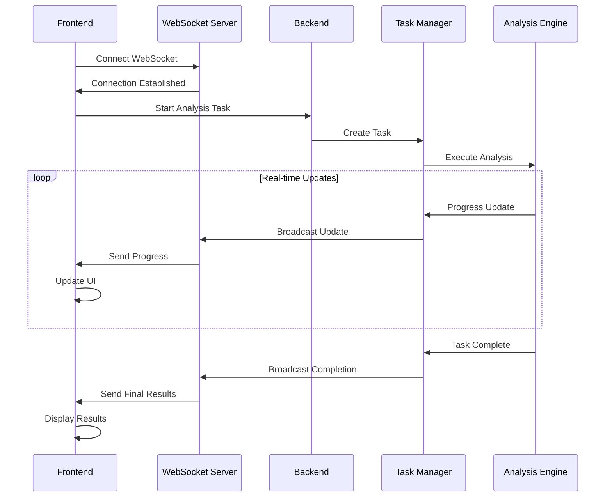

# Data Flow Architecture

## 🔄 ShadowSeek Data Flow Overview

ShadowSeek processes binary analysis data through a sophisticated multi-stage pipeline, from initial binary upload through comprehensive security analysis and fuzzing campaign execution.

---

## 🌐 **High-Level Data Flow**



---

## 📥 **Binary Upload Flow**

### **Step 1: File Upload Process**


### **File Validation Process**
```python
def validate_binary_file(file_data, filename):
    """Comprehensive file validation"""
    
    validation_steps = [
        {
            'name': 'Size Check',
            'function': validate_file_size,
            'params': {'max_size': 100 * 1024 * 1024}  # 100MB
        },
        {
            'name': 'Type Check',
            'function': validate_file_type,
            'params': {'allowed_types': ['.exe', '.dll', '.so', '.bin']}
        },
        {
            'name': 'Header Validation',
            'function': validate_pe_header,
            'params': {'strict': True}
        },
        {
            'name': 'Malware Scan',
            'function': scan_for_malware,
            'params': {'timeout': 30}
        }
    ]
    
    for step in validation_steps:
        result = step['function'](file_data, filename, **step['params'])
        if not result.success:
            return ValidationResult(
                success=False,
                error=f"{step['name']} failed: {result.error}",
                step=step['name']
            )
    
    return ValidationResult(success=True)
```

### **Storage Process**
```python
def store_binary_file(file_data, filename):
    """Secure binary storage with metadata"""
    
    # Generate file hash
    file_hash = hashlib.sha256(file_data).hexdigest()
    
    # Create secure filename
    safe_filename = f"{file_hash}_{secure_filename(filename)}"
    
    # Store binary file
    file_path = os.path.join(UPLOAD_DIR, safe_filename)
    with open(file_path, 'wb') as f:
        f.write(file_data)
    
    # Extract basic metadata
    metadata = {
        'original_name': filename,
        'file_hash': file_hash,
        'file_size': len(file_data),
        'file_type': detect_file_type(file_data),
        'upload_timestamp': datetime.utcnow(),
        'file_path': file_path
    }
    
    # Store in database
    binary = Binary(
        id=str(uuid.uuid4()),
        filename=filename,
        file_hash=file_hash,
        size=len(file_data),
        file_path=file_path,
        analysis_status='pending'
    )
    
    db.session.add(binary)
    db.session.commit()
    
    return binary
```

---

## 🔍 **Analysis Pipeline Flow**

### **Complete Analysis Workflow**

```mermaid
graph TB
    subgraph "Initial Analysis"
        Start[Binary Upload]
        BasicAnalysis[Basic Analysis]
        ExtractMetadata[Extract Metadata]
        DiscoverFunctions[Discover Functions]
    end
    
    subgraph "Decompilation Stage"
        SelectFunctions[Select Functions]
        DecompileQueue[Decompilation Queue]
        GhidraProcess[Ghidra Processing]
        DecompileResults[Decompilation Results]
    end
    
    subgraph "AI Analysis Stage"
        AIQueue[AI Analysis Queue]
        AIService[AI Service]
        FunctionAnalysis[Function Analysis]
        SecurityAssessment[Security Assessment]
        AIResults[AI Results]
    end
    
    subgraph "Security Analysis"
        SecurityEngine[Security Engine]
        PatternDetection[Pattern Detection]
        VulnValidation[Vulnerability Validation]
        RiskScoring[Risk Scoring]
        SecurityFindings[Security Findings]
    end
    
    subgraph "Fuzzing Pipeline"
        FuzzingQueue[Fuzzing Queue]
        HarnessGeneration[Harness Generation]
        FuzzingExecution[Fuzzing Execution]
        CrashAnalysis[Crash Analysis]
        FuzzingResults[Fuzzing Results]
    end
    
    Start --> BasicAnalysis
    BasicAnalysis --> ExtractMetadata
    ExtractMetadata --> DiscoverFunctions
    
    DiscoverFunctions --> SelectFunctions
    SelectFunctions --> DecompileQueue
    DecompileQueue --> GhidraProcess
    GhidraProcess --> DecompileResults
    
    DecompileResults --> AIQueue
    AIQueue --> AIService
    AIService --> FunctionAnalysis
    FunctionAnalysis --> SecurityAssessment
    SecurityAssessment --> AIResults
    
    AIResults --> SecurityEngine
    SecurityEngine --> PatternDetection
    PatternDetection --> VulnValidation
    VulnValidation --> RiskScoring
    RiskScoring --> SecurityFindings
    
    SecurityFindings --> FuzzingQueue
    FuzzingQueue --> HarnessGeneration
    HarnessGeneration --> FuzzingExecution
    FuzzingExecution --> CrashAnalysis
    CrashAnalysis --> FuzzingResults
```


### **Binary Analysis Data Flow**
```python
def analyze_binary_workflow(binary_id):
    """Complete binary analysis workflow"""
    
    # Step 1: Load binary and extract basic information
    binary = Binary.query.get(binary_id)
    if not binary:
        return {'error': 'Binary not found'}
    
    # Step 2: Perform basic analysis
    basic_analysis = {
        'file_type': analyze_file_type(binary.file_path),
        'architecture': detect_architecture(binary.file_path),
        'entry_point': find_entry_point(binary.file_path),
        'imports': extract_imports(binary.file_path),
        'exports': extract_exports(binary.file_path),
        'strings': extract_strings(binary.file_path),
        'sections': analyze_sections(binary.file_path)
    }
    
    # Step 3: Discover functions using Ghidra
    functions = discover_functions_with_ghidra(binary.file_path)
    
    # Step 4: Store function information
    for func_data in functions:
        function = Function(
            binary_id=binary_id,
            name=func_data['name'],
            address=func_data['address'],
            size=func_data['size'],
            is_external=func_data['is_external']
        )
        db.session.add(function)
    
    db.session.commit()
    
    # Step 5: Update binary analysis status
    binary.analysis_status = 'analyzed'
    binary.function_count = len(functions)
    binary.analyzed_at = datetime.utcnow()
    db.session.commit()
    
    return {
        'binary_id': binary_id,
        'analysis': basic_analysis,
        'functions': functions,
        'status': 'completed'
    }
```

---

## 🔧 **Decompilation Data Flow**

### **Decompilation Process**


### **Decompilation Data Structure**
```python
class DecompilationResult:
    """Data structure for decompilation results"""
    
    def __init__(self, function_id, decompiled_code, metadata):
        self.function_id = function_id
        self.decompiled_code = decompiled_code
        self.metadata = metadata
        self.timestamp = datetime.utcnow()
    
    def to_dict(self):
        return {
            'function_id': self.function_id,
            'decompiled_code': self.decompiled_code,
            'metadata': {
                'decompilation_time': self.metadata.get('time', 0),
                'quality_score': self.metadata.get('quality', 0),
                'variable_count': self.metadata.get('variables', 0),
                'complexity_score': self.metadata.get('complexity', 0),
                'ghidra_version': self.metadata.get('ghidra_version', ''),
                'decompiler_version': self.metadata.get('decompiler_version', '')
            },
            'timestamp': self.timestamp.isoformat()
        }

def decompile_function_pipeline(function_id):
    """Decompilation pipeline for single function"""
    
    # Step 1: Load function metadata
    function = Function.query.get(function_id)
    if not function:
        return None
    
    # Step 2: Check cache
    cached_result = cache.get(f"decompiled_{function_id}")
    if cached_result:
        return cached_result
    
    # Step 3: Decompile with Ghidra
    try:
        decompiled_code = ghidra_bridge.decompile_function(
            function.binary.file_path,
            function.address
        )
        
        # Step 4: Process results
        result = DecompilationResult(
            function_id=function_id,
            decompiled_code=decompiled_code,
            metadata={
                'time': 2.5,  # seconds
                'quality': 85,  # percentage
                'variables': 8,
                'complexity': 6.2
            }
        )
        
        # Step 5: Store in database
        function.decompiled_code = decompiled_code
        function.decompiled = True
        function.decompiled_at = datetime.utcnow()
        db.session.commit()
        
        # Step 6: Cache results
        cache.set(f"decompiled_{function_id}", result.to_dict(), timeout=3600)
        
        return result
        
    except Exception as e:
        logger.error(f"Decompilation failed for function {function_id}: {e}")
        return None
```

---

## 🤖 **AI Analysis Data Flow**

### **AI Processing Pipeline**


### **AI Analysis Data Structure**
```python
class AIAnalysisRequest:
    """Structure for AI analysis requests"""
    
    def __init__(self, function_id, code, analysis_type='security'):
        self.function_id = function_id
        self.code = code
        self.analysis_type = analysis_type
        self.timestamp = datetime.utcnow()
        self.provider = 'openai'
        self.model = 'gpt-4'
    
    def create_prompt(self):
        """Generate AI analysis prompt"""
        
        base_prompt = f"""
        Analyze the following decompiled C code for security vulnerabilities:
        
        Function ID: {self.function_id}
        Code:
        {self.code}
        
        Please provide:
        1. Security assessment (vulnerabilities, risks)
        2. Risk score (0-100)
        3. Confidence level (0-100)
        4. Detailed explanation
        5. Remediation recommendations
        
        Format response as JSON with the following structure:
        {{
            "summary": "Brief security assessment",
            "vulnerabilities": [
                {{
                    "type": "vulnerability_type",
                    "severity": "HIGH|MEDIUM|LOW",
                    "description": "detailed description",
                    "evidence": "code evidence"
                }}
            ],
            "risk_score": 85,
            "confidence": 92,
            "recommendations": ["recommendation1", "recommendation2"]
        }}
        """
        
        return base_prompt

class AIAnalysisResult:
    """Structure for AI analysis results"""
    
    def __init__(self, function_id, ai_response, metadata):
        self.function_id = function_id
        self.ai_response = ai_response
        self.metadata = metadata
        self.processed_at = datetime.utcnow()
    
    def parse_response(self):
        """Parse AI response into structured data"""
        
        try:
            parsed = json.loads(self.ai_response)
            return {
                'summary': parsed.get('summary', ''),
                'vulnerabilities': parsed.get('vulnerabilities', []),
                'risk_score': parsed.get('risk_score', 0),
                'confidence': parsed.get('confidence', 0),
                'recommendations': parsed.get('recommendations', [])
            }
        except json.JSONDecodeError:
            # Fallback parsing for non-JSON responses
            return self.extract_from_text(self.ai_response)
    
    def extract_from_text(self, text):
        """Extract structured data from text response"""
        
        # Use regex patterns to extract information
        vulnerability_pattern = r'Vulnerability:\s*(.+)'
        risk_pattern = r'Risk Score:\s*(\d+)'
        confidence_pattern = r'Confidence:\s*(\d+)'
        
        vulnerabilities = re.findall(vulnerability_pattern, text)
        risk_score = re.search(risk_pattern, text)
        confidence = re.search(confidence_pattern, text)
        
        return {
            'summary': text[:200] + '...' if len(text) > 200 else text,
            'vulnerabilities': [{'type': 'unknown', 'description': v} for v in vulnerabilities],
            'risk_score': int(risk_score.group(1)) if risk_score else 0,
            'confidence': int(confidence.group(1)) if confidence else 0,
            'recommendations': []
        }
```

---

## 🛡️ **Security Analysis Data Flow**

### **Security Engine Pipeline**


### **Security Finding Data Structure**
```python
class SecurityFinding:
    """Comprehensive security finding data structure"""
    
    def __init__(self, function_id, finding_data):
        self.function_id = function_id
        self.finding_data = finding_data
        self.created_at = datetime.utcnow()
        self.id = str(uuid.uuid4())
    
    def generate_finding(self):
        """Generate structured security finding"""
        
        return {
            'id': self.id,
            'function_id': self.function_id,
            'title': self.finding_data['title'],
            'description': self.finding_data['description'],
            'severity': self.finding_data['severity'],
            'confidence': self.finding_data['confidence'],
            'cwe_id': self.finding_data.get('cwe_id'),
            'cvss_score': self.calculate_cvss_score(),
            'exploitability': self.assess_exploitability(),
            'impact': self.assess_impact(),
            'evidence': self.collect_evidence(),
            'remediation': self.generate_remediation(),
            'references': self.get_references(),
            'created_at': self.created_at.isoformat()
        }
    
    def calculate_cvss_score(self):
        """Calculate CVSS score based on finding characteristics"""
        
        severity_mapping = {
            'CRITICAL': 9.0,
            'HIGH': 7.5,
            'MEDIUM': 5.0,
            'LOW': 2.5
        }
        
        base_score = severity_mapping.get(self.finding_data['severity'], 0)
        
        # Adjust based on exploitability
        if self.finding_data.get('exploitability') == 'HIGH':
            base_score += 0.5
        elif self.finding_data.get('exploitability') == 'LOW':
            base_score -= 0.5
        
        return min(10.0, max(0.0, base_score))
    
    def collect_evidence(self):
        """Collect comprehensive evidence for finding"""
        
        evidence = []
        
        # Add AI analysis evidence
        if self.finding_data.get('ai_detected'):
            evidence.append({
                'type': 'ai_analysis',
                'description': 'AI model detected security vulnerability',
                'confidence_impact': 0.6,
                'details': self.finding_data.get('ai_details', {})
            })
        
        # Add pattern match evidence
        if self.finding_data.get('pattern_matched'):
            evidence.append({
                'type': 'pattern_match',
                'description': 'Static pattern analysis detected vulnerability',
                'confidence_impact': 0.3,
                'pattern': self.finding_data.get('pattern'),
                'matches': self.finding_data.get('matches', [])
            })
        
        # Add static analysis evidence
        if self.finding_data.get('static_analysis'):
            evidence.append({
                'type': 'static_analysis',
                'description': 'Static code analysis confirmed finding',
                'confidence_impact': 0.1,
                'details': self.finding_data.get('static_details', {})
            })
        
        return evidence
```

---

## 🎯 **Fuzzing Data Flow**

### **Fuzzing Campaign Pipeline**


### **Fuzzing Data Structures**
```python
class FuzzingCampaign:
    """Fuzzing campaign data structure"""
    
    def __init__(self, binary_id, config):
        self.id = str(uuid.uuid4())
        self.binary_id = binary_id
        self.config = config
        self.created_at = datetime.utcnow()
        self.status = 'initializing'
        self.results = {}
    
    def initialize_campaign(self):
        """Initialize fuzzing campaign"""
        
        # Step 1: Generate harnesses for target functions
        harnesses = []
        for function_name in self.config.get('target_functions', []):
            harness = self.generate_harness(function_name)
            if harness:
                harnesses.append(harness)
        
        # Step 2: Configure fuzzing engines
        fuzzer_configs = []
        for engine in self.config.get('fuzzing_engines', ['afl++']):
            config = self.create_fuzzer_config(engine, harnesses)
            fuzzer_configs.append(config)
        
        # Step 3: Generate seed corpus
        seeds = self.generate_seed_corpus()
        
        # Step 4: Create campaign execution plan
        execution_plan = {
            'harnesses': harnesses,
            'fuzzer_configs': fuzzer_configs,
            'seeds': seeds,
            'duration': self.config.get('duration', 3600),
            'estimated_completion': datetime.utcnow() + timedelta(seconds=self.config.get('duration', 3600))
        }
        
        return execution_plan
    
    def process_crash(self, crash_data):
        """Process discovered crash"""
        
        crash_analysis = {
            'crash_id': str(uuid.uuid4()),
            'campaign_id': self.id,
            'found_at': datetime.utcnow(),
            'fuzzer_engine': crash_data['fuzzer'],
            'input_data': crash_data['input'],
            'crash_details': crash_data['details'],
            'severity': self.assess_crash_severity(crash_data),
            'exploitability': self.assess_exploitability(crash_data)
        }
        
        # AI-powered crash analysis
        ai_analysis = self.analyze_crash_with_ai(crash_data)
        crash_analysis.update(ai_analysis)
        
        return crash_analysis

class FuzzingResult:
    """Fuzzing result data structure"""
    
    def __init__(self, campaign_id, session_data):
        self.campaign_id = campaign_id
        self.session_data = session_data
        self.processed_at = datetime.utcnow()
    
    def generate_summary(self):
        """Generate fuzzing session summary"""
        
        return {
            'campaign_id': self.campaign_id,
            'total_executions': self.session_data.get('executions', 0),
            'unique_crashes': len(self.session_data.get('crashes', [])),
            'coverage_percentage': self.session_data.get('coverage', 0),
            'runtime': self.session_data.get('runtime', 0),
            'vulnerabilities_found': self.count_vulnerabilities(),
            'exploitable_crashes': self.count_exploitable_crashes(),
            'fuzzer_performance': self.analyze_fuzzer_performance(),
            'recommendations': self.generate_recommendations()
        }
    
    def count_vulnerabilities(self):
        """Count confirmed vulnerabilities"""
        
        vulnerabilities = 0
        for crash in self.session_data.get('crashes', []):
            if crash.get('severity') in ['HIGH', 'CRITICAL']:
                vulnerabilities += 1
        
        return vulnerabilities
```

---

## 📊 **Data Storage & Retrieval**

### **Database Schema Flow**


### **Caching Strategy**
```python
class CacheManager:
    """Intelligent caching for analysis results"""
    
    def __init__(self):
        self.cache = {}
        self.ttl = {
            'decompilation': 3600,  # 1 hour
            'ai_analysis': 1800,    # 30 minutes
            'security_findings': 900,  # 15 minutes
            'fuzzing_results': 600   # 10 minutes
        }
    
    def get_cached_analysis(self, key, analysis_type):
        """Retrieve cached analysis result"""
        
        cache_key = f"{analysis_type}_{key}"
        cached_data = self.cache.get(cache_key)
        
        if cached_data:
            # Check if cache is still valid
            if datetime.utcnow() - cached_data['timestamp'] < timedelta(seconds=self.ttl[analysis_type]):
                return cached_data['data']
            else:
                # Remove expired cache
                del self.cache[cache_key]
        
        return None
    
    def cache_analysis_result(self, key, analysis_type, data):
        """Cache analysis result with TTL"""
        
        cache_key = f"{analysis_type}_{key}"
        self.cache[cache_key] = {
            'data': data,
            'timestamp': datetime.utcnow()
        }
        
        # Implement cache size management
        if len(self.cache) > 1000:
            self.cleanup_old_entries()
    
    def cleanup_old_entries(self):
        """Remove old cache entries"""
        
        current_time = datetime.utcnow()
        expired_keys = []
        
        for key, value in self.cache.items():
            analysis_type = key.split('_')[0]
            if analysis_type in self.ttl:
                if current_time - value['timestamp'] > timedelta(seconds=self.ttl[analysis_type]):
                    expired_keys.append(key)
        
        for key in expired_keys:
            del self.cache[key]
```

---

## 🔄 **Real-time Data Updates**

### **WebSocket Data Flow**


### **Event-Driven Data Processing**
```python
class DataFlowOrchestrator:
    """Orchestrate data flow through ShadowSeek pipeline"""
    
    def __init__(self):
        self.event_handlers = {
            'binary_uploaded': self.handle_binary_upload,
            'analysis_complete': self.handle_analysis_complete,
            'decompilation_complete': self.handle_decompilation_complete,
            'ai_analysis_complete': self.handle_ai_analysis_complete,
            'security_finding_created': self.handle_security_finding,
            'fuzzing_crash_found': self.handle_fuzzing_crash
        }
    
    def process_event(self, event_type, event_data):
        """Process data flow events"""
        
        handler = self.event_handlers.get(event_type)
        if handler:
            try:
                result = handler(event_data)
                self.broadcast_update(event_type, result)
                return result
            except Exception as e:
                logger.error(f"Error processing {event_type}: {e}")
                return None
        
        return None
    
    def handle_binary_upload(self, data):
        """Handle binary upload event"""
        
        # Start analysis pipeline
        analysis_task = self.create_analysis_task(data['binary_id'])
        
        # Trigger next stage
        self.trigger_event('analysis_started', {
            'binary_id': data['binary_id'],
            'task_id': analysis_task.id
        })
        
        return analysis_task
    
    def handle_analysis_complete(self, data):
        """Handle analysis completion event"""
        
        # Check if decompilation should start
        if data.get('auto_decompile', True):
            decompile_task = self.create_decompilation_task(data['binary_id'])
            
            # Trigger next stage
            self.trigger_event('decompilation_started', {
                'binary_id': data['binary_id'],
                'task_id': decompile_task.id
            })
        
        return data
    
    def broadcast_update(self, event_type, data):
        """Broadcast real-time updates to connected clients"""
        
        update_message = {
            'type': event_type,
            'data': data,
            'timestamp': datetime.utcnow().isoformat()
        }
        
        # Send to WebSocket clients
        websocket_manager.broadcast(update_message)
        
        # Log for audit trail
        logger.info(f"Broadcasted update: {event_type}")
```

---

## 📈 **Performance Optimization**

### **Data Flow Optimization Strategies**
1. **Parallel Processing**: Execute independent analysis stages simultaneously
2. **Intelligent Caching**: Cache frequently accessed results with appropriate TTL
3. **Batch Processing**: Group similar operations for efficiency
4. **Asynchronous Operations**: Use background tasks for long-running operations
5. **Data Compression**: Compress large analysis results for storage and transmission

### **Monitoring & Metrics**
```python
class DataFlowMetrics:
    """Monitor data flow performance"""
    
    def __init__(self):
        self.metrics = {
            'throughput': {},
            'latency': {},
            'error_rates': {},
            'resource_usage': {}
        }
    
    def track_operation(self, operation_name, duration, success=True):
        """Track operation performance"""
        
        if operation_name not in self.metrics['throughput']:
            self.metrics['throughput'][operation_name] = []
            self.metrics['latency'][operation_name] = []
            self.metrics['error_rates'][operation_name] = {'success': 0, 'failure': 0}
        
        # Track throughput
        self.metrics['throughput'][operation_name].append(datetime.utcnow())
        
        # Track latency
        self.metrics['latency'][operation_name].append(duration)
        
        # Track error rates
        if success:
            self.metrics['error_rates'][operation_name]['success'] += 1
        else:
            self.metrics['error_rates'][operation_name]['failure'] += 1
    
    def get_performance_summary(self):
        """Generate performance summary"""
        
        summary = {}
        for operation in self.metrics['throughput']:
            total_ops = len(self.metrics['throughput'][operation])
            avg_latency = sum(self.metrics['latency'][operation]) / total_ops if total_ops > 0 else 0
            
            error_stats = self.metrics['error_rates'][operation]
            success_rate = error_stats['success'] / (error_stats['success'] + error_stats['failure']) * 100
            
            summary[operation] = {
                'total_operations': total_ops,
                'average_latency': avg_latency,
                'success_rate': success_rate,
                'throughput_per_minute': self.calculate_throughput(operation)
            }
        
        return summary
```

---

The ShadowSeek data flow architecture ensures efficient, reliable, and scalable processing of binary analysis data through a sophisticated pipeline that combines static analysis, AI-powered insights, and intelligent fuzzing to deliver comprehensive security assessments. 