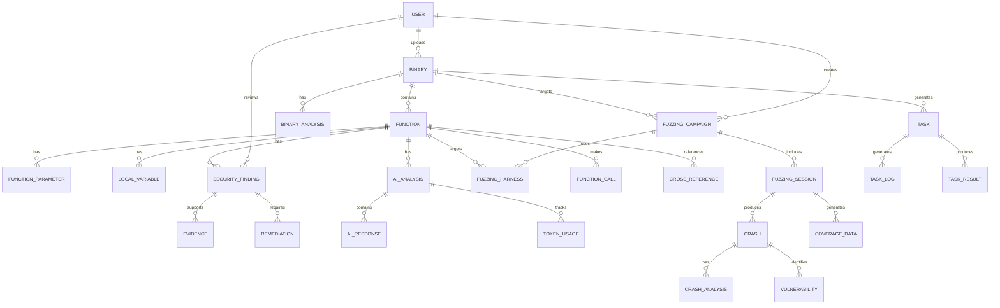

# Database Schema

## 💾 ShadowSeek Database Architecture

ShadowSeek employs a comprehensive relational database schema designed to efficiently store and manage binary analysis data, security findings, AI analysis results, and fuzzing campaign information.

---

## 🏗️ **Complete Database Schema**

### **Entity Relationship Diagram**


---

## 📄 **Core Tables**

### **Binary Table**
**Primary entity storing uploaded binary information**

```sql
CREATE TABLE binary (
    id VARCHAR(36) PRIMARY KEY,                    -- UUID for binary
    filename VARCHAR(255) NOT NULL,               -- Original filename
    file_hash VARCHAR(64) NOT NULL UNIQUE,        -- SHA-256 hash
    file_path VARCHAR(500) NOT NULL,              -- Storage path
    size INTEGER NOT NULL,                        -- File size in bytes
    file_type VARCHAR(50),                        -- PE, ELF, Mach-O, etc.
    architecture VARCHAR(20),                     -- x86_64, i386, ARM, etc.
    analysis_status VARCHAR(20) DEFAULT 'pending', -- pending, analyzing, analyzed, failed
    upload_date DATETIME DEFAULT CURRENT_TIMESTAMP,
    analyzed_at DATETIME,
    function_count INTEGER DEFAULT 0,
    string_count INTEGER DEFAULT 0,
    import_count INTEGER DEFAULT 0,
    export_count INTEGER DEFAULT 0,
    section_count INTEGER DEFAULT 0,
    entry_point VARCHAR(20),                      -- Entry point address
    compiler VARCHAR(100),                        -- Detected compiler
    packer VARCHAR(100),                          -- Detected packer
    metadata TEXT,                                -- JSON metadata
    created_at DATETIME DEFAULT CURRENT_TIMESTAMP,
    updated_at DATETIME DEFAULT CURRENT_TIMESTAMP
);

-- Indexes for performance
CREATE INDEX idx_binary_hash ON binary(file_hash);
CREATE INDEX idx_binary_status ON binary(analysis_status);
CREATE INDEX idx_binary_type ON binary(file_type);
CREATE INDEX idx_binary_upload_date ON binary(upload_date);
```

### **Function Table**
**Stores discovered functions within binaries**

```sql
CREATE TABLE function (
    id INTEGER PRIMARY KEY AUTOINCREMENT,
    binary_id VARCHAR(36) NOT NULL,
    name VARCHAR(255) NOT NULL,
    address VARCHAR(20) NOT NULL,                 -- Function address (hex)
    size INTEGER,                                 -- Function size in bytes
    is_external BOOLEAN DEFAULT FALSE,
    is_thunk BOOLEAN DEFAULT FALSE,
    calling_convention VARCHAR(50),               -- cdecl, stdcall, fastcall, etc.
    return_type VARCHAR(100),
    decompiled BOOLEAN DEFAULT FALSE,
    decompiled_code TEXT,                         -- Decompiled C-like code
    decompiled_at DATETIME,
    decompilation_quality VARCHAR(20),            -- high, medium, low
    ai_analyzed BOOLEAN DEFAULT FALSE,
    ai_summary TEXT,                              -- AI-generated summary
    ai_analyzed_at DATETIME,
    risk_score FLOAT DEFAULT 0.0,                -- 0-100 risk score
    complexity_score FLOAT DEFAULT 0.0,          -- Cyclomatic complexity
    cyclomatic_complexity INTEGER DEFAULT 0,
    npath_complexity INTEGER DEFAULT 0,
    lines_of_code INTEGER DEFAULT 0,
    parameter_count INTEGER DEFAULT 0,
    local_variable_count INTEGER DEFAULT 0,
    call_count INTEGER DEFAULT 0,
    cross_reference_count INTEGER DEFAULT 0,
    basic_block_count INTEGER DEFAULT 0,
    branch_count INTEGER DEFAULT 0,
    loop_count INTEGER DEFAULT 0,
    created_at DATETIME DEFAULT CURRENT_TIMESTAMP,
    updated_at DATETIME DEFAULT CURRENT_TIMESTAMP,
    
    FOREIGN KEY (binary_id) REFERENCES binary(id) ON DELETE CASCADE
);

-- Indexes for performance
CREATE INDEX idx_function_binary_id ON function(binary_id);
CREATE INDEX idx_function_address ON function(address);
CREATE INDEX idx_function_name ON function(name);
CREATE INDEX idx_function_decompiled ON function(decompiled);
CREATE INDEX idx_function_ai_analyzed ON function(ai_analyzed);
CREATE INDEX idx_function_risk_score ON function(risk_score);
CREATE INDEX idx_function_external ON function(is_external);
```

### **Function Parameters Table**
**Stores function parameter information**

```sql
CREATE TABLE function_parameter (
    id INTEGER PRIMARY KEY AUTOINCREMENT,
    function_id INTEGER NOT NULL,
    name VARCHAR(255),
    type VARCHAR(255),
    order_index INTEGER NOT NULL,                -- Parameter order (0-based)
    description TEXT,
    usage_pattern VARCHAR(100),                  -- input_source, output_sink, etc.
    is_pointer BOOLEAN DEFAULT FALSE,
    is_const BOOLEAN DEFAULT FALSE,
    size INTEGER,                                -- Size in bytes
    created_at DATETIME DEFAULT CURRENT_TIMESTAMP,
    
    FOREIGN KEY (function_id) REFERENCES function(id) ON DELETE CASCADE
);

CREATE INDEX idx_parameter_function_id ON function_parameter(function_id);
CREATE INDEX idx_parameter_order ON function_parameter(function_id, order_index);
```

### **Local Variables Table**
**Stores local variable information within functions**

```sql
CREATE TABLE local_variable (
    id INTEGER PRIMARY KEY AUTOINCREMENT,
    function_id INTEGER NOT NULL,
    name VARCHAR(255),
    type VARCHAR(255),
    stack_offset INTEGER,                        -- Stack offset in bytes
    size INTEGER,                                -- Variable size in bytes
    usage VARCHAR(100),                          -- temporary_storage, buffer, etc.
    security_risk VARCHAR(20),                   -- high, medium, low, none
    description TEXT,
    created_at DATETIME DEFAULT CURRENT_TIMESTAMP,
    
    FOREIGN KEY (function_id) REFERENCES function(id) ON DELETE CASCADE
);

CREATE INDEX idx_local_var_function_id ON local_variable(function_id);
CREATE INDEX idx_local_var_security_risk ON local_variable(security_risk);
```

---

## 🛡️ **Security Analysis Tables**

### **Security Finding Table**
**Core table for vulnerability and security issue tracking**

```sql
CREATE TABLE security_finding (
    id INTEGER PRIMARY KEY AUTOINCREMENT,
    function_id INTEGER NOT NULL,
    title VARCHAR(255) NOT NULL,
    description TEXT NOT NULL,
    severity VARCHAR(20) NOT NULL,               -- CRITICAL, HIGH, MEDIUM, LOW
    confidence FLOAT NOT NULL,                   -- 0-100 confidence score
    cwe_id VARCHAR(20),                          -- CWE identifier
    cve_references TEXT,                         -- JSON array of CVE IDs
    cvss_score FLOAT,                            -- CVSS v3.1 score
    cvss_vector VARCHAR(200),                    -- CVSS vector string
    exploitability VARCHAR(20),                  -- HIGH, MEDIUM, LOW
    impact VARCHAR(20),                          -- HIGH, MEDIUM, LOW
    affected_code TEXT,                          -- Specific code snippet
    line_number INTEGER,                         -- Line in decompiled code
    ai_analysis TEXT,                            -- AI-generated analysis
    detection_methods TEXT,                      -- JSON array of detection methods
    confirmed BOOLEAN DEFAULT FALSE,
    false_positive BOOLEAN DEFAULT FALSE,
    analyst_notes TEXT,
    remediation_status VARCHAR(50),              -- open, in_progress, fixed, wont_fix
    assigned_to VARCHAR(255),
    due_date DATETIME,
    tags TEXT,                                   -- JSON array of tags
    created_at DATETIME DEFAULT CURRENT_TIMESTAMP,
    updated_at DATETIME DEFAULT CURRENT_TIMESTAMP,
    created_by VARCHAR(255),
    updated_by VARCHAR(255),
    
    FOREIGN KEY (function_id) REFERENCES function(id) ON DELETE CASCADE
);

-- Indexes for security findings
CREATE INDEX idx_finding_function_id ON security_finding(function_id);
CREATE INDEX idx_finding_severity ON security_finding(severity);
CREATE INDEX idx_finding_confidence ON security_finding(confidence);
CREATE INDEX idx_finding_cwe ON security_finding(cwe_id);
CREATE INDEX idx_finding_confirmed ON security_finding(confirmed);
CREATE INDEX idx_finding_false_positive ON security_finding(false_positive);
CREATE INDEX idx_finding_status ON security_finding(remediation_status);
CREATE INDEX idx_finding_created_at ON security_finding(created_at);
```

### **Evidence Table**
**Stores evidence supporting security findings**

```sql
CREATE TABLE evidence (
    id INTEGER PRIMARY KEY AUTOINCREMENT,
    finding_id INTEGER NOT NULL,
    type VARCHAR(50) NOT NULL,                   -- ai_analysis, pattern_match, static_analysis
    description TEXT NOT NULL,
    confidence_impact FLOAT,                     -- 0-1 confidence contribution
    details TEXT,                                -- JSON details object
    raw_data TEXT,                               -- Raw evidence data
    created_at DATETIME DEFAULT CURRENT_TIMESTAMP,
    
    FOREIGN KEY (finding_id) REFERENCES security_finding(id) ON DELETE CASCADE
);

CREATE INDEX idx_evidence_finding_id ON evidence(finding_id);
CREATE INDEX idx_evidence_type ON evidence(type);
```

### **Remediation Table**
**Tracks remediation steps and recommendations**

```sql
CREATE TABLE remediation (
    id INTEGER PRIMARY KEY AUTOINCREMENT,
    finding_id INTEGER NOT NULL,
    priority VARCHAR(20) NOT NULL,               -- IMMEDIATE, HIGH, MEDIUM, LOW
    difficulty VARCHAR(20),                      -- LOW, MEDIUM, HIGH
    estimated_effort VARCHAR(100),               -- Time estimate
    steps TEXT NOT NULL,                         -- JSON array of steps
    code_examples TEXT,                          -- JSON object with examples
    testing_recommendations TEXT,                -- JSON array of test recommendations
    references TEXT,                             -- JSON array of reference URLs
    status VARCHAR(50) DEFAULT 'pending',        -- pending, in_progress, completed
    implemented_at DATETIME,
    verified_at DATETIME,
    notes TEXT,
    created_at DATETIME DEFAULT CURRENT_TIMESTAMP,
    updated_at DATETIME DEFAULT CURRENT_TIMESTAMP,
    
    FOREIGN KEY (finding_id) REFERENCES security_finding(id) ON DELETE CASCADE
);

CREATE INDEX idx_remediation_finding_id ON remediation(finding_id);
CREATE INDEX idx_remediation_priority ON remediation(priority);
CREATE INDEX idx_remediation_status ON remediation(status);
```

---

## 🤖 **AI Analysis Tables**

### **AI Analysis Table**
**Stores AI analysis sessions and results**

```sql
CREATE TABLE ai_analysis (
    id INTEGER PRIMARY KEY AUTOINCREMENT,
    function_id INTEGER NOT NULL,
    prompt TEXT NOT NULL,                        -- AI prompt used
    response TEXT NOT NULL,                      -- AI response
    ai_provider VARCHAR(50) NOT NULL,            -- openai, claude, gemini, local
    model_used VARCHAR(100) NOT NULL,            -- gpt-4, claude-3-sonnet, etc.
    analysis_focus VARCHAR(50),                  -- security, functionality, performance
    confidence_score FLOAT,                      -- AI confidence in analysis
    processing_time FLOAT,                       -- Seconds to process
    cached BOOLEAN DEFAULT FALSE,
    cache_hit BOOLEAN DEFAULT FALSE,
    created_at DATETIME DEFAULT CURRENT_TIMESTAMP,
    
    FOREIGN KEY (function_id) REFERENCES function(id) ON DELETE CASCADE
);

CREATE INDEX idx_ai_analysis_function_id ON ai_analysis(function_id);
CREATE INDEX idx_ai_analysis_provider ON ai_analysis(ai_provider);
CREATE INDEX idx_ai_analysis_model ON ai_analysis(model_used);
CREATE INDEX idx_ai_analysis_created_at ON ai_analysis(created_at);
```

### **AI Response Table**
**Stores structured AI response data**

```sql
CREATE TABLE ai_response (
    id INTEGER PRIMARY KEY AUTOINCREMENT,
    analysis_id INTEGER NOT NULL,
    summary TEXT,
    vulnerabilities TEXT,                        -- JSON array of vulnerabilities
    risk_score FLOAT,
    confidence FLOAT,
    recommendations TEXT,                        -- JSON array of recommendations
    code_patterns TEXT,                          -- JSON object of patterns
    raw_response TEXT,                           -- Original AI response
    parsed_successfully BOOLEAN DEFAULT TRUE,
    parsing_errors TEXT,                         -- JSON array of errors
    created_at DATETIME DEFAULT CURRENT_TIMESTAMP,
    
    FOREIGN KEY (analysis_id) REFERENCES ai_analysis(id) ON DELETE CASCADE
);

CREATE INDEX idx_ai_response_analysis_id ON ai_response(analysis_id);
CREATE INDEX idx_ai_response_risk_score ON ai_response(risk_score);
```

### **Token Usage Table**
**Tracks AI API token consumption for cost management**

```sql
CREATE TABLE token_usage (
    id INTEGER PRIMARY KEY AUTOINCREMENT,
    analysis_id INTEGER NOT NULL,
    prompt_tokens INTEGER,
    completion_tokens INTEGER,
    total_tokens INTEGER,
    estimated_cost DECIMAL(10, 6),               -- USD cost estimate
    actual_cost DECIMAL(10, 6),                  -- Actual charged cost
    rate_limited BOOLEAN DEFAULT FALSE,
    retry_count INTEGER DEFAULT 0,
    created_at DATETIME DEFAULT CURRENT_TIMESTAMP,
    
    FOREIGN KEY (analysis_id) REFERENCES ai_analysis(id) ON DELETE CASCADE
);

CREATE INDEX idx_token_usage_analysis_id ON token_usage(analysis_id);
CREATE INDEX idx_token_usage_cost ON token_usage(estimated_cost);
CREATE INDEX idx_token_usage_date ON token_usage(created_at);
```

---

## 🎯 **Fuzzing Tables**

### **Fuzzing Campaign Table**
**Manages fuzzing campaigns and configurations**

```sql
CREATE TABLE fuzzing_campaign (
    id VARCHAR(36) PRIMARY KEY,                  -- UUID for campaign
    binary_id VARCHAR(36) NOT NULL,
    name VARCHAR(255) NOT NULL,
    description TEXT,
    target_functions TEXT,                       -- JSON array of function names
    fuzzing_engines TEXT,                        -- JSON array of engine names
    duration INTEGER,                            -- Duration in seconds
    status VARCHAR(50) DEFAULT 'initializing',   -- initializing, running, completed, failed
    priority INTEGER DEFAULT 3,                  -- 1-5 priority level
    created_at DATETIME DEFAULT CURRENT_TIMESTAMP,
    started_at DATETIME,
    completed_at DATETIME,
    total_executions BIGINT DEFAULT 0,
    unique_crashes INTEGER DEFAULT 0,
    unique_hangs INTEGER DEFAULT 0,
    coverage_percentage FLOAT DEFAULT 0.0,
    vulnerabilities_found INTEGER DEFAULT 0,
    configuration TEXT,                          -- JSON configuration
    created_by VARCHAR(255),
    
    FOREIGN KEY (binary_id) REFERENCES binary(id) ON DELETE CASCADE
);

CREATE INDEX idx_campaign_binary_id ON fuzzing_campaign(binary_id);
CREATE INDEX idx_campaign_status ON fuzzing_campaign(status);
CREATE INDEX idx_campaign_created_at ON fuzzing_campaign(created_at);
CREATE INDEX idx_campaign_priority ON fuzzing_campaign(priority);
```

### **Fuzzing Harness Table**
**Stores generated fuzzing harnesses**

```sql
CREATE TABLE fuzzing_harness (
    id VARCHAR(36) PRIMARY KEY,                  -- UUID for harness
    campaign_id VARCHAR(36),
    function_id INTEGER NOT NULL,
    harness_type VARCHAR(50) NOT NULL,           -- afl++, afl, libfuzzer, honggfuzz
    source_code TEXT NOT NULL,                   -- Generated harness code
    compilation_flags TEXT,                      -- Compilation flags
    makefile TEXT,                               -- Generated Makefile
    readme TEXT,                                 -- Generated documentation
    ai_generated BOOLEAN DEFAULT FALSE,
    template_based BOOLEAN DEFAULT FALSE,
    compilation_successful BOOLEAN DEFAULT FALSE,
    compiled_binary_path VARCHAR(500),
    estimated_coverage FLOAT,
    generation_time FLOAT,                       -- Seconds to generate
    created_at DATETIME DEFAULT CURRENT_TIMESTAMP,
    compiled_at DATETIME,
    
    FOREIGN KEY (campaign_id) REFERENCES fuzzing_campaign(id) ON DELETE CASCADE,
    FOREIGN KEY (function_id) REFERENCES function(id) ON DELETE CASCADE
);

CREATE INDEX idx_harness_campaign_id ON fuzzing_harness(campaign_id);
CREATE INDEX idx_harness_function_id ON fuzzing_harness(function_id);
CREATE INDEX idx_harness_type ON fuzzing_harness(harness_type);
CREATE INDEX idx_harness_ai_generated ON fuzzing_harness(ai_generated);
```

### **Fuzzing Session Table**
**Tracks individual fuzzing execution sessions**

```sql
CREATE TABLE fuzzing_session (
    id VARCHAR(36) PRIMARY KEY,                  -- UUID for session
    campaign_id VARCHAR(36) NOT NULL,
    harness_id VARCHAR(36) NOT NULL,
    fuzzer_engine VARCHAR(50) NOT NULL,          -- afl++, libfuzzer, honggfuzz
    status VARCHAR(50) DEFAULT 'queued',         -- queued, running, completed, failed
    started_at DATETIME,
    completed_at DATETIME,
    duration INTEGER,                            -- Runtime in seconds
    executions BIGINT DEFAULT 0,
    executions_per_second FLOAT DEFAULT 0.0,
    total_paths INTEGER DEFAULT 0,
    unique_crashes INTEGER DEFAULT 0,
    unique_hangs INTEGER DEFAULT 0,
    coverage_percentage FLOAT DEFAULT 0.0,
    last_new_path DATETIME,
    configuration TEXT,                          -- JSON fuzzer configuration
    working_directory VARCHAR(500),
    pid INTEGER,                                 -- Process ID
    exit_code INTEGER,
    error_message TEXT,
    created_at DATETIME DEFAULT CURRENT_TIMESTAMP,
    
    FOREIGN KEY (campaign_id) REFERENCES fuzzing_campaign(id) ON DELETE CASCADE,
    FOREIGN KEY (harness_id) REFERENCES fuzzing_harness(id) ON DELETE CASCADE
);

CREATE INDEX idx_session_campaign_id ON fuzzing_session(campaign_id);
CREATE INDEX idx_session_harness_id ON fuzzing_session(harness_id);
CREATE INDEX idx_session_status ON fuzzing_session(status);
CREATE INDEX idx_session_fuzzer_engine ON fuzzing_session(fuzzer_engine);
CREATE INDEX idx_session_started_at ON fuzzing_session(started_at);
```

### **Crash Table**
**Stores discovered crashes from fuzzing**

```sql
CREATE TABLE crash (
    id VARCHAR(36) PRIMARY KEY,                  -- UUID for crash
    session_id VARCHAR(36) NOT NULL,
    crash_hash VARCHAR(64) NOT NULL,             -- Hash of crash input
    found_at DATETIME NOT NULL,
    signal VARCHAR(20),                          -- SIGSEGV, SIGABRT, etc.
    signal_number INTEGER,
    crash_address VARCHAR(20),                   -- Memory address of crash
    instruction_pointer VARCHAR(20),             -- IP at crash
    stack_trace TEXT,                            -- JSON stack trace
    registers TEXT,                              -- JSON register dump
    input_file VARCHAR(500),                     -- Path to crash input
    input_size INTEGER,
    input_hash VARCHAR(64),                      -- Hash of input data
    severity VARCHAR(20),                        -- CRITICAL, HIGH, MEDIUM, LOW
    exploitability VARCHAR(20),                  -- HIGH, MEDIUM, LOW, UNKNOWN
    triaged BOOLEAN DEFAULT FALSE,
    duplicate_of VARCHAR(36),                    -- Reference to master crash
    crash_details TEXT,                          -- JSON crash details
    reproduction_steps TEXT,                     -- Steps to reproduce
    created_at DATETIME DEFAULT CURRENT_TIMESTAMP,
    
    FOREIGN KEY (session_id) REFERENCES fuzzing_session(id) ON DELETE CASCADE,
    FOREIGN KEY (duplicate_of) REFERENCES crash(id) ON DELETE SET NULL
);

CREATE INDEX idx_crash_session_id ON crash(session_id);
CREATE INDEX idx_crash_hash ON crash(crash_hash);
CREATE INDEX idx_crash_found_at ON crash(found_at);
CREATE INDEX idx_crash_severity ON crash(severity);
CREATE INDEX idx_crash_exploitability ON crash(exploitability);
CREATE INDEX idx_crash_triaged ON crash(triaged);
CREATE INDEX idx_crash_duplicate ON crash(duplicate_of);
```

### **Crash Analysis Table**
**Stores detailed crash analysis results**

```sql
CREATE TABLE crash_analysis (
    id INTEGER PRIMARY KEY AUTOINCREMENT,
    crash_id VARCHAR(36) NOT NULL,
    root_cause TEXT,
    vulnerability_type VARCHAR(100),             -- buffer_overflow, use_after_free, etc.
    exploitability_assessment TEXT,
    impact_assessment TEXT,
    ai_analysis TEXT,                            -- AI-powered crash analysis
    proof_of_concept TEXT,                       -- PoC code or steps
    mitigation_suggestions TEXT,                 -- JSON array of suggestions
    cvss_score FLOAT,
    cwe_mapping VARCHAR(20),
    analysis_confidence FLOAT,
    analyzed_by VARCHAR(100),                    -- ai, manual, hybrid
    created_at DATETIME DEFAULT CURRENT_TIMESTAMP,
    updated_at DATETIME DEFAULT CURRENT_TIMESTAMP,
    
    FOREIGN KEY (crash_id) REFERENCES crash(id) ON DELETE CASCADE
);

CREATE INDEX idx_crash_analysis_crash_id ON crash_analysis(crash_id);
CREATE INDEX idx_crash_analysis_vulnerability_type ON crash_analysis(vulnerability_type);
CREATE INDEX idx_crash_analysis_cvss ON crash_analysis(cvss_score);
```

---

## ⚙️ **Task Management Tables**

### **Task Table**
**Manages asynchronous operations and background jobs**

```sql
CREATE TABLE task (
    id VARCHAR(50) PRIMARY KEY,                  -- Unique task identifier
    task_type VARCHAR(50) NOT NULL,              -- analyze, decompile, ai_explain, etc.
    status VARCHAR(50) DEFAULT 'queued',         -- queued, running, completed, failed, cancelled
    progress FLOAT DEFAULT 0.0,                  -- 0-100 completion percentage
    binary_id VARCHAR(36),                       -- Associated binary (if applicable)
    function_id INTEGER,                         -- Associated function (if applicable)
    campaign_id VARCHAR(36),                     -- Associated campaign (if applicable)
    priority INTEGER DEFAULT 3,                  -- 1-5 priority level
    created_at DATETIME DEFAULT CURRENT_TIMESTAMP,
    started_at DATETIME,
    completed_at DATETIME,
    estimated_completion DATETIME,
    assigned_worker VARCHAR(100),
    current_step TEXT,
    total_steps INTEGER,
    completed_steps INTEGER DEFAULT 0,
    failed_steps INTEGER DEFAULT 0,
    configuration TEXT,                          -- JSON task configuration
    metadata TEXT,                               -- JSON task metadata
    error_message TEXT,
    result_data TEXT,                            -- JSON result data
    created_by VARCHAR(255),
    
    FOREIGN KEY (binary_id) REFERENCES binary(id) ON DELETE CASCADE,
    FOREIGN KEY (function_id) REFERENCES function(id) ON DELETE CASCADE,
    FOREIGN KEY (campaign_id) REFERENCES fuzzing_campaign(id) ON DELETE CASCADE
);

CREATE INDEX idx_task_type ON task(task_type);
CREATE INDEX idx_task_status ON task(status);
CREATE INDEX idx_task_priority ON task(priority);
CREATE INDEX idx_task_binary_id ON task(binary_id);
CREATE INDEX idx_task_created_at ON task(created_at);
CREATE INDEX idx_task_assigned_worker ON task(assigned_worker);
```

### **Task Log Table**
**Stores detailed logs for task execution**

```sql
CREATE TABLE task_log (
    id INTEGER PRIMARY KEY AUTOINCREMENT,
    task_id VARCHAR(50) NOT NULL,
    timestamp DATETIME DEFAULT CURRENT_TIMESTAMP,
    level VARCHAR(20) NOT NULL,                  -- DEBUG, INFO, WARNING, ERROR
    message TEXT NOT NULL,
    details TEXT,                                -- JSON details object
    step_name VARCHAR(100),
    progress_update FLOAT,
    
    FOREIGN KEY (task_id) REFERENCES task(id) ON DELETE CASCADE
);

CREATE INDEX idx_task_log_task_id ON task_log(task_id);
CREATE INDEX idx_task_log_timestamp ON task_log(timestamp);
CREATE INDEX idx_task_log_level ON task_log(level);
```

---

## 👤 **User Management Tables**

### **User Table**
**Basic user management for the platform**

```sql
CREATE TABLE user (
    id INTEGER PRIMARY KEY AUTOINCREMENT,
    username VARCHAR(100) NOT NULL UNIQUE,
    email VARCHAR(255) NOT NULL UNIQUE,
    password_hash VARCHAR(255) NOT NULL,
    full_name VARCHAR(255),
    role VARCHAR(50) DEFAULT 'analyst',          -- admin, analyst, viewer
    is_active BOOLEAN DEFAULT TRUE,
    last_login DATETIME,
    preferences TEXT,                            -- JSON user preferences
    api_key VARCHAR(100) UNIQUE,                 -- API access key
    created_at DATETIME DEFAULT CURRENT_TIMESTAMP,
    updated_at DATETIME DEFAULT CURRENT_TIMESTAMP
);

CREATE INDEX idx_user_username ON user(username);
CREATE INDEX idx_user_email ON user(email);
CREATE INDEX idx_user_api_key ON user(api_key);
CREATE INDEX idx_user_role ON user(role);
```

### **User Session Table**
**Tracks user sessions for security**

```sql
CREATE TABLE user_session (
    id VARCHAR(100) PRIMARY KEY,                 -- Session token
    user_id INTEGER NOT NULL,
    ip_address VARCHAR(45),                      -- IPv4 or IPv6
    user_agent TEXT,
    created_at DATETIME DEFAULT CURRENT_TIMESTAMP,
    last_activity DATETIME DEFAULT CURRENT_TIMESTAMP,
    expires_at DATETIME NOT NULL,
    is_active BOOLEAN DEFAULT TRUE,
    
    FOREIGN KEY (user_id) REFERENCES user(id) ON DELETE CASCADE
);

CREATE INDEX idx_session_user_id ON user_session(user_id);
CREATE INDEX idx_session_expires_at ON user_session(expires_at);
CREATE INDEX idx_session_active ON user_session(is_active);
```

---

## 📊 **Supporting Tables**

### **Binary Analysis Table**
**Stores comprehensive binary analysis results**

```sql
CREATE TABLE binary_analysis (
    id INTEGER PRIMARY KEY AUTOINCREMENT,
    binary_id VARCHAR(36) NOT NULL,
    file_type_detailed VARCHAR(100),             -- Detailed file type info
    pe_characteristics TEXT,                     -- JSON PE characteristics
    elf_info TEXT,                              -- JSON ELF information
    imports TEXT,                               -- JSON import table
    exports TEXT,                               -- JSON export table
    sections TEXT,                              -- JSON section information
    strings TEXT,                               -- JSON extracted strings
    certificates TEXT,                          -- JSON code signing info
    version_info TEXT,                          -- JSON version information
    entropy_analysis TEXT,                      -- JSON entropy data
    packer_detection TEXT,                      -- JSON packer results
    compiler_detection TEXT,                    -- JSON compiler results
    anti_debug_techniques TEXT,                 -- JSON anti-debug detection
    obfuscation_analysis TEXT,                  -- JSON obfuscation analysis
    created_at DATETIME DEFAULT CURRENT_TIMESTAMP,
    
    FOREIGN KEY (binary_id) REFERENCES binary(id) ON DELETE CASCADE
);

CREATE INDEX idx_binary_analysis_binary_id ON binary_analysis(binary_id);
```

### **Function Call Table**
**Tracks function call relationships**

```sql
CREATE TABLE function_call (
    id INTEGER PRIMARY KEY AUTOINCREMENT,
    caller_function_id INTEGER NOT NULL,
    target_function VARCHAR(255) NOT NULL,       -- Called function name
    target_address VARCHAR(20),                  -- Target function address
    call_address VARCHAR(20),                    -- Address of call instruction
    is_external BOOLEAN DEFAULT FALSE,
    call_type VARCHAR(50),                       -- direct, indirect, virtual
    security_risk VARCHAR(20),                   -- high, medium, low, none
    created_at DATETIME DEFAULT CURRENT_TIMESTAMP,
    
    FOREIGN KEY (caller_function_id) REFERENCES function(id) ON DELETE CASCADE
);

CREATE INDEX idx_function_call_caller ON function_call(caller_function_id);
CREATE INDEX idx_function_call_target ON function_call(target_function);
CREATE INDEX idx_function_call_external ON function_call(is_external);
CREATE INDEX idx_function_call_security_risk ON function_call(security_risk);
```

### **Cross Reference Table**
**Stores code and data cross-references**

```sql
CREATE TABLE cross_reference (
    id INTEGER PRIMARY KEY AUTOINCREMENT,
    function_id INTEGER NOT NULL,
    reference_type VARCHAR(50) NOT NULL,         -- code, data, string
    reference_address VARCHAR(20) NOT NULL,
    reference_value TEXT,                        -- Referenced value/string
    usage_context VARCHAR(100),                  -- read, write, call, jump
    created_at DATETIME DEFAULT CURRENT_TIMESTAMP,
    
    FOREIGN KEY (function_id) REFERENCES function(id) ON DELETE CASCADE
);

CREATE INDEX idx_cross_ref_function_id ON cross_reference(function_id);
CREATE INDEX idx_cross_ref_type ON cross_reference(reference_type);
CREATE INDEX idx_cross_ref_address ON cross_reference(reference_address);
```

### **Coverage Data Table**
**Stores fuzzing coverage information**

```sql
CREATE TABLE coverage_data (
    id INTEGER PRIMARY KEY AUTOINCREMENT,
    session_id VARCHAR(36) NOT NULL,
    timestamp DATETIME DEFAULT CURRENT_TIMESTAMP,
    total_blocks INTEGER,
    covered_blocks INTEGER,
    coverage_percentage FLOAT,
    new_coverage INTEGER,                        -- New blocks this update
    coverage_bitmap BLOB,                        -- Coverage bitmap data
    edge_coverage INTEGER,                       -- Edge coverage count
    function_coverage TEXT,                      -- JSON per-function coverage
    
    FOREIGN KEY (session_id) REFERENCES fuzzing_session(id) ON DELETE CASCADE
);

CREATE INDEX idx_coverage_session_id ON coverage_data(session_id);
CREATE INDEX idx_coverage_timestamp ON coverage_data(timestamp);
CREATE INDEX idx_coverage_percentage ON coverage_data(coverage_percentage);
```

---

## 🔍 **Database Views**

### **Security Summary View**
**Provides aggregated security analysis data**

```sql
CREATE VIEW security_summary AS
SELECT 
    b.id as binary_id,
    b.filename,
    b.file_hash,
    COUNT(f.id) as total_functions,
    COUNT(CASE WHEN f.decompiled = 1 THEN 1 END) as decompiled_functions,
    COUNT(CASE WHEN f.ai_analyzed = 1 THEN 1 END) as ai_analyzed_functions,
    COUNT(sf.id) as total_findings,
    COUNT(CASE WHEN sf.severity = 'CRITICAL' THEN 1 END) as critical_findings,
    COUNT(CASE WHEN sf.severity = 'HIGH' THEN 1 END) as high_findings,
    COUNT(CASE WHEN sf.severity = 'MEDIUM' THEN 1 END) as medium_findings,
    COUNT(CASE WHEN sf.severity = 'LOW' THEN 1 END) as low_findings,
    AVG(f.risk_score) as average_risk_score,
    MAX(f.risk_score) as highest_risk_score,
    COUNT(CASE WHEN sf.confirmed = 1 THEN 1 END) as confirmed_findings,
    COUNT(CASE WHEN sf.false_positive = 1 THEN 1 END) as false_positives
FROM binary b
LEFT JOIN function f ON b.id = f.binary_id
LEFT JOIN security_finding sf ON f.id = sf.function_id
GROUP BY b.id, b.filename, b.file_hash;
```

### **Fuzzing Campaign Summary View**
**Provides fuzzing campaign overview data**

```sql
CREATE VIEW fuzzing_summary AS
SELECT 
    fc.id as campaign_id,
    fc.name as campaign_name,
    fc.status,
    fc.binary_id,
    b.filename as binary_name,
    COUNT(fs.id) as total_sessions,
    SUM(fs.executions) as total_executions,
    SUM(fs.unique_crashes) as total_crashes,
    COUNT(DISTINCT c.crash_hash) as unique_crashes,
    AVG(fs.coverage_percentage) as average_coverage,
    MAX(fs.coverage_percentage) as max_coverage,
    COUNT(CASE WHEN c.severity = 'CRITICAL' THEN 1 END) as critical_crashes,
    COUNT(CASE WHEN c.severity = 'HIGH' THEN 1 END) as high_crashes,
    fc.created_at,
    fc.completed_at,
    CASE WHEN fc.completed_at IS NOT NULL 
         THEN (julianday(fc.completed_at) - julianday(fc.started_at)) * 24 * 60 * 60
         ELSE NULL END as duration_seconds
FROM fuzzing_campaign fc
LEFT JOIN binary b ON fc.binary_id = b.id
LEFT JOIN fuzzing_session fs ON fc.id = fs.campaign_id
LEFT JOIN crash c ON fs.id = c.session_id
GROUP BY fc.id, fc.name, fc.status, fc.binary_id, b.filename, fc.created_at, fc.completed_at;
```

---

## ⚡ **Performance Optimization**

### **Partitioning Strategy**
For high-volume deployments, consider partitioning large tables:

```sql
-- Partition task_log by date for better performance
CREATE TABLE task_log_2024_01 AS SELECT * FROM task_log WHERE timestamp >= '2024-01-01' AND timestamp < '2024-02-01';
CREATE TABLE task_log_2024_02 AS SELECT * FROM task_log WHERE timestamp >= '2024-02-01' AND timestamp < '2024-03-01';
-- ... continue for each month
```

### **Archive Tables**
For long-term data retention:

```sql
-- Archive old completed tasks
CREATE TABLE task_archive AS SELECT * FROM task WHERE status = 'completed' AND completed_at < date('now', '-30 days');
CREATE TABLE task_log_archive AS SELECT * FROM task_log WHERE task_id IN (SELECT id FROM task_archive);
```

### **Maintenance Procedures**

#### **Database Cleanup Procedure**
```sql
-- Clean up old task logs (older than 30 days)
DELETE FROM task_log WHERE timestamp < date('now', '-30 days');

-- Clean up old user sessions (expired)
DELETE FROM user_session WHERE expires_at < datetime('now');

-- Clean up orphaned evidence records
DELETE FROM evidence WHERE finding_id NOT IN (SELECT id FROM security_finding);

-- Update statistics
ANALYZE;

-- Rebuild indexes if needed
REINDEX;
```

#### **Data Integrity Checks**
```sql
-- Check for orphaned functions
SELECT f.* FROM function f WHERE f.binary_id NOT IN (SELECT id FROM binary);

-- Check for security findings without functions
SELECT sf.* FROM security_finding sf WHERE sf.function_id NOT IN (SELECT id FROM function);

-- Check for crashes without sessions
SELECT c.* FROM crash c WHERE c.session_id NOT IN (SELECT id FROM fuzzing_session);
```

---

## 📊 **Database Statistics**

### **Expected Table Sizes**
| Table | Estimated Rows | Growth Rate | Storage Impact |
|-------|---------------|-------------|----------------|
| binary | 1,000-10,000 | Moderate | Low |
| function | 50,000-500,000 | High | Medium |
| security_finding | 10,000-100,000 | High | Medium |
| ai_analysis | 25,000-250,000 | High | High |
| task | 100,000-1,000,000 | Very High | Medium |
| task_log | 1,000,000+ | Very High | High |
| crash | 1,000-50,000 | Moderate | Low |
| evidence | 50,000-500,000 | High | Medium |

### **Storage Requirements**
- **Minimal Setup**: 100MB - 1GB
- **Typical Enterprise**: 10GB - 100GB  
- **Large Scale**: 100GB - 1TB+

---

## 🔧 **Configuration Management**

### **Database Configuration Settings**

```sql
-- SQLite optimizations for ShadowSeek
PRAGMA journal_mode = WAL;              -- Write-Ahead Logging for better concurrency
PRAGMA synchronous = NORMAL;            -- Balance safety and performance
PRAGMA cache_size = -64000;             -- 64MB cache
PRAGMA temp_store = MEMORY;             -- Store temp tables in memory
PRAGMA mmap_size = 268435456;           -- 256MB memory mapping
PRAGMA optimize;                        -- Optimize query planner
```

### **Backup Strategy**
```bash
#!/bin/bash
# Daily backup script
DATE=$(date +"%Y%m%d_%H%M%S")
sqlite3 shadowseek.db ".backup shadowseek_backup_$DATE.db"
gzip shadowseek_backup_$DATE.db

# Keep only last 30 days of backups
find . -name "shadowseek_backup_*.db.gz" -mtime +30 -delete
```

---

The ShadowSeek database schema provides a comprehensive foundation for storing and managing binary analysis data, security findings, AI analysis results, and fuzzing campaigns. The schema is designed for scalability, performance, and data integrity while supporting the complex relationships required for advanced security analysis workflows. 