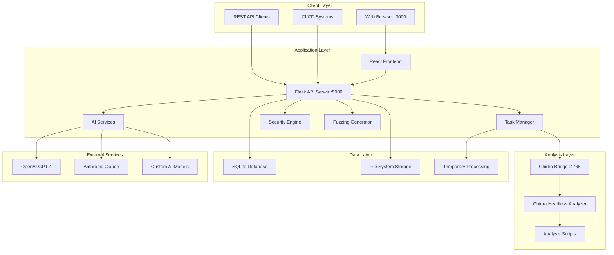
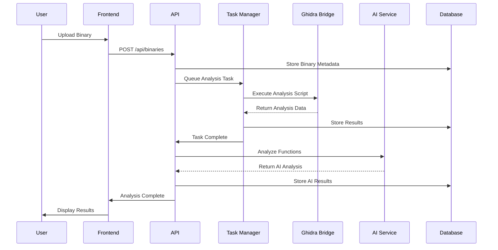
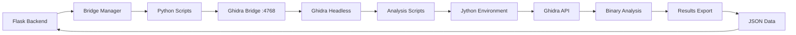
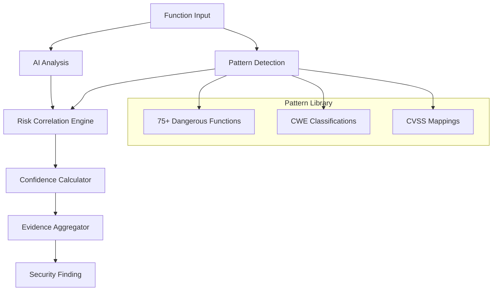
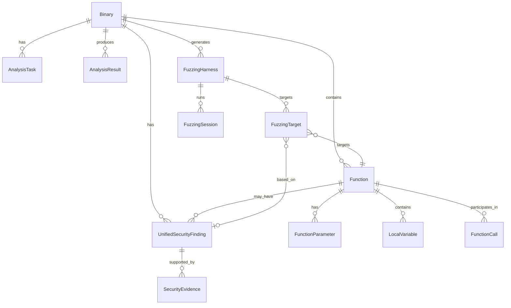
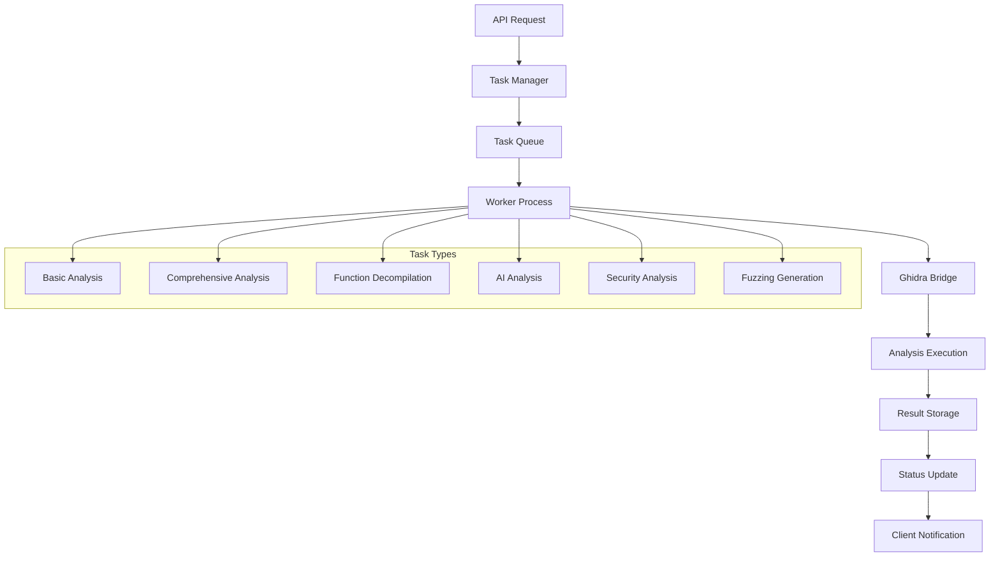
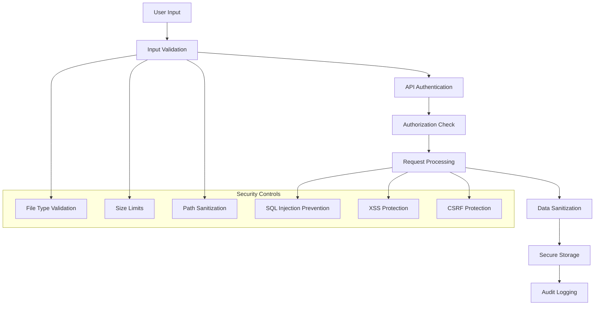
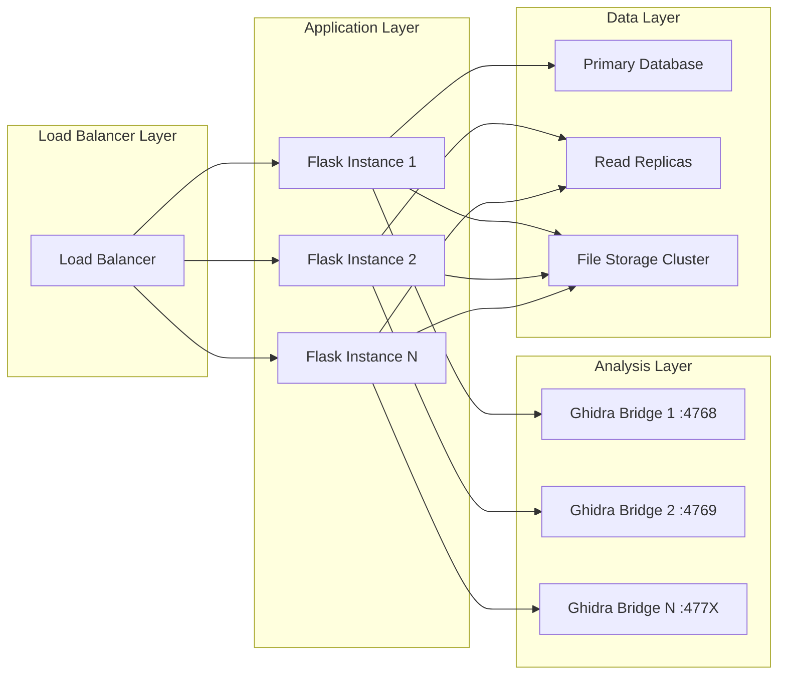
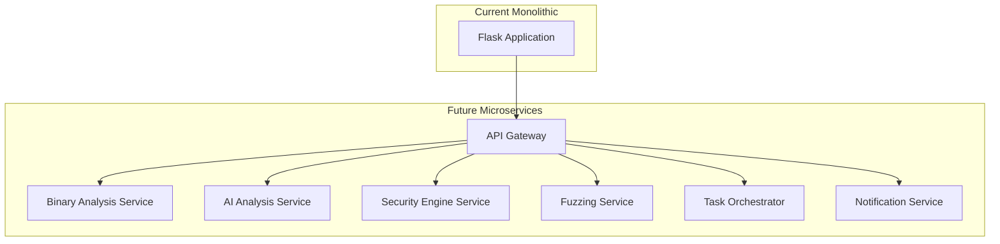

# System Architecture

## 🏗️ ShadowSeek System Architecture Overview

ShadowSeek is built on a modern, scalable architecture that combines powerful static analysis tools with AI-enhanced security capabilities. The platform follows a microservices-inspired design with clear separation of concerns and professional-grade component integration.

---

## 🌐 **High-Level Architecture**

### **System Topology**


### **Component Interaction Flow**


---

## 🎯 **Core Components**

### **1. Frontend Layer (React + TypeScript)**

#### **Technology Stack**
- **Framework**: React 18 with TypeScript
- **UI Library**: Material-UI (MUI) v5
- **Routing**: React Router v6
- **State Management**: React Hooks (useState, useEffect, useContext)
- **HTTP Client**: Fetch API with custom utility functions
- **Build Tool**: Create React App with TypeScript template

#### **Component Architecture**
```
src/
├── components/
│   ├── Dashboard.tsx                    # Main binary management interface
│   ├── BinaryDetails.tsx               # Comprehensive binary analysis view
│   ├── FunctionDetailModal.tsx         # Function-specific analysis modal
│   ├── UnifiedSecurityDashboard.tsx    # Security analysis interface
│   ├── FuzzingDashboard.tsx            # Fuzzing harness management
│   ├── DocumentationViewer.tsx         # Integrated documentation system
│   ├── TaskProgress.tsx                # Real-time task monitoring
│   ├── SystemManagement.tsx            # System administration
│   └── Configuration.tsx               # System configuration
├── utils/
│   └── api.ts                          # API client utilities
├── types/
│   └── cytoscape-extensions.d.ts       # TypeScript definitions
├── App.tsx                             # Main application component
└── index.tsx                           # Application entry point
```

#### **Navigation Architecture**
```typescript
const NavigationStructure = {
  primary: [
    { path: '/', label: 'Dashboard', component: 'Dashboard' },
    { path: '/upload', label: 'Upload', component: 'FileUpload' },
    { path: '/comparison', label: 'Compare', component: 'BinaryComparison' },
    { path: '/vulnerabilities', label: 'Security Hub', component: 'VulnerabilityDashboard' },
    { path: '/fuzzing', label: 'Fuzzing', component: 'FuzzingDashboard' },
    { path: '/docs', label: 'Docs', component: 'DocumentationViewer' },
    { path: '/config', label: 'Config', component: 'Configuration' },
    { path: '/system', label: 'System', component: 'SystemManagement' }
  ],
  binary_specific: [
    { path: '/binary/:binaryId', component: 'BinaryDetails' }
  ]
};
```

### **2. Backend Layer (Flask + SQLAlchemy)**

#### **Technology Stack**
- **Framework**: Flask 2.3 with Blueprints
- **ORM**: SQLAlchemy 2.0 with declarative models
- **Database**: SQLite (development) / PostgreSQL (production)
- **Task Management**: Custom background task system
- **API Documentation**: Swagger/OpenAPI integration
- **Logging**: Python logging with structured output

#### **Service Architecture**
```
flask_app/
├── __init__.py                         # Application factory
├── app.py                              # Main application entry
├── routes.py                           # REST API endpoints (3,200+ lines)
├── models.py                           # Database models and relationships
├── config.py                           # Configuration management
├── ai_service.py                       # AI provider integration
├── task_manager.py                     # Background task orchestration
├── ghidra_bridge_manager.py            # Ghidra Bridge communication
├── unified_security_analyzer.py        # Security analysis engine
├── fuzzing_harness_generator.py        # Fuzzing harness creation
├── vulnerability_engine.py             # Vulnerability pattern detection
├── simple_security_analyzer.py         # Basic security analysis
└── swagger_api.py                      # API documentation
```

#### **API Design Patterns**
```python
# RESTful endpoint structure
@api_bp.route('/binaries', methods=['GET', 'POST'])
@api_bp.route('/binaries/<binary_id>', methods=['GET', 'DELETE'])
@api_bp.route('/binaries/<binary_id>/analyze', methods=['POST'])
@api_bp.route('/binaries/<binary_id>/functions', methods=['GET'])
@api_bp.route('/functions/<function_id>/decompile', methods=['POST'])
@api_bp.route('/functions/<function_id>/explain', methods=['POST'])
@api_bp.route('/functions/<function_id>/security-analysis', methods=['POST'])
@api_bp.route('/binaries/<binary_id>/generate-fuzzing-harness', methods=['POST'])

# Consistent response format
def api_response(data=None, message=None, status=200):
    return jsonify({
        'success': status < 400,
        'data': data,
        'message': message,
        'timestamp': datetime.utcnow().isoformat()
    }), status
```

### **3. Analysis Layer (Ghidra Integration)**

#### **Ghidra Bridge Architecture**


#### **Analysis Scripts**
```
analysis_scripts/
├── analyze_functions.py                # Basic function analysis
├── bulk_decompile_functions.py         # Batch decompilation
├── comprehensive_analysis_direct.py    # Complete binary analysis (7.9KB)
├── decompile_function.py               # Single function decompilation
├── quick_analysis.py                   # Fast overview analysis
└── simple_analysis.py                  # Minimal analysis
```

#### **Bridge Communication Protocol**
```python
class GhidraBridgeManager:
    def execute_script(self, project_name, script_path, args=None, binary_path=None):
        """Execute Python script in Ghidra's Jython environment"""
        # Convert script path to absolute path
        script_path = os.path.abspath(script_path)
        
        # Add script directory to Ghidra script path
        script_dir = os.path.dirname(script_path)
        self.bridge.remote_eval(f"import sys; sys.path.append(r'{script_dir}')")
        
        # Execute the script in Ghidra's Jython environment
        import_cmd = f"exec(open(r'{script_path}').read())"
        result = self.bridge.remote_eval(import_cmd)
        
        return {"success": True, "result": result}
```

### **4. AI Integration Layer**

#### **Multi-Provider Architecture**
```python
class AIService:
    def __init__(self):
        self.providers = {
            'openai': OpenAIProvider(),
            'anthropic': AnthropicProvider(),
            'custom': CustomModelProvider()
        }
        
    def analyze_function(self, function_code, context):
        provider = self.get_active_provider()
        return provider.analyze_function(function_code, context)
```

#### **Security-Enhanced Prompts**
```python
SECURITY_ANALYSIS_PROMPT = """
You are a security expert analyzing a decompiled function for vulnerabilities.

Function: {function_name}
Address: {function_address}
Code:
{decompiled_code}

Analyze this function for security vulnerabilities focusing on:
1. Buffer overflows (strcpy, strcat, sprintf, gets, memcpy)
2. Format string vulnerabilities (printf family functions)
3. Input validation issues
4. Memory management problems
5. Integer overflow/underflow conditions

Provide your analysis in JSON format:
{
  "summary": "Brief security assessment",
  "risk_score": 0-100,
  "vulnerabilities": [list of identified issues],
  "confidence": 0-100,
  "recommendations": "Remediation suggestions"
}
"""
```

### **5. Security Analysis Engine**

#### **Unified Security Architecture**


#### **Vulnerability Pattern Database**
```python
DANGEROUS_FUNCTION_PATTERNS = {
    'buffer_overflow': {
        'functions': ['strcpy', 'strcat', 'sprintf', 'gets', 'memcpy'],
        'regex_patterns': [
            r'strcpy\s*\(',
            r'strcat\s*\(',
            r'sprintf\s*\(',
            r'gets\s*\(',
            r'memcpy\s*\('
        ],
        'cwe_id': 'CWE-120',
        'severity': 'HIGH',
        'confidence_base': 0.8
    },
    'format_string': {
        'functions': ['printf', 'sprintf', 'fprintf', 'snprintf'],
        'regex_patterns': [
            r'printf\s*\([^,]*[^"]',
            r'sprintf\s*\([^,]*,[^,]*[^"]',
            r'fprintf\s*\([^,]*,[^,]*[^"]'
        ],
        'cwe_id': 'CWE-134',
        'severity': 'HIGH',
        'confidence_base': 0.75
    }
    # ... 75+ total patterns
}
```

### **6. Fuzzing Harness Generator**

#### **Multi-Fuzzer Support Architecture**
```python
class FuzzingHarnessGenerator:
    def __init__(self):
        self.supported_fuzzers = {
            'AFL++': AFLPlusPlusGenerator(),
            'AFL': AFLGenerator(),
            'LibFuzzer': LibFuzzerGenerator(),
            'Honggfuzz': HonggfuzzGenerator()
        }
        
    def generate_harness(self, binary, targets, fuzzer_type):
        generator = self.supported_fuzzers[fuzzer_type]
        return generator.create_harness(binary, targets)
```

#### **Intelligent Target Selection**
```python
def _find_fuzzing_candidates(self, binary, min_risk_score, target_severities):
    """Find high-value fuzzing targets using AI and pattern analysis"""
    
    # Get security findings for prioritization
    security_findings = UnifiedSecurityFinding.query.filter_by(
        binary_id=binary.id
    ).filter(
        UnifiedSecurityFinding.confidence >= min_risk_score,
        UnifiedSecurityFinding.severity.in_(target_severities)
    ).all()
    
    candidates = []
    for finding in security_findings:
        function = Function.query.get(finding.function_id)
        candidate = FuzzingCandidate(
            function=function,
            security_finding=finding,
            risk_score=finding.confidence,
            severity=finding.severity,
            rationale=self._generate_rationale(finding, function),
            input_strategy=self._determine_input_strategy(function),
            priority=self._calculate_priority(finding, function)
        )
        candidates.append(candidate)
    
    return sorted(candidates, key=lambda x: (x.priority, x.risk_score), reverse=True)
```

---

## 💾 **Data Architecture**

### **Database Schema Design**

#### **Core Entity Relationships**


#### **Primary Tables**
```sql
-- Core binary information
CREATE TABLE binaries (
    id VARCHAR PRIMARY KEY,
    filename VARCHAR NOT NULL,
    original_filename VARCHAR NOT NULL,
    file_path VARCHAR NOT NULL,
    file_size INTEGER NOT NULL,
    file_hash VARCHAR UNIQUE,
    mime_type VARCHAR,
    analysis_status VARCHAR DEFAULT 'uploaded',
    upload_date TIMESTAMP DEFAULT CURRENT_TIMESTAMP,
    ai_summary TEXT
);

-- Function analysis data
CREATE TABLE functions (
    id INTEGER PRIMARY KEY AUTOINCREMENT,
    binary_id VARCHAR NOT NULL,
    name VARCHAR NOT NULL,
    address VARCHAR NOT NULL,
    size INTEGER,
    decompiled_code TEXT,
    ai_summary TEXT,
    risk_score FLOAT DEFAULT 0.0,
    is_external BOOLEAN DEFAULT FALSE,
    decompiled BOOLEAN DEFAULT FALSE,
    ai_analyzed BOOLEAN DEFAULT FALSE,
    FOREIGN KEY (binary_id) REFERENCES binaries(id)
);

-- Unified security findings
CREATE TABLE unified_security_findings (
    id INTEGER PRIMARY KEY AUTOINCREMENT,
    binary_id VARCHAR NOT NULL,
    function_id INTEGER,
    title VARCHAR NOT NULL,
    description TEXT,
    severity VARCHAR NOT NULL,
    confidence FLOAT NOT NULL,
    cwe_id VARCHAR,
    cvss_score FLOAT,
    ai_analysis TEXT,
    detection_methods TEXT,
    created_at TIMESTAMP DEFAULT CURRENT_TIMESTAMP,
    FOREIGN KEY (binary_id) REFERENCES binaries(id),
    FOREIGN KEY (function_id) REFERENCES functions(id)
);

-- Security evidence trails
CREATE TABLE security_evidence (
    id INTEGER PRIMARY KEY AUTOINCREMENT,
    finding_id INTEGER NOT NULL,
    evidence_type VARCHAR NOT NULL,
    description TEXT NOT NULL,
    confidence_impact FLOAT,
    raw_data TEXT,
    FOREIGN KEY (finding_id) REFERENCES unified_security_findings(id)
);

-- Fuzzing harness information
CREATE TABLE fuzzing_harnesses (
    id INTEGER PRIMARY KEY AUTOINCREMENT,
    binary_id VARCHAR NOT NULL,
    name VARCHAR NOT NULL,
    description TEXT,
    harness_type VARCHAR NOT NULL,
    harness_code TEXT,
    makefile_content TEXT,
    readme_content TEXT,
    afl_config TEXT,
    confidence_score FLOAT,
    created_at TIMESTAMP DEFAULT CURRENT_TIMESTAMP,
    FOREIGN KEY (binary_id) REFERENCES binaries(id)
);

-- Fuzzing targets
CREATE TABLE fuzzing_targets (
    id INTEGER PRIMARY KEY AUTOINCREMENT,
    harness_id INTEGER NOT NULL,
    function_id INTEGER NOT NULL,
    security_finding_id INTEGER,
    priority INTEGER NOT NULL,
    rationale TEXT,
    risk_score FLOAT,
    severity VARCHAR,
    input_strategy VARCHAR,
    FOREIGN KEY (harness_id) REFERENCES fuzzing_harnesses(id),
    FOREIGN KEY (function_id) REFERENCES functions(id),
    FOREIGN KEY (security_finding_id) REFERENCES unified_security_findings(id)
);
```

### **File System Organization**
```
ShadowSeek/
├── uploads/                            # Binary file storage
│   ├── {uuid}_{filename}              # Uploaded binaries
│   └── temp/                          # Temporary processing files
├── logs/                              # System logging
│   ├── flask_app.log                 # Backend application logs
│   ├── ghidra_bridge.log             # Bridge communication logs
│   └── analysis_tasks.log            # Task execution logs
├── instance/                          # Flask instance folder
│   └── shadowseek.db                 # SQLite database file
└── temp/                              # Temporary analysis data
    ├── comprehensive_analysis_*.json  # Analysis result caches
    └── ghidra_projects/               # Temporary Ghidra project files
```

---

## 🔄 **Task Management System**

### **Background Processing Architecture**


### **Task Management Implementation**
```python
class TaskManager:
    def __init__(self):
        self.running_tasks = {}
        self.task_queue = []
        
    def start_task(self, task_type, binary_id, **kwargs):
        """Start a new background analysis task"""
        task_id = str(uuid.uuid4())
        
        # Create task record
        task = AnalysisTask(
            id=task_id,
            binary_id=binary_id,
            task_type=task_type,
            status='queued',
            parameters=kwargs
        )
        db.session.add(task)
        db.session.commit()
        
        # Execute in background thread
        thread = threading.Thread(
            target=self._run_task,
            args=(task_id, task_type, binary_id),
            kwargs=kwargs
        )
        thread.daemon = True
        thread.start()
        
        self.running_tasks[task_id] = thread
        return task_id
    
    def _run_task(self, task_id, task_type, binary_id, **kwargs):
        """Execute analysis task with error handling"""
        try:
            task = AnalysisTask.query.get(task_id)
            task.status = 'running'
            task.started_at = datetime.utcnow()
            db.session.commit()
            
            # Route to appropriate handler
            if task_type == 'comprehensive':
                self._run_comprehensive_analysis(binary_id, **kwargs)
            elif task_type == 'decompile_function':
                self._run_function_decompilation(kwargs['function_id'])
            elif task_type == 'ai_analysis':
                self._run_ai_analysis(kwargs['function_id'])
            elif task_type == 'security_analysis':
                self._run_security_analysis(binary_id, **kwargs)
            elif task_type == 'fuzzing_generation':
                self._run_fuzzing_generation(binary_id, **kwargs)
            
            task.status = 'completed'
            task.completed_at = datetime.utcnow()
            
        except Exception as e:
            task.status = 'failed'
            task.error_message = str(e)
            logger.error(f"Task {task_id} failed: {e}")
            
        finally:
            db.session.commit()
            if task_id in self.running_tasks:
                del self.running_tasks[task_id]
```

---

## 🔒 **Security Architecture**

### **Security Layers**


### **Security Implementation**
```python
# File upload security
def allowed_file(filename):
    """Validate uploaded file types"""
    ALLOWED_EXTENSIONS = {
        'exe', 'dll', 'sys', 'obj',  # Windows
        'so', 'elf', 'a', 'o',       # Linux
        'dylib', 'app', 'framework', # macOS
        'bin', 'hex', 'raw'          # Generic
    }
    return '.' in filename and \
           filename.rsplit('.', 1)[1].lower() in ALLOWED_EXTENSIONS

# Path sanitization
def secure_filename(filename):
    """Sanitize filename to prevent directory traversal"""
    filename = re.sub(r'[^\w\s-.]', '', filename).strip()
    filename = re.sub(r'[-\s]+', '-', filename)
    return filename[:255]  # Limit length

# SQL injection prevention (SQLAlchemy ORM)
def get_binary_safely(binary_id):
    """Safe database query using parameterized statements"""
    return Binary.query.filter(Binary.id == binary_id).first()

# API input validation
def validate_analysis_request(data):
    """Validate API request parameters"""
    schema = {
        'analysis_type': {'type': 'string', 'allowed': ['basic', 'comprehensive']},
        'parameters': {'type': 'dict', 'required': False}
    }
    return cerberus.Validator(schema).validate(data)
```

---

## 📈 **Scalability Design**

### **Horizontal Scaling Points**


### **Performance Optimization**

#### **Database Optimization**
```sql
-- Indexing strategy for performance
CREATE INDEX idx_binaries_status ON binaries(analysis_status);
CREATE INDEX idx_functions_binary_id ON functions(binary_id);
CREATE INDEX idx_functions_decompiled ON functions(decompiled);
CREATE INDEX idx_functions_ai_analyzed ON functions(ai_analyzed);
CREATE INDEX idx_security_findings_binary_id ON unified_security_findings(binary_id);
CREATE INDEX idx_security_findings_severity ON unified_security_findings(severity);
CREATE INDEX idx_security_findings_confidence ON unified_security_findings(confidence);
CREATE INDEX idx_fuzzing_harnesses_binary_id ON fuzzing_harnesses(binary_id);
CREATE INDEX idx_tasks_status ON analysis_tasks(status);
CREATE INDEX idx_tasks_created_at ON analysis_tasks(created_at);
```

#### **Caching Strategy**
```python
# Function decompilation caching
def get_cached_decompilation(function_id):
    """Check for cached decompilation results"""
    function = Function.query.get(function_id)
    if function and function.decompiled and function.decompiled_code:
        return function.decompiled_code
    return None

# AI analysis result caching
def get_cached_ai_analysis(function_id):
    """Check for cached AI analysis results"""
    function = Function.query.get(function_id)
    if function and function.ai_analyzed and function.ai_summary:
        return {
            'summary': function.ai_summary,
            'risk_score': function.risk_score,
            'cached': True
        }
    return None

# Binary analysis result caching
def get_cached_comprehensive_analysis(binary_id):
    """Check for cached comprehensive analysis results"""
    cache_file = f"temp/comprehensive_analysis_{binary_id}.json"
    if os.path.exists(cache_file):
        with open(cache_file, 'r') as f:
            return json.load(f)
    return None
```

---

## 🔧 **Deployment Architecture**

### **Development Environment**
```yaml
# Docker Compose for development
version: '3.8'
services:
  shadowseek-backend:
    build: .
    ports:
      - "5000:5000"
    environment:
      - FLASK_ENV=development
      - DATABASE_URL=sqlite:///shadowseek.db
    volumes:
      - ./uploads:/app/uploads
      - ./logs:/app/logs
    depends_on:
      - ghidra-bridge

  shadowseek-frontend:
    build: ./frontend
    ports:
      - "3000:3000"
    environment:
      - REACT_APP_API_URL=http://localhost:5000
    depends_on:
      - shadowseek-backend

  ghidra-bridge:
    image: ghidra:10.4
    ports:
      - "4768:4768"
    volumes:
      - ./ghidra_projects:/projects
    command: >
      bash -c "
        /opt/ghidra/support/analyzeHeadless /projects temp -import /dev/null -postScript ghidra_bridge_server_background.py
      "
```

### **Production Environment**
```yaml
# Production deployment configuration
version: '3.8'
services:
  nginx:
    image: nginx:alpine
    ports:
      - "80:80"
      - "443:443"
    volumes:
      - ./nginx.conf:/etc/nginx/nginx.conf
      - ./ssl:/etc/ssl
    depends_on:
      - shadowseek-backend

  shadowseek-backend:
    image: shadowseek:production
    environment:
      - FLASK_ENV=production
      - DATABASE_URL=postgresql://user:pass@db:5432/shadowseek
      - SECRET_KEY=${SECRET_KEY}
      - OPENAI_API_KEY=${OPENAI_API_KEY}
    volumes:
      - uploads:/app/uploads
      - logs:/app/logs
    depends_on:
      - db
      - redis

  db:
    image: postgres:15
    environment:
      - POSTGRES_DB=shadowseek
      - POSTGRES_USER=shadowseek
      - POSTGRES_PASSWORD=${DB_PASSWORD}
    volumes:
      - postgres_data:/var/lib/postgresql/data

  redis:
    image: redis:7-alpine
    volumes:
      - redis_data:/data

volumes:
  postgres_data:
  redis_data:
  uploads:
  logs:
```

---

## 📊 **Monitoring & Observability**

### **Logging Architecture**
```python
# Structured logging configuration
import logging
import sys
from datetime import datetime

class StructuredFormatter(logging.Formatter):
    def format(self, record):
        log_entry = {
            'timestamp': datetime.utcnow().isoformat(),
            'level': record.levelname,
            'logger': record.name,
            'message': record.getMessage(),
            'module': record.module,
            'function': record.funcName,
            'line': record.lineno
        }
        
        if hasattr(record, 'binary_id'):
            log_entry['binary_id'] = record.binary_id
        if hasattr(record, 'task_id'):
            log_entry['task_id'] = record.task_id
        if hasattr(record, 'user_id'):
            log_entry['user_id'] = record.user_id
            
        return json.dumps(log_entry)

# Configure logging
logging.basicConfig(
    level=logging.INFO,
    format='%(asctime)s - %(name)s - %(levelname)s - %(message)s',
    handlers=[
        logging.FileHandler('logs/flask_app.log'),
        logging.StreamHandler(sys.stdout)
    ]
)
```

### **Health Monitoring**
```python
@api_bp.route('/health', methods=['GET'])
def health_check():
    """Comprehensive system health check"""
    health_status = {
        'status': 'healthy',
        'timestamp': datetime.utcnow().isoformat(),
        'services': {}
    }
    
    # Database connectivity
    try:
        db.session.execute('SELECT 1')
        health_status['services']['database'] = 'healthy'
    except Exception as e:
        health_status['services']['database'] = f'unhealthy: {str(e)}'
        health_status['status'] = 'degraded'
    
    # Ghidra Bridge connectivity
    try:
        bridge_status = current_app.ghidra_bridge_manager.get_bridge_status()
        if bridge_status.get('connected'):
            health_status['services']['ghidra_bridge'] = 'healthy'
        else:
            health_status['services']['ghidra_bridge'] = 'unhealthy'
            health_status['status'] = 'degraded'
    except Exception as e:
        health_status['services']['ghidra_bridge'] = f'unhealthy: {str(e)}'
        health_status['status'] = 'degraded'
    
    # AI Service connectivity
    try:
        ai_service = current_app.ai_service
        test_result = ai_service.test_connection()
        if test_result.get('success'):
            health_status['services']['ai_service'] = 'healthy'
        else:
            health_status['services']['ai_service'] = 'degraded'
    except Exception as e:
        health_status['services']['ai_service'] = f'unhealthy: {str(e)}'
        health_status['status'] = 'degraded'
    
    status_code = 200 if health_status['status'] == 'healthy' else 503
    return jsonify(health_status), status_code
```

---

## 🔮 **Future Architecture Considerations**

### **Microservices Migration Path**


### **Cloud-Native Considerations**
- **Container Orchestration**: Kubernetes deployment with autoscaling
- **Service Mesh**: Istio for service-to-service communication
- **Message Queue**: Apache Kafka for asynchronous task processing
- **Distributed Storage**: MinIO or AWS S3 for binary file storage
- **Monitoring**: Prometheus + Grafana for metrics and alerting
- **Tracing**: Jaeger for distributed request tracing

### **Performance Enhancements**
- **Caching Layer**: Redis for function analysis result caching
- **CDN Integration**: CloudFront for static asset delivery
- **Database Optimization**: Read replicas and connection pooling
- **Async Processing**: Celery with Redis/RabbitMQ for background tasks
- **GPU Acceleration**: CUDA support for AI model inference

---

ShadowSeek's architecture is designed for enterprise-scale binary security analysis with professional-grade reliability, security, and performance. The modular design enables easy extension and scaling as requirements evolve. 