# Workflow Diagrams

## 🔄 **Complete Analysis Workflow**

### **End-to-End Binary Analysis Process**
```mermaid
graph TB
    subgraph "User Interaction"
        U1[User Selects Binary]
        U2[Configure Analysis]
        U3[Review Results]
        U4[Generate Report]
    end
    
    subgraph "Upload & Validation"
        V1[File Upload]
        V2[Security Validation]
        V3[File Type Check]
        V4[Store Binary]
    end
    
    subgraph "Basic Analysis"
        A1[Load Binary]
        A2[Extract Metadata]
        A3[Discover Functions]
        A4[Identify Imports/Exports]
        A5[Extract Strings]
    end
    
    subgraph "Decompilation Pipeline"
        D1[Queue Decompilation]
        D2[Ghidra Analysis]
        D3[Function Decompilation]
        D4[Code Quality Assessment]
        D5[Store Decompiled Code]
    end
    
    subgraph "AI Analysis Pipeline"
        AI1[Queue AI Analysis]
        AI2[Generate Prompts]
        AI3[Call AI Provider]
        AI4[Parse AI Response]
        AI5[Store AI Results]
    end
    
    subgraph "Security Analysis"
        S1[Pattern Detection]
        S2[AI Security Analysis]
        S3[Vulnerability Validation]
        S4[Risk Assessment]
        S5[Generate Findings]
    end
    
    subgraph "Fuzzing Pipeline"
        F1[Generate Harnesses]
        F2[Configure Fuzzers]
        F3[Execute Fuzzing]
        F4[Analyze Crashes]
        F5[Update Findings]
    end
    
    subgraph "Reporting & Output"
        R1[Consolidate Results]
        R2[Generate Reports]
        R3[Create Dashboards]
        R4[Send Alerts]
    end
    
    U1 --> V1
    U2 --> V2
    V1 --> V2
    V2 --> V3
    V3 --> V4
    
    V4 --> A1
    A1 --> A2
    A2 --> A3
    A3 --> A4
    A4 --> A5
    
    A5 --> D1
    D1 --> D2
    D2 --> D3
    D3 --> D4
    D4 --> D5
    
    D5 --> AI1
    AI1 --> AI2
    AI2 --> AI3
    AI3 --> AI4
    AI4 --> AI5
    
    AI5 --> S1
    S1 --> S2
    S2 --> S3
    S3 --> S4
    S4 --> S5
    
    S5 --> F1
    F1 --> F2
    F2 --> F3
    F3 --> F4
    F4 --> F5
    
    F5 --> R1
    R1 --> R2
    R2 --> R3
    R3 --> R4
    
    R4 --> U3
    U3 --> U4
    
    style U1 fill:#e1f5fe
    style U2 fill:#e1f5fe
    style U3 fill:#e1f5fe
    style U4 fill:#e1f5fe
    style V4 fill:#e8f5e8
    style A5 fill:#e8f5e8
    style D5 fill:#e8f5e8
    style AI5 fill:#e8f5e8
    style S5 fill:#e8f5e8
    style F5 fill:#e8f5e8
    style R4 fill:#e8f5e8
```

---

## 📥 **Binary Upload Workflow**

### **Secure Binary Upload Process**
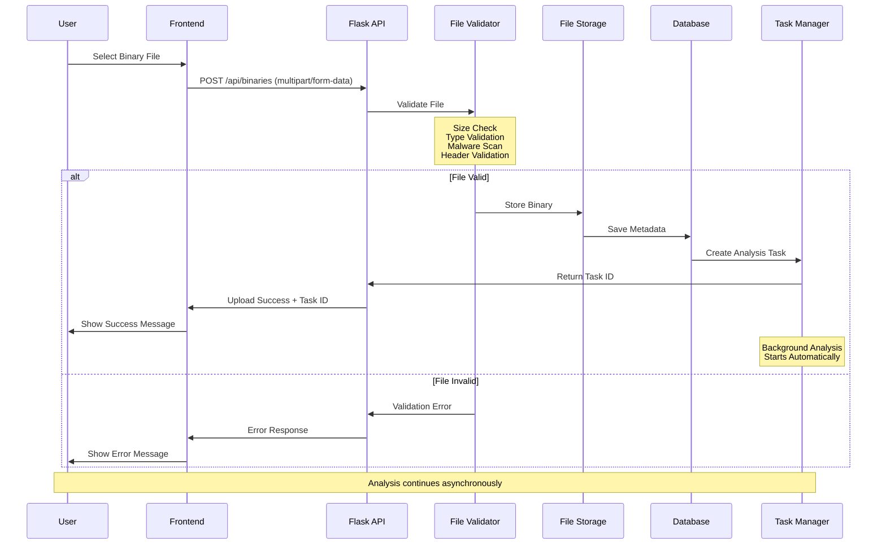

### **File Validation Decision Tree**
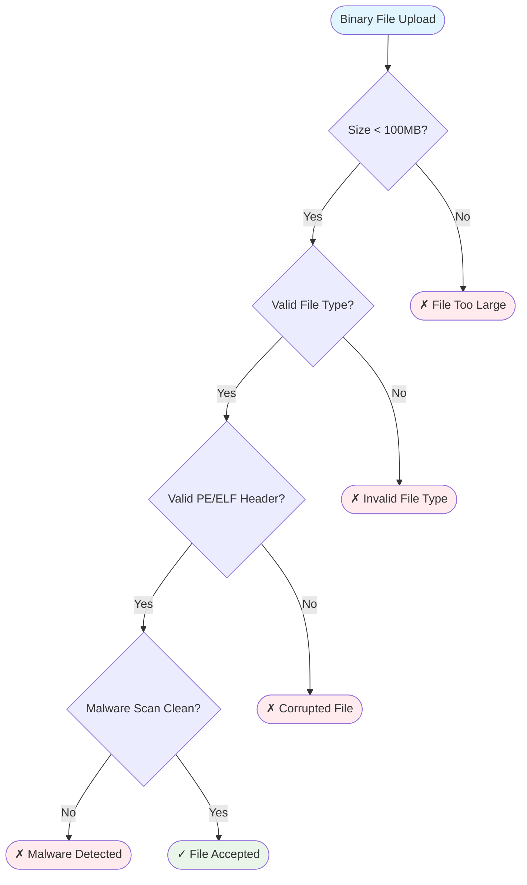

---

## 🔍 **Function Analysis Workflow**

### **Function-Level Analysis Pipeline**
```mermaid
graph TB
    subgraph "Function Discovery"
        FD1[Binary Loaded in Ghidra]
        FD2[Auto-Analysis Complete]
        FD3[Extract Function List]
        FD4[Function Metadata]
    end
    
    subgraph "Decompilation Process"
        DC1[Select Function]
        DC2[Check Cache]
        DC3[Ghidra Decompile]
        DC4[Quality Assessment]
        DC5[Store Results]
    end
    
    subgraph "AI Analysis Process"
        AI1[Prepare Code Context]
        AI2[Generate AI Prompt]
        AI3[Call AI Provider]
        AI4[Parse Response]
        AI5[Extract Insights]
    end
    
    subgraph "Security Analysis"
        SA1[Pattern Matching]
        SA2[Vulnerability Detection]
        SA3[Risk Scoring]
        SA4[Evidence Collection]
        SA5[Generate Finding]
    end
    
    subgraph "Results Integration"
        RI1[Combine Analyses]
        RI2[Update Database]
        RI3[Cache Results]
        RI4[Notify Frontend]
    end
    
    FD1 --> FD2
    FD2 --> FD3
    FD3 --> FD4
    
    FD4 --> DC1
    DC1 --> DC2
    DC2 -->|Cache Hit| DC5
    DC2 -->|Cache Miss| DC3
    DC3 --> DC4
    DC4 --> DC5
    
    DC5 --> AI1
    AI1 --> AI2
    AI2 --> AI3
    AI3 --> AI4
    AI4 --> AI5
    
    AI5 --> SA1
    SA1 --> SA2
    SA2 --> SA3
    SA3 --> SA4
    SA4 --> SA5
    
    SA5 --> RI1
    RI1 --> RI2
    RI2 --> RI3
    RI3 --> RI4
    
    style FD4 fill:#e8f5e8
    style DC5 fill:#e8f5e8
    style AI5 fill:#e8f5e8
    style SA5 fill:#e8f5e8
    style RI4 fill:#e8f5e8
```

### **Decompilation Quality Assessment**
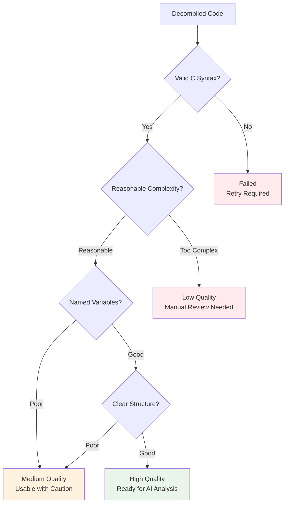

---

## 🤖 **AI Analysis Workflow**

### **AI-Powered Security Analysis**
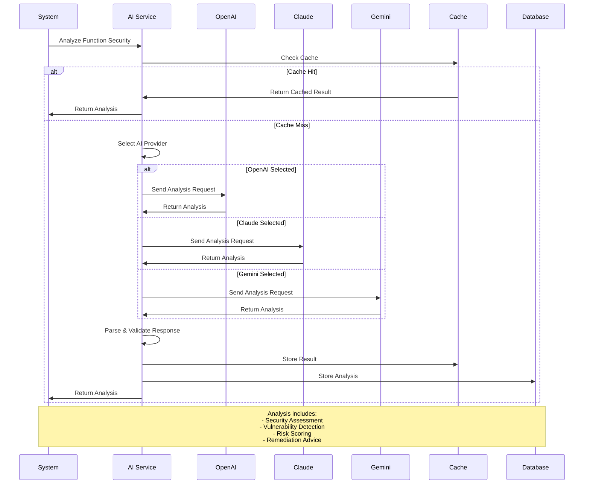

### **AI Provider Selection Logic**
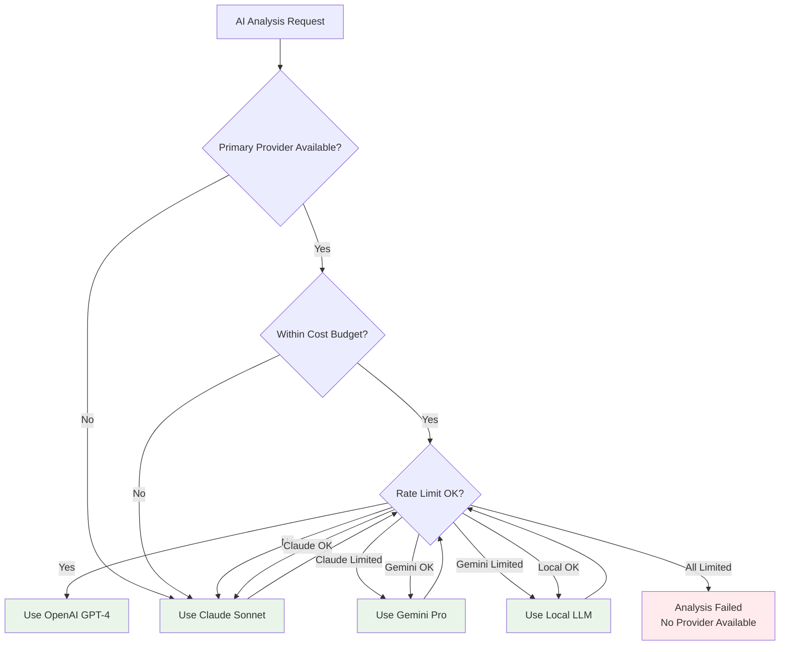

---

## 🛡️ **Security Analysis Workflow**

### **Unified Security Analysis Pipeline**
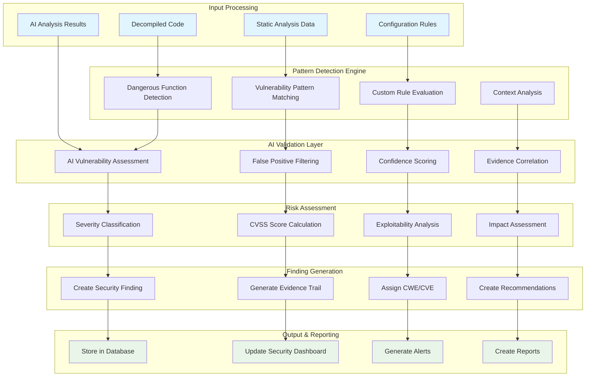

### **Vulnerability Detection Decision Tree**
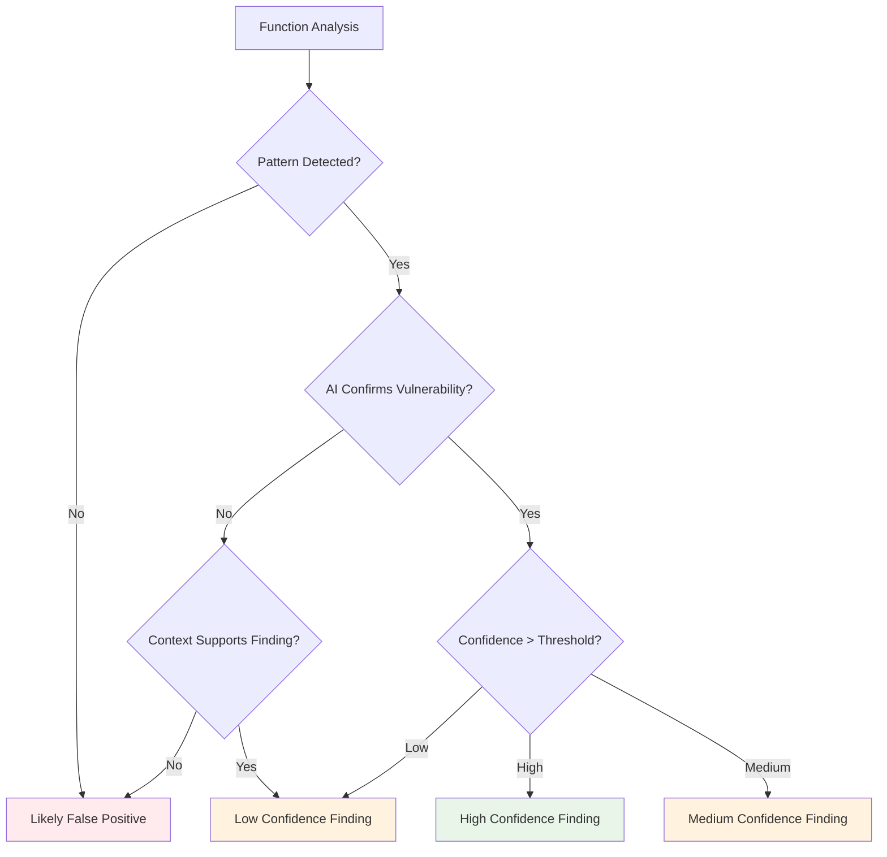

---

## 🎯 **Fuzzing Campaign Workflow**

### **Complete Fuzzing Pipeline**
```mermaid
graph TB
    subgraph "Campaign Setup"
        CS1[Define Campaign]
        CS2[Select Target Functions]
        CS3[Configure Fuzzing Engines]
        CS4[Set Duration & Resources]
    end
    
    subgraph "Harness Generation"
        HG1[Analyze Target Functions]
        HG2[Generate AI Harnesses]
        HG3[Create Template Harnesses]
        HG4[Validate & Compile]
    end
    
    subgraph "Corpus Generation"
        CG1[Analyze Input Requirements]
        CG2[Generate Basic Seeds]
        CG3[AI-Assisted Seed Creation]
        CG4[Optimize Corpus]
    end
    
    subgraph "Fuzzing Execution"
        FE1[Initialize Fuzzing Engines]
        FE2[Start Parallel Fuzzing]
        FE3[Monitor Progress]
        FE4[Collect Crashes]
    end
    
    subgraph "Crash Analysis"
        CA1[Triage Crashes]
        CA2[Deduplicate Crashes]
        CA3[Analyze with AI]
        CA4[Assess Exploitability]
    end
    
    subgraph "Results & Reporting"
        RR1[Generate Campaign Report]
        RR2[Update Security Findings]
        RR3[Create Fuzzing Dashboard]
        RR4[Send Notifications]
    end
    
    CS1 --> CS2
    CS2 --> CS3
    CS3 --> CS4
    
    CS4 --> HG1
    HG1 --> HG2
    HG2 --> HG3
    HG3 --> HG4
    
    HG4 --> CG1
    CG1 --> CG2
    CG2 --> CG3
    CG3 --> CG4
    
    CG4 --> FE1
    FE1 --> FE2
    FE2 --> FE3
    FE3 --> FE4
    
    FE4 --> CA1
    CA1 --> CA2
    CA2 --> CA3
    CA3 --> CA4
    
    CA4 --> RR1
    RR1 --> RR2
    RR2 --> RR3
    RR3 --> RR4
    
    style CS4 fill:#e8f5e8
    style HG4 fill:#e8f5e8
    style CG4 fill:#e8f5e8
    style FE4 fill:#e8f5e8
    style CA4 fill:#e8f5e8
    style RR4 fill:#e8f5e8
```

### **Fuzzing Engine Coordination**
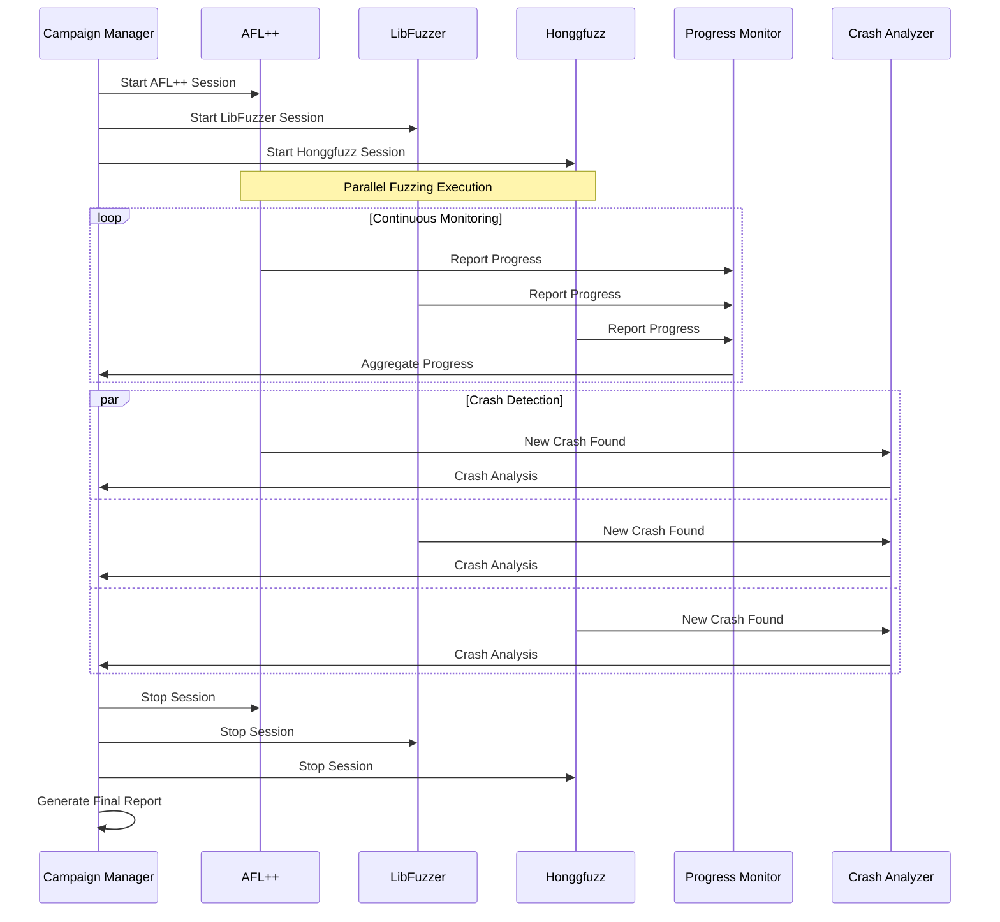

---

## 📊 **Task Management Workflow**

### **Asynchronous Task Execution**
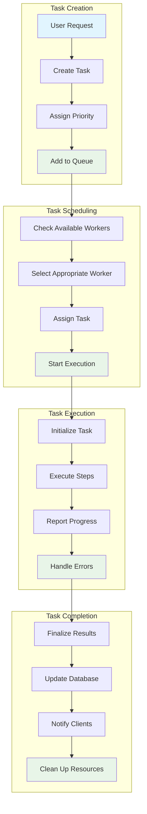

### **Task Priority Management**
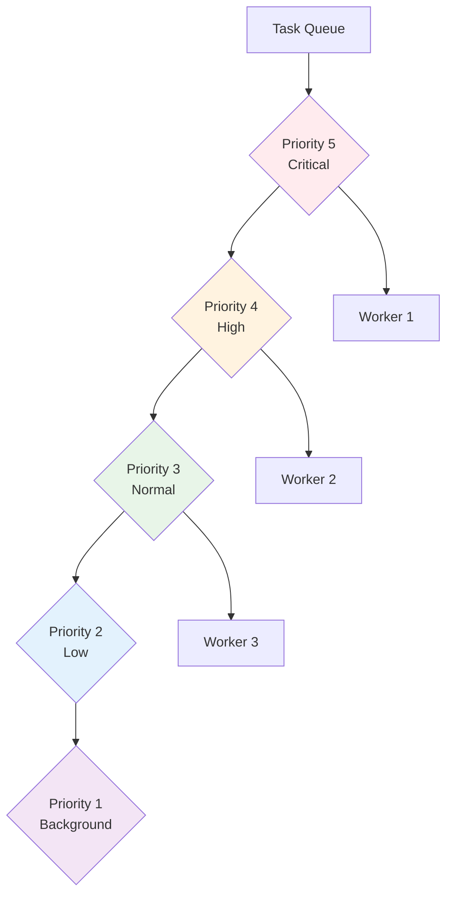

---

## 🔄 **Real-time Update Workflow**

### **WebSocket Communication Flow**
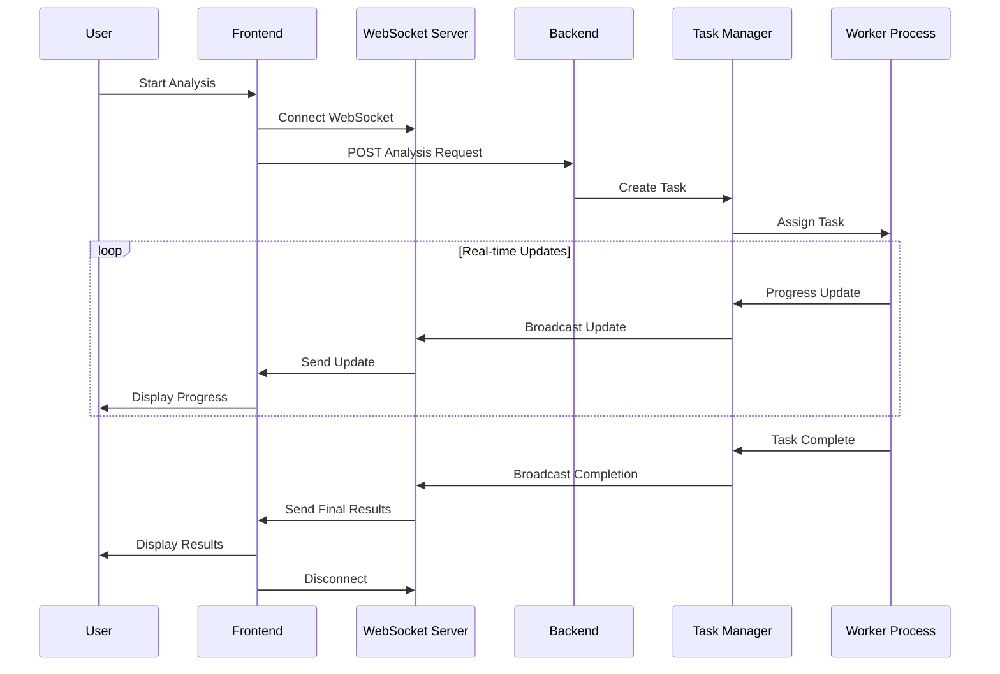

### **Event-Driven Architecture**
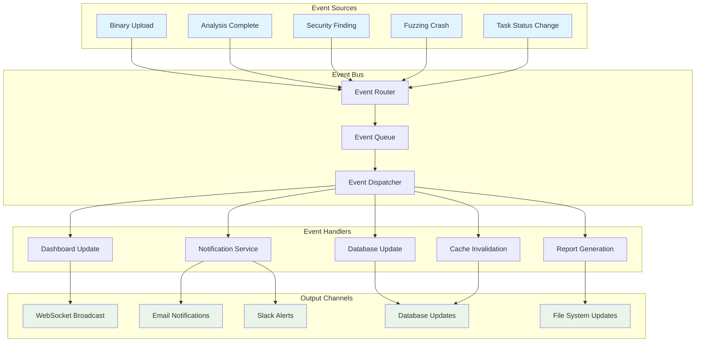

---

## 📈 **Performance Optimization Workflow**

### **Analysis Performance Pipeline**
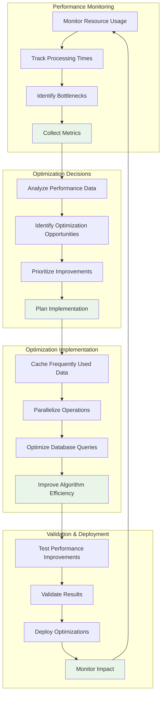

---

## 🔐 **Security Review Workflow**

### **Security Finding Review Process**
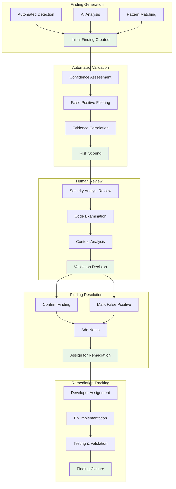

---

## 📊 **Reporting Workflow**

### **Comprehensive Report Generation**
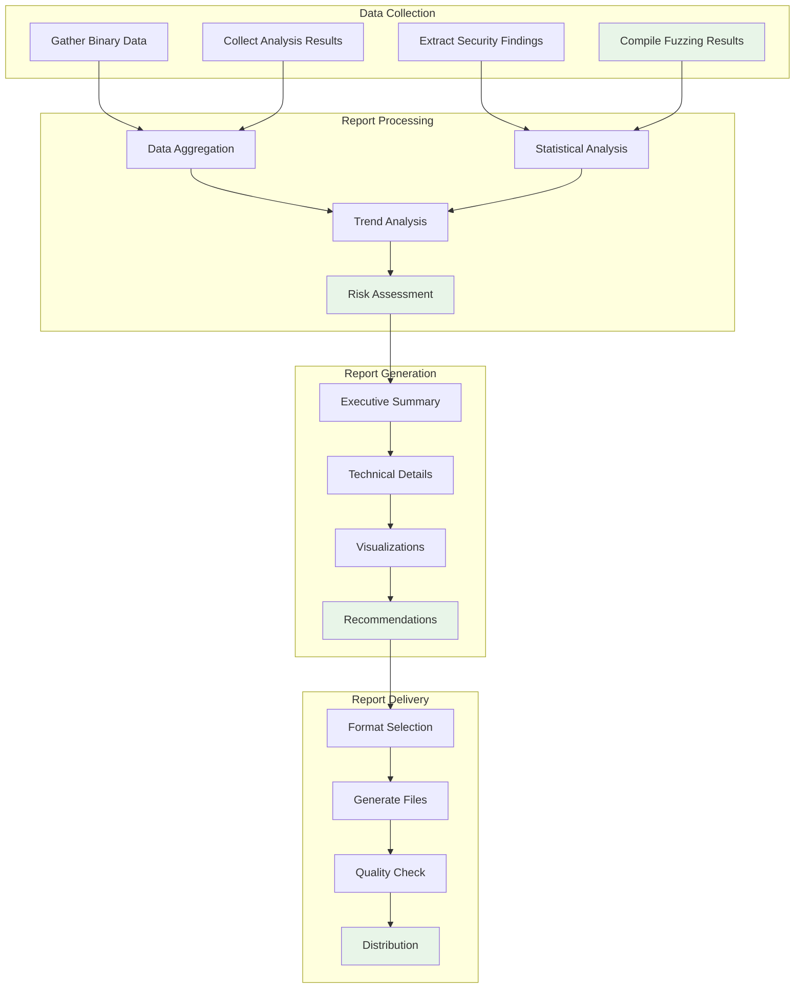

---

## 🎯 **Workflow Integration Points**

### **Key Integration Points**
1. **API Gateway**: All workflows integrate through the REST API
2. **Database Layer**: Central storage for all workflow data
3. **Task Manager**: Coordinates asynchronous operations
4. **Event Bus**: Enables real-time communication
5. **Cache Layer**: Optimizes performance across workflows
6. **Logging System**: Provides audit trails for all operations

### **Workflow Dependencies**
- **Binary Upload** → **Analysis** → **Decompilation** → **AI Analysis** → **Security Analysis** → **Fuzzing**
- **Security Findings** → **Review Process** → **Remediation** → **Verification**
- **Task Creation** → **Execution** → **Monitoring** → **Completion** → **Reporting**

---

The ShadowSeek workflow diagrams provide a comprehensive view of how the system orchestrates complex binary analysis operations, from initial upload through final reporting, ensuring efficient and reliable processing of security assessments. 