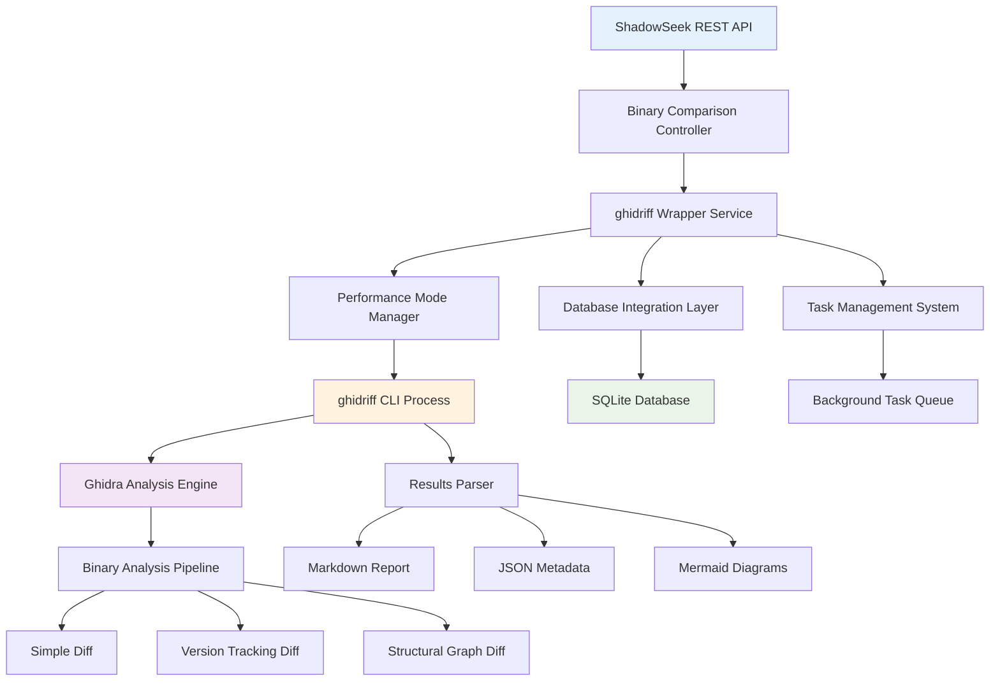

# Binary Differential Analysis Engine

## Acknowledgments & Credits

ShadowSeek's binary comparison capabilities are powered by **[ghidriff](https://github.com/clearbluejar/ghidriff)**, an exceptional open-source binary diffing engine created by **[@clearbluejar](https://clearbluejar.github.io/)** ([@clearbluejar on X/Twitter](https://x.com/clearbluejar)).

**ghidriff** is a powerful command-line binary diffing engine built on top of **Ghidra**, the NSA's flagship software reverse engineering framework. We extend our sincere gratitude to the original authors for their outstanding work and contribution to the reverse engineering community.

**Key Technologies:**
- **ghidriff**: Binary diffing engine (BSD 3-Clause License)
- **Ghidra**: NSA's Software Reverse Engineering Framework
- **Original Repository**: [github.com/clearbluejar/ghidriff](https://github.com/clearbluejar/ghidriff)
- **Documentation**: [clearbluejar.github.io](https://clearbluejar.github.io/)

## System Architecture

ShadowSeek integrates ghidriff through a sophisticated wrapper architecture that provides enterprise-grade features while maintaining the core functionality of the original tool:



## Technical Implementation Details

### Core Integration Components

1. **ghidriff Wrapper Service** (`analysis_scripts/ghidriff_simple_wrapper.py`)
   - **Purpose**: Bridges ShadowSeek's REST API with ghidriff's command-line interface
   - **Features**: Process management, timeout handling, result parsing, database integration
   - **Performance Optimization**: Dynamic JVM tuning, memory management, multi-threading support

2. **Command Execution Engine**
   ```python
   # Example ghidriff command execution
   ghidriff_cmd = [
       "python", "-m", "ghidriff", 
       binary1_path, binary2_path,
       "--engine", diff_type,
       "--output-dir", results_dir,
       "--project-location", project_dir,
       "--log-level", "INFO"
   ]
   ```

3. **Performance Mode Configuration**
   - **Speed Mode**: Optimized for quick comparisons with reduced analysis depth
   - **Balanced Mode**: Standard analysis with reasonable performance/accuracy trade-off  
   - **Accuracy Mode**: Deep analysis with maximum precision and detail

### Supported Diff Types

| Diff Type | Description | ghidriff Engine | Use Case |
|-----------|-------------|-----------------|----------|
| **Simple** | Basic function-level comparison | `SimpleDiff` | Quick version comparisons |
| **Version Tracking** | Advanced version tracking analysis | `VersionTrackingDiff` | Detailed change tracking |
| **Structural Graph** | Graph-based structural analysis | `StructuralGraphDiff` | Architecture comparisons |

### JVM & Memory Optimization

Our implementation includes intelligent JVM tuning for optimal performance:

```python
# Dynamic JVM argument generation
jvm_args = [
    f"-Xmx{max_memory}g",      # Maximum heap size
    f"-Xms{initial_memory}g",   # Initial heap size  
    "-XX:+UseG1GC",            # G1 Garbage Collector
    "-XX:MaxGCPauseMillis=200", # GC pause time limit
    "-Dghidra.analysis.timeout=1800"  # Analysis timeout
]
```

**Memory allocation strategy:**
- **Speed Mode**: 4GB heap, simplified analysis
- **Balanced Mode**: 6GB heap, standard features
- **Accuracy Mode**: 8GB heap, comprehensive analysis

### Result Processing Pipeline

1. **Raw Output Collection**
   - Markdown reports (`.ghidriff.md`)
   - JSON metadata files
   - Ghidra project artifacts
   - Analysis logs and statistics

2. **Content Parsing & Enhancement**
   - Markdown content extraction and validation
   - Mermaid diagram detection and rendering
   - Function statistics calculation
   - Performance metrics aggregation

3. **Database Integration**
   - Automatic result persistence
   - Metadata indexing for search
   - Historical comparison tracking
   - Task status management

### Error Handling & Resilience

- **Timeout Management**: Configurable timeouts per performance mode
- **Process Monitoring**: Real-time process health checking
- **Graceful Degradation**: Partial results on analysis failures
- **Resource Cleanup**: Automatic cleanup of temporary files and processes

### Security & Isolation

- **Process Sandboxing**: ghidriff runs in isolated subprocess
- **Resource Limits**: Memory and CPU usage constraints
- **File System Security**: Controlled access to analysis directories
- **Input Validation**: Binary file validation before analysis

## API Integration Points

### Primary Endpoints
- `POST /api/analysis/diff` - Initiate binary comparison
- `GET /api/analysis/diff/{task_id}` - Monitor comparison progress
- `GET /api/analysis/results` - List historical comparisons
- `DELETE /api/analysis/results/{result_id}` - Clean up old results

### Performance Monitoring
- Real-time progress tracking via task management system
- Execution time metrics and performance analytics
- Resource utilization monitoring (CPU, memory, disk I/O)
- Success/failure rate statistics

## Usage Patterns & Best Practices

### Recommended Workflows

1. **Quick Version Comparison**
   ```bash
   # Fast comparison for similar binaries
   curl -X POST "/api/analysis/diff" \
        -H "Content-Type: application/json" \
        -d '{"binary_id1":"uuid1","binary_id2":"uuid2","performance_mode":"speed"}'
   ```

2. **Detailed Security Analysis**
   ```bash
   # Comprehensive analysis for security research
   curl -X POST "/api/analysis/diff" \
        -H "Content-Type: application/json" \
        -d '{"binary_id1":"uuid1","binary_id2":"uuid2","performance_mode":"accuracy","diff_type":"structural_graph"}'
   ```

3. **Version Tracking Analysis**
   ```bash
   # Track changes across multiple versions
   curl -X POST "/api/analysis/diff" \
        -H "Content-Type: application/json" \
        -d '{"binary_id1":"uuid1","binary_id2":"uuid2","diff_type":"version_tracking"}'
   ```

### Performance Optimization Tips

- **Use Speed Mode** for CI/CD pipelines and quick version checks
- **Choose Balanced Mode** for most production analysis workflows
- **Reserve Accuracy Mode** for detailed security research and forensics
- **Monitor memory usage** especially with large binaries (>50MB)
- **Clean up old results** regularly to maintain system performance

### Troubleshooting Common Issues

#### Memory Errors
- Increase JVM heap size in performance mode configuration
- Ensure system has sufficient RAM (8GB+ recommended for Accuracy mode)
- Check for memory leaks in long-running analysis sessions

#### Timeout Issues  
- Increase analysis timeout for complex binaries
- Consider using Speed mode for initial analysis
- Verify Ghidra installation and bridge connectivity

#### Process Failures
- Check ghidriff installation and dependencies
- Verify binary file permissions and accessibility
- Review analysis logs for detailed error information

## Advanced Features

### Custom Analysis Configurations

You can customize the analysis behavior through various parameters:

```python
# Advanced configuration example
analysis_config = {
    "performance_mode": "balanced",
    "diff_type": "version_tracking", 
    "jvm_args": ["-Xmx8g", "-XX:+UseG1GC"],
    "analysis_timeout": 3600,  # 1 hour
    "enable_structural_analysis": True,
    "generate_call_graphs": True,
    "detailed_function_diff": True
}
```

### Integration with Security Workflows

The Binary Differential Analysis Engine integrates seamlessly with ShadowSeek's security analysis capabilities:

- **Vulnerability Detection**: Compare security patches to identify fixed vulnerabilities
- **Malware Analysis**: Track malware evolution and variant analysis
- **Supply Chain Security**: Verify binary integrity across software updates
- **Reverse Engineering**: Understand architectural changes between versions

---

*This documentation covers the core functionality of ShadowSeek's Binary Differential Analysis Engine. For additional technical details, API references, and advanced usage examples, please refer to the main [API Documentation](../api-reference/README.md).* 