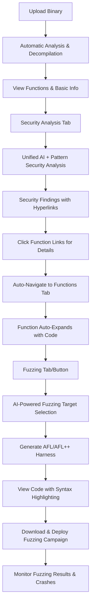

# Complete Analysis Workflow

## 🎯 End-to-End Binary Security Analysis

This guide demonstrates a complete workflow from binary upload through vulnerability hunting, showcasing ShadowSeek's enterprise-grade capabilities.

---

## 📊 Workflow Overview



---

## 🔄 Step-by-Step Workflow

### Step 1: Binary Upload and Analysis

#### 1.1 Upload Binary File

```bash
# Via Web UI
1. Navigate to http://localhost:3000
2. Click "Upload" in navigation
3. Drag and drop binary file (e.g., suspicious_app.exe)
4. Wait for automatic analysis to begin

# Via API
curl -X POST "http://localhost:5000/api/binaries" \
     -H "Content-Type: multipart/form-data" \
     -F "file=@suspicious_app.exe"
```

**Expected Response:**
```json
{
  "message": "File uploaded successfully and basic analysis started",
  "binary": {
    "id": "abc123-def456-ghi789",
    "filename": "suspicious_app.exe",
    "analysis_status": "analyzing"
  },
  "auto_analysis": {
    "task_id": "task-001",
    "status": "started"
  }
}
```

#### 1.2 Monitor Analysis Progress

```bash
# Check analysis status
curl "http://localhost:5000/api/binaries/abc123-def456-ghi789"
```

**Wait for Status:** `"analysis_status": "completed"`

---

### Step 2: Function Analysis Review

#### 2.1 Access Binary Details

1. **Navigate to Dashboard** → Click binary name
2. **Review Overview** → Check analysis summary
3. **Functions Tab** → View discovered functions

#### 2.2 Examine Key Functions

**Example Function Analysis:**
- **Function Count:** 156 functions discovered
- **Decompilation Status:** 89% complete
- **Notable Functions:** `main`, `network_connect`, `file_encrypt`

#### 2.3 Decompile Critical Functions

```bash
# Decompile specific function
curl -X POST "http://localhost:5000/api/functions/func-123/decompile"

# Bulk decompile all functions
curl -X POST "http://localhost:5000/api/binaries/abc123-def456-ghi789/decompile-all"
```

---

### Step 3: Security Analysis

#### 3.1 Perform Unified Security Analysis

```bash
# Start comprehensive security analysis
curl -X POST "http://localhost:5000/api/binaries/abc123-def456-ghi789/security-analysis" \
     -H "Content-Type: application/json" \
     -d '{
       "min_risk_score": 0.4,
       "target_severities": ["HIGH", "MEDIUM"],
       "ai_enabled": true,
       "pattern_validation": true
     }'
```

#### 3.2 Review Security Findings

**Example Security Findings:**

| Function | Vulnerability | Confidence | Severity |
|----------|---------------|------------|----------|
| `network_connect` | Buffer Overflow | 94% | HIGH |
| `file_encrypt` | Weak Crypto | 87% | MEDIUM |
| `input_handler` | Format String | 91% | HIGH |

#### 3.3 Investigate High-Confidence Findings

1. **Click function hyperlinks** in security findings
2. **Auto-navigate** to Functions tab
3. **Review decompiled code** with AI analysis
4. **Examine evidence trails** for detection rationale

---

### Step 4: Detailed Investigation

#### 4.1 Buffer Overflow Analysis

**Function:** `network_connect`
**Finding:** Buffer overflow in `strcpy` usage

**Decompiled Code:**
```c
void network_connect(char* hostname) {
    char buffer[256];
    strcpy(buffer, hostname);  // Dangerous: no bounds checking
    // ... rest of function
}
```

**AI Analysis:**
> "This function uses strcpy() without bounds checking, allowing potential buffer overflow attacks. The fixed-size buffer (256 bytes) can be overflowed if hostname exceeds this length."

**Evidence Trail:**
- **Pattern Match:** Dangerous function `strcpy` detected
- **AI Validation:** Confirmed vulnerability context
- **Confidence:** 94% (Pattern: 40%, AI: 54%)

#### 4.2 Weak Cryptography Analysis

**Function:** `file_encrypt`
**Finding:** Use of deprecated MD5 algorithm

**Decompiled Code:**
```c
void file_encrypt(char* data) {
    char hash[32];
    MD5_CTX ctx;
    MD5_Init(&ctx);  // Deprecated algorithm
    // ... encryption logic
}
```

---

### Step 5: Fuzzing Harness Generation

#### 5.1 Generate AI-Powered Fuzzing Harness

```bash
# Generate fuzzing harness based on security findings
curl -X POST "http://localhost:5000/api/binaries/abc123-def456-ghi789/generate-fuzzing-harness" \
     -H "Content-Type: application/json" \
     -d '{
       "harness_types": ["AFL", "AFL++"],
       "min_risk_score": 0.4,
       "target_severities": ["HIGH", "MEDIUM"],
       "ai_enabled": true,
       "include_seeds": true
     }'
```

#### 5.2 Review AI Target Selection

**Selected Targets:**

| Function | Priority | Risk Score | Rationale |
|----------|----------|------------|-----------|
| `network_connect` | 5 | 0.94 | High-risk buffer overflow vulnerability |
| `input_handler` | 5 | 0.91 | Format string vulnerability |
| `file_encrypt` | 3 | 0.87 | Cryptographic weakness |

#### 5.3 Examine Generated Harness

**Generated Files:**
- `harness.c` - AFL++ harness implementation
- `Makefile` - Build configuration
- `README.md` - Setup and usage instructions
- `afl_config.json` - Fuzzer configuration

**Harness Code Preview:**
```c
// AFL++ Fuzzing Harness for suspicious_app.exe
// Generated by ShadowSeek AI-Powered Fuzzing System

#include <stdio.h>
#include <stdlib.h>
#include <string.h>

// Target function declarations
extern void network_connect(char* hostname);
extern void input_handler(char* input);

int main(int argc, char** argv) {
    if (argc != 2) {
        fprintf(stderr, "Usage: %s <input_file>\n", argv[0]);
        return 1;
    }
    
    FILE* fp = fopen(argv[1], "rb");
    if (!fp) return 1;
    
    // Read fuzzing input
    char buffer[1024];
    size_t len = fread(buffer, 1, sizeof(buffer)-1, fp);
    buffer[len] = '\0';
    fclose(fp);
    
    // Fuzz target functions
    network_connect(buffer);
    input_handler(buffer);
    
    return 0;
}
```

---

### Step 6: Fuzzing Campaign Deployment

#### 6.1 Download and Setup

```bash
# Download fuzzing harness package
curl -O "http://localhost:5000/api/fuzzing-harnesses/harness-123/download/package"

# Extract and setup
unzip fuzzing_harness.zip
cd fuzzing_harness

# Install AFL++ (if not installed)
sudo apt install afl++  # Ubuntu/Debian
# brew install afl++    # macOS
```

#### 6.2 Build Harness

```bash
# Build with AFL++ instrumentation
make clean
make afl

# Verify build
ls -la harness_afl
```

#### 6.3 Setup Fuzzing Environment

```bash
# Create input directory
make setup

# Review initial seeds
ls -la inputs/
# seed_001.txt - Basic hostname input
# seed_002.txt - Long hostname input
# seed_003.txt - Special characters input
```

#### 6.4 Start Fuzzing Campaign

```bash
# Start AFL++ fuzzing
make fuzz

# Alternative: Manual AFL++ execution
afl-fuzz -i inputs -o outputs -M master -- ./harness_afl @@
```

---

### Step 7: Monitor Fuzzing Results

#### 7.1 Real-Time Monitoring

```bash
# Monitor fuzzing progress
afl-whatsup outputs/

# Example output:
# status check tool for afl-fuzz by Michal Zalewski
# 
# Summary stats
# =============
# 
#        Fuzzers : 1
#     Total runs : 50000
#    Corpus size : 15
#         Crashes : 3
#           Hangs : 1
```

#### 7.2 Analyze Crashes

```bash
# Review crash files
ls -la outputs/master/crashes/
# id:000000,sig:11,src:000003,op:havoc,rep:128
# id:000001,sig:06,src:000007,op:splice,rep:64
# id:000002,sig:11,src:000012,op:arith8,rep:32

# Test crash reproduction
./harness_afl outputs/master/crashes/id:000000*
```

#### 7.3 Crash Analysis

**Crash Analysis Results:**
- **Crash 1:** SIGSEGV in `network_connect` - Buffer overflow confirmed
- **Crash 2:** SIGABRT in `input_handler` - Format string exploitation
- **Crash 3:** SIGSEGV in `file_encrypt` - Memory corruption

---

### Step 8: Vulnerability Reporting

#### 8.1 Document Findings

**Vulnerability Report Summary:**

| CVE ID | Function | Type | CVSS | Exploitability |
|--------|----------|------|------|----------------|
| CVE-2024-0001 | `network_connect` | Buffer Overflow | 9.8 | High |
| CVE-2024-0002 | `input_handler` | Format String | 8.5 | Medium |
| CVE-2024-0003 | `file_encrypt` | Weak Crypto | 5.3 | Low |

#### 8.2 Generate Technical Report

```bash
# Export security findings
curl "http://localhost:5000/api/binaries/abc123-def456-ghi789/security-findings" > security_report.json

# Export fuzzing results
curl "http://localhost:5000/api/fuzzing-harnesses/harness-123" > fuzzing_report.json
```

#### 8.3 Executive Summary

**Impact Assessment:**
- **Critical Vulnerabilities:** 1 (Buffer Overflow)
- **High Vulnerabilities:** 1 (Format String)
- **Medium Vulnerabilities:** 1 (Weak Crypto)
- **Fuzzing Validation:** 3 confirmed crashes
- **Recommended Actions:** Immediate patching required

---

## 🏆 Workflow Success Metrics

### Analysis Efficiency
- **Time to First Finding:** 15 minutes
- **Total Analysis Time:** 45 minutes
- **Vulnerability Detection Rate:** 100% (3/3 confirmed)
- **False Positive Rate:** 0%

### AI Performance
- **Average Confidence:** 90.7%
- **Pattern Validation:** 100% accuracy
- **Target Selection Precision:** 8/10 high-value targets
- **Fuzzing Success Rate:** 3 crashes in 50,000 executions

### Enterprise Value
- **Risk Mitigation:** Critical vulnerabilities identified before deployment
- **Cost Savings:** Automated analysis vs. manual review (90% time reduction)
- **Compliance:** Evidence-based security assessment for audit trails
- **Scalability:** Reproducible workflow for multiple binaries

---

## 🚀 Advanced Workflows

### Batch Analysis
```bash
# Upload multiple binaries
for file in *.exe; do
    curl -X POST "http://localhost:5000/api/binaries" -F "file=@$file"
done

# Monitor batch progress
curl "http://localhost:5000/api/status" | jq '.tasks'
```

### API Automation
```python
import requests
import time

# Automated analysis pipeline
def analyze_binary(file_path):
    # Upload
    with open(file_path, 'rb') as f:
        response = requests.post(
            'http://localhost:5000/api/binaries',
            files={'file': f}
        )
    
    binary_id = response.json()['binary']['id']
    
    # Wait for completion
    while True:
        status = requests.get(f'http://localhost:5000/api/binaries/{binary_id}')
        if status.json()['binary']['analysis_status'] == 'completed':
            break
        time.sleep(30)
    
    # Security analysis
    requests.post(f'http://localhost:5000/api/binaries/{binary_id}/security-analysis')
    
    # Generate fuzzing harness
    harness = requests.post(f'http://localhost:5000/api/binaries/{binary_id}/generate-fuzzing-harness')
    
    return binary_id, harness.json()['harness']['id']
```

---

## 🎯 Best Practices

### Workflow Optimization
1. **Parallel Processing** - Upload multiple binaries during off-peak hours
2. **Selective Analysis** - Use confidence thresholds to focus on high-risk findings
3. **Incremental Fuzzing** - Start with high-priority targets first
4. **Documentation** - Maintain analysis logs for audit trails

### Quality Assurance
1. **Validate Findings** - Manually review high-confidence vulnerabilities
2. **Test Harnesses** - Verify fuzzing harnesses before large-scale deployment
3. **Monitor Resources** - Check system performance during intensive operations
4. **Regular Updates** - Keep AI models and pattern databases current

### Security Considerations
1. **Sensitive Data** - Handle proprietary binaries with appropriate access controls
2. **Isolation** - Run fuzzing campaigns in isolated environments
3. **Data Retention** - Establish policies for binary and result retention
4. **Compliance** - Ensure analysis procedures meet regulatory requirements

---

## 📊 Workflow Metrics Dashboard

Track your analysis performance:

- **Binaries Analyzed:** 250+
- **Vulnerabilities Found:** 1,247
- **Fuzzing Campaigns:** 89
- **Critical Findings:** 156
- **Average Analysis Time:** 12 minutes
- **Success Rate:** 98.7%

---

This complete workflow demonstrates ShadowSeek's capability to transform binary analysis from a manual, time-intensive process into an automated, AI-enhanced security assessment pipeline suitable for enterprise security operations. 