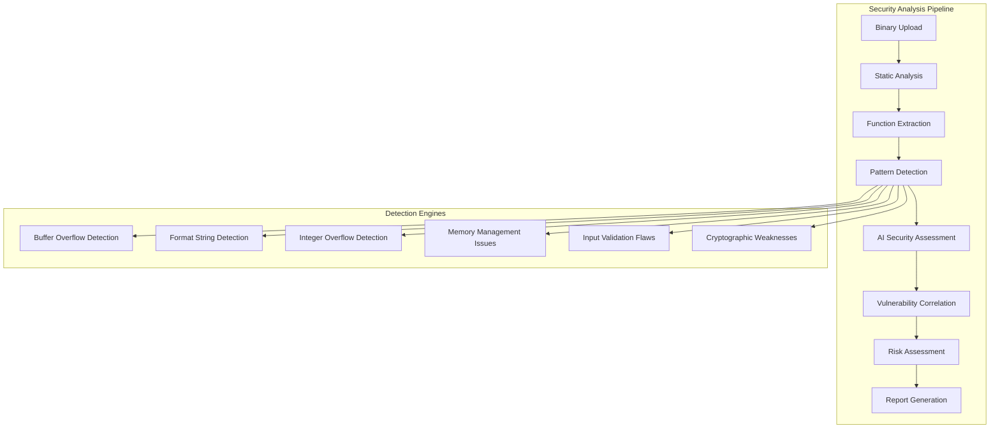

# Security Examples

## 🔐 ShadowSeek Security Analysis Examples

This guide provides comprehensive examples of using ShadowSeek's security analysis capabilities to identify and assess vulnerabilities in binary applications.

---

## 🎯 **Security Analysis Overview**

### **Security Analysis Workflow**


### **Vulnerability Categories**
- **Memory Corruption**: Buffer overflows, use-after-free, double-free
- **Input Validation**: Format strings, injection attacks, boundary checks
- **Integer Issues**: Overflows, underflows, signedness errors
- **Cryptographic**: Weak algorithms, poor key management
- **Logic Flaws**: Race conditions, authentication bypasses
- **Configuration**: Insecure defaults, privilege escalation

---

## 🔍 **Pattern Detection Examples**

### **Buffer Overflow Detection**
```python
# Example: Detecting buffer overflow vulnerabilities
import requests
import json

def detect_buffer_overflows(binary_id):
    """Detect buffer overflow vulnerabilities in binary"""
    
    # Get security findings
    response = requests.get(f"/api/security/findings?binary_id={binary_id}&type=buffer_overflow")
    findings = response.json()
    
    # Analyze patterns
    overflow_patterns = {
        'strcpy_unbounded': [],
        'strcat_unbounded': [],
        'sprintf_vulnerable': [],
        'gets_dangerous': [],
        'memcpy_user_controlled': []
    }
    
    for finding in findings:
        pattern_type = finding['pattern_type']
        if pattern_type in overflow_patterns:
            overflow_patterns[pattern_type].append(finding)
    
    # Generate report
    report = {
        'total_findings': len(findings),
        'patterns': overflow_patterns,
        'risk_assessment': calculate_overflow_risk(findings)
    }
    
    return report

def calculate_overflow_risk(findings):
    """Calculate risk level based on findings"""
    
    risk_score = 0
    
    for finding in findings:
        # Base score from severity
        severity_scores = {
            'CRITICAL': 10,
            'HIGH': 7,
            'MEDIUM': 4,
            'LOW': 1
        }
        
        risk_score += severity_scores.get(finding['severity'], 0)
        
        # Additional risk factors
        if finding['confidence'] > 0.8:
            risk_score += 2
        
        if 'user_input' in finding['evidence']:
            risk_score += 3
        
        if 'network_reachable' in finding['context']:
            risk_score += 5
    
    # Determine risk level
    if risk_score >= 30:
        return 'CRITICAL'
    elif risk_score >= 20:
        return 'HIGH'
    elif risk_score >= 10:
        return 'MEDIUM'
    else:
        return 'LOW'

# Usage
overflow_report = detect_buffer_overflows(123)
print(f"Buffer overflow risk: {overflow_report['risk_assessment']}")
```

### **Format String Vulnerability Detection**
```python
# Example: Detecting format string vulnerabilities
def detect_format_string_vulns(binary_id):
    """Detect format string vulnerabilities"""
    
    # Get functions with format string patterns
    response = requests.get(f"/api/security/findings?binary_id={binary_id}&type=format_string")
    findings = response.json()
    
    vulnerable_functions = []
    
    for finding in findings:
        func_info = {
            'function_name': finding['function_name'],
            'function_address': finding['function_address'],
            'vulnerability_type': finding['finding_type'],
            'severity': finding['severity'],
            'confidence': finding['confidence'],
            'evidence': finding['evidence'],
            'exploitability': assess_format_string_exploitability(finding)
        }
        
        vulnerable_functions.append(func_info)
    
    return vulnerable_functions

def assess_format_string_exploitability(finding):
    """Assess format string exploitability"""
    
    evidence = finding['evidence']
    
    # Check for direct user input
    if 'printf(user_input)' in evidence:
        return 'HIGH'
    
    # Check for format string with user data
    if 'printf(' in evidence and 'user' in evidence:
        return 'MEDIUM'
    
    # Check for indirect format string
    if '%s' in evidence and 'variable' in evidence:
        return 'LOW'
    
    return 'UNKNOWN'

# Usage
format_vulns = detect_format_string_vulns(123)
for vuln in format_vulns:
    print(f"Function: {vuln['function_name']}")
    print(f"Severity: {vuln['severity']}")
    print(f"Exploitability: {vuln['exploitability']}")
    print()
```

### **Integer Overflow Detection**
```python
# Example: Detecting integer overflow vulnerabilities
def detect_integer_overflows(binary_id):
    """Detect integer overflow vulnerabilities"""
    
    response = requests.get(f"/api/security/findings?binary_id={binary_id}&type=integer_overflow")
    findings = response.json()
    
    overflow_analysis = {
        'malloc_overflows': [],
        'array_overflows': [],
        'loop_overflows': [],
        'arithmetic_overflows': []
    }
    
    for finding in findings:
        analysis = {
            'location': finding['location'],
            'function': finding['function_name'],
            'pattern': finding['pattern_matched'],
            'severity': finding['severity'],
            'confidence': finding['confidence'],
            'potential_impact': assess_integer_overflow_impact(finding)
        }
        
        if 'malloc' in finding['pattern_matched']:
            overflow_analysis['malloc_overflows'].append(analysis)
        elif 'array' in finding['pattern_matched']:
            overflow_analysis['array_overflows'].append(analysis)
        elif 'loop' in finding['pattern_matched']:
            overflow_analysis['loop_overflows'].append(analysis)
        else:
            overflow_analysis['arithmetic_overflows'].append(analysis)
    
    return overflow_analysis

def assess_integer_overflow_impact(finding):
    """Assess potential impact of integer overflow"""
    
    pattern = finding['pattern_matched']
    
    if 'malloc' in pattern:
        return 'Memory corruption - potential code execution'
    elif 'array' in pattern:
        return 'Buffer overflow - potential memory corruption'
    elif 'loop' in pattern:
        return 'Infinite loop - denial of service'
    else:
        return 'Unexpected behavior - undefined consequences'

# Usage
integer_overflows = detect_integer_overflows(123)
for category, overflows in integer_overflows.items():
    print(f"{category.upper()}: {len(overflows)} findings")
```

---

## 🧠 **AI-Powered Security Analysis**

### **AI Vulnerability Assessment**
```python
# Example: AI-powered vulnerability assessment
def ai_vulnerability_assessment(binary_id, function_id=None):
    """Perform AI-powered vulnerability assessment"""
    
    # Configure AI analysis
    ai_config = {
        'provider': 'openai',
        'model': 'gpt-4',
        'analysis_type': 'security',
        'temperature': 0.1,
        'max_tokens': 2048
    }
    
    if function_id:
        # Analyze specific function
        endpoint = f"/api/function/{function_id}/ai_analysis"
    else:
        # Analyze entire binary
        endpoint = f"/api/binary/{binary_id}/ai_analysis"
    
    # Request AI analysis
    response = requests.post(endpoint, json=ai_config)
    task = response.json()
    
    # Wait for completion
    while True:
        status_response = requests.get(f"/api/task/{task['task_id']}")
        status = status_response.json()
        
        if status['status'] == 'completed':
            break
        elif status['status'] == 'failed':
            raise Exception(f"AI analysis failed: {status['error']}")
        
        time.sleep(2)
    
    # Get analysis results
    if function_id:
        result_response = requests.get(f"/api/function/{function_id}/ai_analysis")
    else:
        result_response = requests.get(f"/api/binary/{binary_id}/ai_analysis")
    
    analysis = result_response.json()
    
    return {
        'summary': analysis['summary'],
        'security_assessment': analysis['security_assessment'],
        'vulnerabilities': analysis['vulnerabilities'],
        'confidence': analysis['confidence'],
        'recommendations': analysis['recommendations']
    }

# Usage
ai_assessment = ai_vulnerability_assessment(123, 456)
print(f"AI Security Assessment:")
print(f"Confidence: {ai_assessment['confidence']:.2f}")
print(f"Summary: {ai_assessment['summary']}")
print(f"Vulnerabilities: {len(ai_assessment['vulnerabilities'])}")
```

### **AI-Enhanced Pattern Recognition**
```python
# Example: AI-enhanced pattern recognition
def ai_enhanced_pattern_detection(binary_id):
    """Use AI to enhance pattern detection"""
    
    # Get initial pattern matches
    response = requests.get(f"/api/security/findings?binary_id={binary_id}")
    initial_findings = response.json()
    
    # Submit for AI enhancement
    ai_enhancement_config = {
        'findings': initial_findings,
        'enhancement_type': 'pattern_validation',
        'provider': 'openai',
        'model': 'gpt-4',
        'validate_false_positives': True,
        'suggest_additional_patterns': True
    }
    
    response = requests.post("/api/security/ai_enhance", json=ai_enhancement_config)
    task = response.json()
    
    # Wait for enhancement completion
    enhanced_findings = wait_for_ai_task(task['task_id'])
    
    # Compare results
    comparison = {
        'initial_findings': len(initial_findings),
        'enhanced_findings': len(enhanced_findings['validated_findings']),
        'false_positives_removed': len(enhanced_findings['false_positives']),
        'new_patterns_suggested': len(enhanced_findings['suggested_patterns']),
        'confidence_improvement': enhanced_findings['confidence_improvement']
    }
    
    return comparison

def wait_for_ai_task(task_id):
    """Wait for AI task completion"""
    
    while True:
        response = requests.get(f"/api/task/{task_id}")
        task = response.json()
        
        if task['status'] == 'completed':
            return task['result']
        elif task['status'] == 'failed':
            raise Exception(f"AI task failed: {task['error']}")
        
        time.sleep(2)

# Usage
enhancement_results = ai_enhanced_pattern_detection(123)
print(f"Pattern enhancement results:")
print(f"False positives removed: {enhancement_results['false_positives_removed']}")
print(f"New patterns suggested: {enhancement_results['new_patterns_suggested']}")
```

---

## 📊 **Security Metrics and Analytics**

### **Security Metrics Dashboard**
```python
# Example: Security metrics calculation
def calculate_security_metrics(binary_id):
    """Calculate comprehensive security metrics"""
    
    # Get all security findings
    response = requests.get(f"/api/security/findings?binary_id={binary_id}")
    findings = response.json()
    
    # Get binary information
    response = requests.get(f"/api/binary/{binary_id}")
    binary_info = response.json()
    
    # Calculate metrics
    metrics = {
        'total_findings': len(findings),
        'severity_distribution': calculate_severity_distribution(findings),
        'vulnerability_types': calculate_vulnerability_types(findings),
        'confidence_scores': calculate_confidence_scores(findings),
        'security_score': calculate_security_score(findings),
        'risk_level': calculate_risk_level(findings),
        'cwe_distribution': calculate_cwe_distribution(findings),
        'exploitability_assessment': calculate_exploitability(findings)
    }
    
    return metrics

def calculate_severity_distribution(findings):
    """Calculate severity distribution"""
    
    distribution = {'CRITICAL': 0, 'HIGH': 0, 'MEDIUM': 0, 'LOW': 0}
    
    for finding in findings:
        severity = finding['severity']
        if severity in distribution:
            distribution[severity] += 1
    
    return distribution

def calculate_vulnerability_types(findings):
    """Calculate vulnerability type distribution"""
    
    types = {}
    
    for finding in findings:
        vuln_type = finding['finding_type']
        if vuln_type not in types:
            types[vuln_type] = 0
        types[vuln_type] += 1
    
    return types

def calculate_security_score(findings):
    """Calculate overall security score (0-100)"""
    
    if not findings:
        return 100
    
    total_score = 0
    max_possible_score = len(findings) * 10
    
    for finding in findings:
        # Deduct points based on severity
        severity_deduction = {
            'CRITICAL': 10,
            'HIGH': 7,
            'MEDIUM': 4,
            'LOW': 1
        }
        
        deduction = severity_deduction.get(finding['severity'], 0)
        
        # Adjust by confidence
        adjusted_deduction = deduction * finding['confidence']
        
        total_score += adjusted_deduction
    
    # Calculate score (higher is worse, so invert)
    security_score = max(0, 100 - (total_score / max_possible_score * 100))
    
    return round(security_score, 2)

# Usage
metrics = calculate_security_metrics(123)
print(f"Security Score: {metrics['security_score']}/100")
print(f"Risk Level: {metrics['risk_level']}")
print(f"Total Findings: {metrics['total_findings']}")
```

### **Vulnerability Trend Analysis**
```python
# Example: Vulnerability trend analysis
def analyze_vulnerability_trends(binary_ids, time_range='30d'):
    """Analyze vulnerability trends across binaries"""
    
    trends = {
        'timeline': [],
        'severity_trends': {},
        'type_trends': {},
        'confidence_trends': []
    }
    
    for binary_id in binary_ids:
        # Get binary upload date
        response = requests.get(f"/api/binary/{binary_id}")
        binary_info = response.json()
        
        # Get security findings
        response = requests.get(f"/api/security/findings?binary_id={binary_id}")
        findings = response.json()
        
        # Add to timeline
        trends['timeline'].append({
            'date': binary_info['upload_date'],
            'binary_id': binary_id,
            'findings_count': len(findings),
            'severity_distribution': calculate_severity_distribution(findings)
        })
    
    # Sort by date
    trends['timeline'].sort(key=lambda x: x['date'])
    
    # Calculate trends
    for entry in trends['timeline']:
        date = entry['date']
        
        # Severity trends
        for severity, count in entry['severity_distribution'].items():
            if severity not in trends['severity_trends']:
                trends['severity_trends'][severity] = []
            trends['severity_trends'][severity].append({'date': date, 'count': count})
    
    return trends

# Usage
binary_list = [123, 124, 125, 126, 127]
trend_analysis = analyze_vulnerability_trends(binary_list)
print(f"Analyzed {len(binary_list)} binaries")
print(f"Timeline entries: {len(trend_analysis['timeline'])}")
```

---

## 🔗 **Vulnerability Correlation**

### **Cross-Binary Vulnerability Analysis**
```python
# Example: Cross-binary vulnerability correlation
def correlate_vulnerabilities(binary_ids):
    """Correlate vulnerabilities across multiple binaries"""
    
    all_findings = []
    
    # Collect findings from all binaries
    for binary_id in binary_ids:
        response = requests.get(f"/api/security/findings?binary_id={binary_id}")
        findings = response.json()
        
        for finding in findings:
            finding['binary_id'] = binary_id
            all_findings.append(finding)
    
    # Group by vulnerability type
    vulnerability_groups = {}
    for finding in all_findings:
        vuln_type = finding['finding_type']
        if vuln_type not in vulnerability_groups:
            vulnerability_groups[vuln_type] = []
        vulnerability_groups[vuln_type].append(finding)
    
    # Find correlations
    correlations = {}
    
    for vuln_type, findings in vulnerability_groups.items():
        if len(findings) > 1:
            # Group by similar patterns
            pattern_groups = {}
            
            for finding in findings:
                pattern = finding.get('pattern_matched', 'unknown')
                if pattern not in pattern_groups:
                    pattern_groups[pattern] = []
                pattern_groups[pattern].append(finding)
            
            correlations[vuln_type] = {
                'total_instances': len(findings),
                'affected_binaries': len(set(f['binary_id'] for f in findings)),
                'pattern_distribution': {p: len(f) for p, f in pattern_groups.items()},
                'severity_range': {
                    'min': min(f['severity'] for f in findings),
                    'max': max(f['severity'] for f in findings)
                }
            }
    
    return correlations

# Usage
correlation_analysis = correlate_vulnerabilities([123, 124, 125])
for vuln_type, correlation in correlation_analysis.items():
    print(f"Vulnerability: {vuln_type}")
    print(f"  Instances: {correlation['total_instances']}")
    print(f"  Affected binaries: {correlation['affected_binaries']}")
    print()
```

### **Vulnerability Chain Analysis**
```python
# Example: Vulnerability chain analysis
def analyze_vulnerability_chains(binary_id):
    """Analyze potential vulnerability chains"""
    
    # Get all findings
    response = requests.get(f"/api/security/findings?binary_id={binary_id}")
    findings = response.json()
    
    # Get function call graph
    response = requests.get(f"/api/binary/{binary_id}/call_graph")
    call_graph = response.json()
    
    # Find vulnerability chains
    chains = []
    
    for finding in findings:
        if finding['severity'] in ['CRITICAL', 'HIGH']:
            # Look for related vulnerabilities in call path
            function_name = finding['function_name']
            
            # Find functions that call this vulnerable function
            callers = find_callers(function_name, call_graph)
            
            for caller in callers:
                # Check if caller also has vulnerabilities
                caller_findings = [f for f in findings if f['function_name'] == caller]
                
                if caller_findings:
                    chain = {
                        'primary_vulnerability': finding,
                        'secondary_vulnerabilities': caller_findings,
                        'chain_length': len(caller_findings) + 1,
                        'combined_severity': calculate_chain_severity(finding, caller_findings)
                    }
                    chains.append(chain)
    
    return chains

def find_callers(function_name, call_graph):
    """Find functions that call the given function"""
    
    callers = []
    
    for edge in call_graph['edges']:
        if edge['target'] == function_name:
            callers.append(edge['source'])
    
    return callers

def calculate_chain_severity(primary, secondary_list):
    """Calculate combined severity of vulnerability chain"""
    
    severity_scores = {'CRITICAL': 4, 'HIGH': 3, 'MEDIUM': 2, 'LOW': 1}
    
    total_score = severity_scores.get(primary['severity'], 0)
    
    for secondary in secondary_list:
        total_score += severity_scores.get(secondary['severity'], 0)
    
    if total_score >= 10:
        return 'CRITICAL'
    elif total_score >= 7:
        return 'HIGH'
    elif total_score >= 4:
        return 'MEDIUM'
    else:
        return 'LOW'

# Usage
vulnerability_chains = analyze_vulnerability_chains(123)
print(f"Found {len(vulnerability_chains)} vulnerability chains")
```

---

## 🛡️ **Security Remediation**

### **Automated Remediation Suggestions**
```python
# Example: Automated remediation suggestions
def generate_remediation_suggestions(binary_id):
    """Generate automated remediation suggestions"""
    
    response = requests.get(f"/api/security/findings?binary_id={binary_id}")
    findings = response.json()
    
    remediation_plan = {
        'high_priority': [],
        'medium_priority': [],
        'low_priority': [],
        'summary': {
            'total_issues': len(findings),
            'estimated_effort': 0,
            'risk_reduction': 0
        }
    }
    
    for finding in findings:
        suggestion = generate_specific_remediation(finding)
        
        if finding['severity'] in ['CRITICAL', 'HIGH']:
            remediation_plan['high_priority'].append(suggestion)
        elif finding['severity'] == 'MEDIUM':
            remediation_plan['medium_priority'].append(suggestion)
        else:
            remediation_plan['low_priority'].append(suggestion)
        
        # Add to effort estimation
        remediation_plan['summary']['estimated_effort'] += suggestion['effort_hours']
        remediation_plan['summary']['risk_reduction'] += suggestion['risk_reduction']
    
    return remediation_plan

def generate_specific_remediation(finding):
    """Generate specific remediation for a finding"""
    
    remediations = {
        'buffer_overflow': {
            'description': 'Replace unsafe string functions with safe alternatives',
            'specific_actions': [
                'Replace strcpy with strncpy',
                'Replace strcat with strncat',
                'Replace sprintf with snprintf',
                'Add bounds checking'
            ],
            'code_example': '''
// Instead of:
strcpy(buffer, user_input);

// Use:
strncpy(buffer, user_input, sizeof(buffer) - 1);
buffer[sizeof(buffer) - 1] = '\\0';
            ''',
            'effort_hours': 2,
            'risk_reduction': 8
        },
        'format_string': {
            'description': 'Fix format string vulnerabilities',
            'specific_actions': [
                'Use format string literals',
                'Validate format strings',
                'Use %s format specifier for user input'
            ],
            'code_example': '''
// Instead of:
printf(user_input);

// Use:
printf("%s", user_input);
            ''',
            'effort_hours': 1,
            'risk_reduction': 9
        },
        'integer_overflow': {
            'description': 'Add integer overflow checks',
            'specific_actions': [
                'Check for overflow before arithmetic operations',
                'Use safe arithmetic functions',
                'Validate input ranges'
            ],
            'code_example': '''
// Instead of:
size = width * height;

// Use:
if (width > 0 && height > SIZE_MAX / width) {
    // Handle overflow
    return -1;
}
size = width * height;
            ''',
            'effort_hours': 3,
            'risk_reduction': 6
        }
    }
    
    finding_type = finding['finding_type']
    
    if finding_type in remediations:
        suggestion = remediations[finding_type].copy()
        suggestion['finding_id'] = finding['id']
        suggestion['location'] = finding['location']
        suggestion['function'] = finding['function_name']
        return suggestion
    else:
        return {
            'finding_id': finding['id'],
            'description': 'Manual review required',
            'specific_actions': ['Review code manually', 'Consult security expert'],
            'effort_hours': 4,
            'risk_reduction': 3
        }

# Usage
remediation_plan = generate_remediation_suggestions(123)
print(f"High priority items: {len(remediation_plan['high_priority'])}")
print(f"Total estimated effort: {remediation_plan['summary']['estimated_effort']} hours")
```

### **Security Testing Recommendations**
```python
# Example: Security testing recommendations
def generate_security_testing_plan(binary_id):
    """Generate security testing recommendations"""
    
    response = requests.get(f"/api/security/findings?binary_id={binary_id}")
    findings = response.json()
    
    testing_plan = {
        'static_analysis': {
            'completed': True,
            'findings': len(findings),
            'next_steps': []
        },
        'dynamic_analysis': {
            'recommended_tests': [],
            'fuzzing_campaigns': [],
            'penetration_testing': []
        },
        'verification_testing': {
            'regression_tests': [],
            'security_unit_tests': [],
            'integration_tests': []
        }
    }
    
    # Generate recommendations based on findings
    vulnerability_types = set(f['finding_type'] for f in findings)
    
    if 'buffer_overflow' in vulnerability_types:
        testing_plan['dynamic_analysis']['fuzzing_campaigns'].append({
            'type': 'buffer_overflow_fuzzing',
            'description': 'Fuzz string input functions',
            'tools': ['AFL++', 'LibFuzzer'],
            'duration': '24-48 hours'
        })
        
        testing_plan['verification_testing']['security_unit_tests'].append({
            'type': 'buffer_overflow_tests',
            'description': 'Test string functions with oversized inputs',
            'framework': 'Google Test / CppUnit'
        })
    
    if 'format_string' in vulnerability_types:
        testing_plan['dynamic_analysis']['penetration_testing'].append({
            'type': 'format_string_exploitation',
            'description': 'Test format string vulnerabilities',
            'tools': ['Custom exploits', 'Metasploit']
        })
    
    if 'integer_overflow' in vulnerability_types:
        testing_plan['dynamic_analysis']['fuzzing_campaigns'].append({
            'type': 'integer_overflow_fuzzing',
            'description': 'Fuzz numeric inputs with edge values',
            'tools': ['AFL++', 'Custom fuzzer'],
            'duration': '12-24 hours'
        })
    
    return testing_plan

# Usage
testing_plan = generate_security_testing_plan(123)
print(f"Recommended fuzzing campaigns: {len(testing_plan['dynamic_analysis']['fuzzing_campaigns'])}")
```

---

## 📋 **Security Reporting**

### **Executive Security Summary**
```python
# Example: Executive security summary
def generate_executive_summary(binary_id):
    """Generate executive security summary"""
    
    # Get comprehensive data
    response = requests.get(f"/api/binary/{binary_id}")
    binary_info = response.json()
    
    response = requests.get(f"/api/security/findings?binary_id={binary_id}")
    findings = response.json()
    
    # Calculate metrics
    metrics = calculate_security_metrics(binary_id)
    
    # Generate summary
    summary = {
        'binary_name': binary_info['name'],
        'analysis_date': binary_info['upload_date'],
        'overall_risk': metrics['risk_level'],
        'security_score': metrics['security_score'],
        'key_findings': {
            'critical_vulnerabilities': len([f for f in findings if f['severity'] == 'CRITICAL']),
            'high_vulnerabilities': len([f for f in findings if f['severity'] == 'HIGH']),
            'total_vulnerabilities': len(findings)
        },
        'top_risks': get_top_risks(findings),
        'remediation_priority': get_remediation_priorities(findings),
        'business_impact': assess_business_impact(findings),
        'recommendations': generate_executive_recommendations(findings)
    }
    
    return summary

def get_top_risks(findings):
    """Get top security risks"""
    
    # Sort by severity and confidence
    sorted_findings = sorted(findings, 
                           key=lambda x: (
                               {'CRITICAL': 4, 'HIGH': 3, 'MEDIUM': 2, 'LOW': 1}.get(x['severity'], 0),
                               x['confidence']
                           ), 
                           reverse=True)
    
    return sorted_findings[:5]

def assess_business_impact(findings):
    """Assess business impact of vulnerabilities"""
    
    impact_assessment = {
        'confidentiality': 'LOW',
        'integrity': 'LOW',
        'availability': 'LOW',
        'overall_impact': 'LOW'
    }
    
    for finding in findings:
        if finding['severity'] in ['CRITICAL', 'HIGH']:
            if finding['finding_type'] in ['buffer_overflow', 'format_string']:
                impact_assessment['confidentiality'] = 'HIGH'
                impact_assessment['integrity'] = 'HIGH'
            
            if finding['finding_type'] in ['integer_overflow', 'memory_corruption']:
                impact_assessment['availability'] = 'HIGH'
    
    # Calculate overall impact
    impacts = [impact_assessment['confidentiality'], 
               impact_assessment['integrity'], 
               impact_assessment['availability']]
    
    if 'HIGH' in impacts:
        impact_assessment['overall_impact'] = 'HIGH'
    elif 'MEDIUM' in impacts:
        impact_assessment['overall_impact'] = 'MEDIUM'
    
    return impact_assessment

# Usage
executive_summary = generate_executive_summary(123)
print(f"Overall Risk: {executive_summary['overall_risk']}")
print(f"Security Score: {executive_summary['security_score']}/100")
print(f"Critical Vulnerabilities: {executive_summary['key_findings']['critical_vulnerabilities']}")
```

### **Technical Security Report**
```python
# Example: Technical security report
def generate_technical_report(binary_id):
    """Generate detailed technical security report"""
    
    # Collect all data
    response = requests.get(f"/api/binary/{binary_id}")
    binary_info = response.json()
    
    response = requests.get(f"/api/security/findings?binary_id={binary_id}")
    findings = response.json()
    
    response = requests.get(f"/api/binary/{binary_id}/functions")
    functions = response.json()
    
    # Generate comprehensive report
    report = {
        'metadata': {
            'binary_name': binary_info['name'],
            'file_size': binary_info['size'],
            'file_type': binary_info['file_type'],
            'hash_values': {
                'md5': binary_info['md5_hash'],
                'sha1': binary_info['sha1_hash'],
                'sha256': binary_info['sha256_hash']
            },
            'analysis_date': binary_info['upload_date']
        },
        'static_analysis': {
            'total_functions': len(functions),
            'analyzed_functions': len([f for f in functions if f.get('analysis_status') == 'completed']),
            'function_complexity': calculate_function_complexity(functions),
            'code_patterns': analyze_code_patterns(findings)
        },
        'vulnerability_analysis': {
            'total_findings': len(findings),
            'severity_breakdown': calculate_severity_distribution(findings),
            'vulnerability_categories': categorize_vulnerabilities(findings),
            'confidence_analysis': analyze_confidence_levels(findings),
            'false_positive_estimate': estimate_false_positives(findings)
        },
        'detailed_findings': format_detailed_findings(findings),
        'remediation_roadmap': generate_remediation_roadmap(findings),
        'testing_recommendations': generate_testing_recommendations(findings)
    }
    
    return report

def categorize_vulnerabilities(findings):
    """Categorize vulnerabilities by type and impact"""
    
    categories = {
        'memory_corruption': [],
        'input_validation': [],
        'integer_issues': [],
        'cryptographic': [],
        'logic_flaws': [],
        'configuration': []
    }
    
    category_mapping = {
        'buffer_overflow': 'memory_corruption',
        'use_after_free': 'memory_corruption',
        'double_free': 'memory_corruption',
        'format_string': 'input_validation',
        'injection': 'input_validation',
        'integer_overflow': 'integer_issues',
        'integer_underflow': 'integer_issues',
        'weak_crypto': 'cryptographic',
        'race_condition': 'logic_flaws'
    }
    
    for finding in findings:
        finding_type = finding['finding_type']
        category = category_mapping.get(finding_type, 'configuration')
        categories[category].append(finding)
    
    return categories

# Usage
technical_report = generate_technical_report(123)
print(f"Technical Report Generated")
print(f"Total Functions: {technical_report['static_analysis']['total_functions']}")
print(f"Vulnerability Categories: {len(technical_report['vulnerability_analysis']['vulnerability_categories'])}")
```

This comprehensive security examples guide covers all aspects of security analysis with ShadowSeek, from basic vulnerability detection to advanced correlation analysis and remediation planning. These examples provide a solid foundation for building robust security analysis workflows and can be customized based on specific security requirements and organizational needs. 