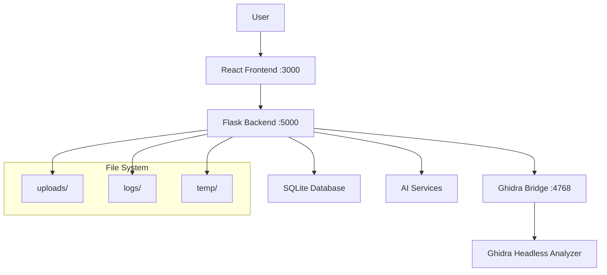

# Installation Guide

## 🔧 Complete ShadowSeek Installation Guide

This guide will walk you through installing ShadowSeek on Windows, Linux, or macOS. The entire process typically takes 10-15 minutes.

---

## 📋 **System Requirements**

### **Hardware Requirements**
- **CPU**: Modern 64-bit processor (x64/ARM64)
- **RAM**: 8GB minimum, 16GB recommended for large binaries
- **Storage**: 10GB free space for installation and analysis data
- **Network**: Internet connection for AI services and updates

### **Software Prerequisites**
- **Python**: 3.8 or newer with pip and venv support
- **Node.js**: 16.0 or newer with npm
- **Ghidra**: 10.4 or newer (latest version recommended)
- **Java**: 17+ (required by Ghidra)
- **Git**: For cloning the repository

### **Operating System Support**
- **Windows**: 10/11 (x64)
- **Linux**: Ubuntu 20.04+, CentOS 8+, or equivalent distributions
- **macOS**: 11.0+ (Big Sur or newer)

---

## 🚀 **Quick Installation (Automated)**

### **Windows Installation**
```batch
# 1. Install prerequisites using Chocolatey (optional)
choco install python nodejs git openjdk

# 2. Download and extract Ghidra
# Visit https://ghidra-sre.org/ and download Ghidra 10.4+

# 3. Clone ShadowSeek
git clone https://github.com/shadowseek/shadowseek.git
cd shadowseek

# 4. Run automated setup
start_all.bat
```

### **Linux Installation**
```bash
# 1. Install prerequisites (Ubuntu/Debian)
sudo apt update
sudo apt install python3 python3-pip python3-venv nodejs npm git openjdk-17-jdk

# 2. Download and extract Ghidra
wget https://github.com/NationalSecurityAgency/ghidra/releases/download/Ghidra_10.4_build/ghidra_10.4_PUBLIC_20230928.zip
unzip ghidra_10.4_PUBLIC_20230928.zip

# 3. Clone ShadowSeek
git clone https://github.com/shadowseek/shadowseek.git
cd shadowseek

# 4. Run setup script
chmod +x setup.sh
./setup.sh
```

### **macOS Installation**
```bash
# 1. Install prerequisites using Homebrew
brew install python@3.11 node git openjdk@17

# 2. Download Ghidra from https://ghidra-sre.org/

# 3. Clone ShadowSeek
git clone https://github.com/shadowseek/shadowseek.git
cd shadowseek

# 4. Run setup script
chmod +x setup.sh
./setup.sh
```

---

## 🔧 **Manual Installation (Step-by-Step)**

### **Step 1: Install Prerequisites**

#### **Python 3.8+**
```bash
# Verify Python installation
python --version
# Should show Python 3.8 or newer

# Install if needed:
# Windows: Download from https://python.org
# Linux: sudo apt install python3 python3-pip python3-venv
# macOS: brew install python@3.11
```

#### **Node.js 16+**
```bash
# Verify Node.js installation
node --version
npm --version

# Install if needed:
# Windows: Download from https://nodejs.org
# Linux: sudo apt install nodejs npm
# macOS: brew install node
```

#### **Java 17+ (for Ghidra)**
```bash
# Verify Java installation
java -version

# Install if needed:
# Windows: choco install openjdk
# Linux: sudo apt install openjdk-17-jdk
# macOS: brew install openjdk@17
```

### **Step 2: Install Ghidra**

1. **Download Ghidra**:
   - Visit [https://ghidra-sre.org/](https://ghidra-sre.org/)
   - Download Ghidra 10.4 or newer
   - Extract to a permanent location (e.g., `C:\Tools\ghidra` or `/opt/ghidra`)

2. **Verify Ghidra Installation**:
   ```bash
   # Navigate to Ghidra directory
   cd /path/to/ghidra
   
   # Test Ghidra (Linux/macOS)
   ./ghidraRun
   
   # Test Ghidra (Windows)
   ghidraRun.bat
   ```

### **Step 3: Clone ShadowSeek Repository**

```bash
# Clone the repository
git clone https://github.com/shadowseek/shadowseek.git
cd shadowseek

# Verify directory structure
ls -la
# Should see: flask_app/, frontend/, analysis_scripts/, requirements.txt, etc.
```

### **Step 4: Set Up Backend Environment**

```bash
# Create Python virtual environment
python -m venv venv

# Activate virtual environment
# Windows:
venv\Scripts\activate
# Linux/macOS:
source venv/bin/activate

# Install Python dependencies
pip install -r requirements.txt

# Verify installation
python -c "import flask, sqlalchemy; print('Backend dependencies installed successfully')"
```

### **Step 5: Set Up Frontend Environment**

```bash
# Navigate to frontend directory
cd frontend

# Install Node.js dependencies
npm install

# Verify installation
npm run build
# Should complete without errors

# Return to root directory
cd ..
```

### **Step 6: Configure Environment**

1. **Create Environment File**:
   ```bash
   # Copy template
   cp env_template.txt .env
   
   # Edit configuration (use your preferred editor)
   nano .env  # or vim .env, code .env, etc.
   ```

2. **Required Configuration**:
   ```bash
   # Ghidra Configuration
   GHIDRA_INSTALL_DIR=/path/to/ghidra_10.4_PUBLIC
   GHIDRA_BRIDGE_PORT=4768
   
   # AI Service Configuration (choose one)
   AI_SERVICE_TYPE=openai  # or anthropic
   OPENAI_API_KEY=your_openai_api_key_here
   # ANTHROPIC_API_KEY=your_anthropic_api_key_here
   
   # Database Configuration
   DATABASE_URL=sqlite:///shadowseek.db
   
   # Flask Configuration
   FLASK_ENV=development
   SECRET_KEY=your_secret_key_here
   ```

3. **AI Provider Setup** (Required):
   
   **Option 1: OpenAI**
   - Visit [https://platform.openai.com/api-keys](https://platform.openai.com/api-keys)
   - Create an API key
   - Add to `.env`: `OPENAI_API_KEY=sk-...`
   
   **Option 2: Anthropic Claude**
   - Visit [https://console.anthropic.com/](https://console.anthropic.com/)
   - Create an API key
   - Add to `.env`: `ANTHROPIC_API_KEY=sk-ant-...`

### **Step 7: Initialize Database**

```bash
# Initialize the database schema
python -c "
from flask_app import create_app, db
app = create_app()
with app.app_context():
    db.create_all()
    print('Database initialized successfully')
"
```

### **Step 8: Start Services**

#### **Option A: Automated Startup (Recommended)**
```bash
# Windows
start_all.bat

# Linux/macOS
chmod +x start_all.sh
./start_all.sh
```

#### **Option B: Manual Startup**
```bash
# Terminal 1: Start Ghidra Bridge
start_ghidra_bridge_new.bat  # Windows
./start_ghidra_bridge_new.sh  # Linux/macOS

# Terminal 2: Start Flask Backend
python run.py

# Terminal 3: Start React Frontend
cd frontend
npm start
```

---

## ✅ **Verification & Testing**

### **1. Service Status Check**
- **Frontend**: Open [http://localhost:3000](http://localhost:3000)
- **Backend API**: Visit [http://localhost:5000/api/status](http://localhost:5000/api/status)
- **Ghidra Bridge**: Check connection status in the System Management page

### **2. Upload Test Binary**
1. Navigate to Upload page
2. Drag and drop a test executable (e.g., `calc.exe`, `/bin/ls`)
3. Watch automatic analysis progress
4. Verify function decompilation works

### **3. AI Analysis Test**
1. Open binary details page
2. Navigate to Functions tab
3. Click "AI Explain All" button
4. Verify AI explanations are generated

### **4. Security Analysis Test**
1. Open Security Hub from navigation
2. Select an analyzed binary
3. Click "Security Analysis" button
4. Verify vulnerability findings are generated

---

## 🔧 **Troubleshooting**

### **Common Issues**

#### **Python Dependencies**
```bash
# Issue: ModuleNotFoundError
# Solution: Reinstall dependencies
pip install --upgrade -r requirements.txt
```

#### **Node.js Dependencies**
```bash
# Issue: npm install fails
# Solution: Clear cache and reinstall
npm cache clean --force
rm -rf node_modules package-lock.json
npm install
```

#### **Ghidra Bridge Connection**
```bash
# Issue: Bridge not connecting
# Solutions:
1. Verify Java 17+ is installed
2. Check Ghidra path in .env file
3. Ensure port 4768 is available
4. Restart Ghidra Bridge service
```

#### **AI Service Issues**
```bash
# Issue: AI analysis fails
# Solutions:
1. Verify API key is correct in .env
2. Check API quotas and billing
3. Test connection in Configuration page
4. Try alternative AI provider
```

### **Log Files**
- **Backend Logs**: `logs/flask_app.log`
- **Ghidra Bridge**: `logs/ghidra_bridge.log`
- **Frontend**: Browser developer console
- **Analysis Tasks**: Database `analysis_tasks` table

### **Getting Help**
- **Email**: [dev@shadowseek.security](mailto:dev@shadowseek.security)
- **Documentation**: Complete troubleshooting guide available
- **System Status**: Check `/system` page for detailed diagnostics

---

## 🚀 **Next Steps**

Once installation is complete:

1. **[Quick Start Tutorial](quick-start.md)** - Analyze your first binary in 5 minutes
2. **[Basic Workflow](basic-workflow.md)** - Understand the analysis process
3. **[User Guide](../user-guide/dashboard.md)** - Explore all features
4. **[API Documentation](../api-reference/rest-api.md)** - Integrate with your tools

---

## 📊 **System Architecture**



Your ShadowSeek installation is now complete and ready for binary security analysis! 