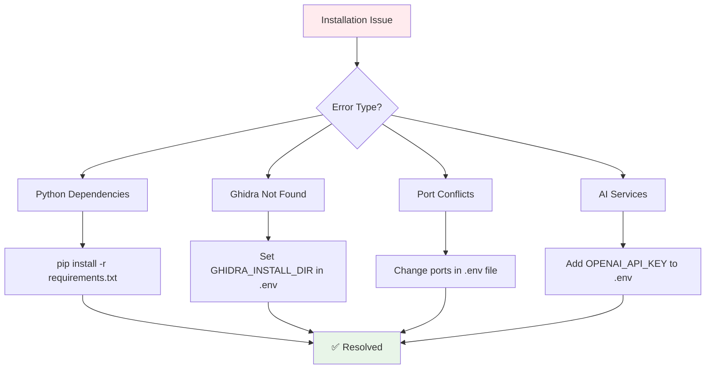

# Installation Guide

## 🔧 Complete ShadowSeek Installation Guide

This guide will walk you through installing ShadowSeek on Windows, Linux, or macOS. With the automated setup script, the entire process typically takes **5-10 minutes**.

---

## 📋 **System Requirements**

### **Hardware Requirements**
- **CPU**: Modern 64-bit processor (x64/ARM64)
- **RAM**: 8GB minimum, 16GB recommended for large binaries
- **Storage**: 10GB free space for installation and analysis data
- **Network**: Internet connection for AI services and dependencies

### **Software Prerequisites**
| Component | Version | Purpose |
|-----------|---------|---------|
| **Python** | 3.8+ | Backend API and analysis scripts |
| **Node.js** | 16.0+ | Frontend React application |
| **Ghidra** | 10.4+ | Binary analysis engine |
| **Java JDK** | 17+ | Required for Ghidra execution |
| **Git** | Any | Repository cloning (optional) |

### **Operating System Support**
- ✅ **Windows**: 10/11 (x64) - Full support with batch scripts
- ✅ **Linux**: Ubuntu 20.04+, CentOS 8+, Debian 11+
- ✅ **macOS**: 11.0+ (Big Sur or newer)

---

## 🚀 **Quick Installation (Recommended)**

### **📥 Method 1: Automated Setup Script**

**This is the easiest and fastest way to get ShadowSeek running:**

```bash
# 1. Download/Clone ShadowSeek
git clone <your-repository-url>
cd ShadowSeek

# 2. Run automated setup (installs everything)
python setup-shadowseek.py --auto

# 3. Start analyzing!
# Frontend: http://localhost:3000
# Backend: http://localhost:5000
```

**What the automated setup does:**
- ✅ **Auto-detects** Ghidra installations
- ✅ **Installs** missing Python dependencies
- ✅ **Installs** official Ghidra Bridge server scripts (enables Python-Ghidra integration)
- ✅ **Creates** .env configuration file
- ✅ **Validates** all connections
- ✅ **Starts** all components automatically

### **🖥️ Method 2: Platform-Specific Quick Start**

#### **Windows** (PowerShell)
```powershell
# Download repository
git clone <repository-url>
cd ShadowSeek

# Option A: Use Python setup script
python setup-shadowseek.py

# Option B: Use Windows batch script
setup_environment.bat
```

#### **Linux** (Ubuntu/Debian)
```bash
# Install system dependencies
sudo apt update
sudo apt install python3 python3-pip nodejs npm default-jdk git

# Download ShadowSeek
git clone <repository-url>
cd ShadowSeek

# Run setup
python3 setup_environment.py --auto
```

#### **macOS** (with Homebrew)
```bash
# Install system dependencies  
brew install python node openjdk git

# Download ShadowSeek
git clone <repository-url>
cd ShadowSeek

# Run setup
python setup-shadowseek.py --auto
```

---

## 🔧 **Manual Installation (Advanced)**

If automated setup doesn't work for your environment:

### **Step 1: Install System Dependencies**

#### **Install Java JDK 17+**
```bash
# Windows (using winget)
winget install Microsoft.OpenJDK.17

# Linux (Ubuntu/Debian)
sudo apt install openjdk-17-jdk

# macOS (using Homebrew)
brew install openjdk@17

# Verify installation
java -version
```

#### **Install Python 3.8+**
```bash
# Windows: Download from https://python.org
# Linux: Usually pre-installed, or:
sudo apt install python3 python3-pip python3-venv

# macOS: Usually pre-installed, or:
brew install python@3.11

# Verify installation
python --version  # or python3 --version
```

#### **Install Node.js 16+**
```bash
# Windows: Download from https://nodejs.org
# Linux:
curl -fsSL https://deb.nodesource.com/setup_18.x | sudo -E bash -
sudo apt-get install -y nodejs

# macOS:
brew install node

# Verify installation
node --version
npm --version
```

### **Step 2: Install Ghidra**

1. **Download Ghidra**:
   - Visit [https://ghidra-sre.org/](https://ghidra-sre.org/)
   - Download latest version (10.4+ recommended)
   - Extract to permanent location:
     - **Windows**: `C:\Tools\ghidra_10.4_PUBLIC`
     - **Linux**: `/opt/ghidra_10.4_PUBLIC`
     - **macOS**: `/Applications/ghidra_10.4_PUBLIC`

2. **Test Ghidra Installation**:
   ```bash
   # Navigate to Ghidra directory
   cd /path/to/ghidra_10.4_PUBLIC
   
   # Test launch (Linux/macOS)
   ./ghidraRun
   
   # Test launch (Windows)
   ghidraRun.bat
   ```

### **Step 3: Set Up ShadowSeek**

```bash
# 1. Download ShadowSeek
git clone <repository-url>
cd ShadowSeek

# 2. Create Python virtual environment
python -m venv venv

# 3. Activate virtual environment
# Windows:
venv\Scripts\activate
# Linux/macOS:
source venv/bin/activate

# 4. Install Python dependencies
pip install -r requirements.txt

# 5. Install frontend dependencies
cd frontend
npm install
cd ..

# 6. Create configuration file
cp .env.backup .env

# 7. Edit .env file with your paths
# Set GHIDRA_INSTALL_DIR to your Ghidra installation path
# Add OpenAI API key for AI features (optional)
```

### **Step 4: Configure Environment**

Edit the `.env` file with your system-specific paths:

```bash
# Required: Ghidra installation path
GHIDRA_INSTALL_DIR=/path/to/ghidra_10.4_PUBLIC

# Optional: Custom directories
GHIDRA_TEMP_DIR=./temp/ghidra_temp
GHIDRA_PROJECTS_DIR=./ghidra_projects
UPLOAD_FOLDER=./uploads

# Optional: AI Services (for AI explanations)
OPENAI_API_KEY=your_openai_api_key_here
OPENAI_MODEL=gpt-4o-mini

# Network configuration
GHIDRA_BRIDGE_PORT=4768
FLASK_PORT=5000
```

### **Step 5: Initialize Database**

```bash
# Initialize the SQLite database
python -c "
from flask_app import create_app
from flask_app.models import db
app = create_app()
with app.app_context():
    db.create_all()
    print('Database initialized successfully')
"
```

---

## ✅ **Launch ShadowSeek**

### **🚀 Method 1: Automatic Startup (Recommended)**
```bash
# Windows
start_all.bat

# Linux/macOS  
chmod +x start_all.sh
./start_all.sh
```

### **🔧 Method 2: Manual Component Startup**
```bash
# Terminal 1: Start Ghidra Bridge
start_ghidra_bridge_new.bat  # Windows
./start_ghidra_bridge_new.sh  # Linux/macOS

# Terminal 2: Start Flask Backend  
python run.py

# Terminal 3: Start React Frontend
cd frontend
npm start
```

### **🌐 Access Points**
- **Frontend Dashboard**: http://localhost:3000
- **Backend API**: http://localhost:5000
- **API Documentation**: http://localhost:5000/api/docs
- **System Status**: http://localhost:5000/api/system/status

---

## 🧪 **Verify Installation**

### **1. System Health Check**
```bash
# Quick validation
python quick_test.py

# Comprehensive testing
python test_configuration.py
```

**Expected Output:**
```
✅ Ghidra installation found
✅ Python dependencies installed
✅ Network ports available
✅ Flask backend running
✅ Ghidra Bridge connected
🎉 Installation successful!
```

### **2. Test Binary Analysis**
1. Open **http://localhost:3000**
2. Navigate to **"Upload"** page
3. Upload a test binary (e.g., `calc.exe`, `/bin/ls`)
4. Watch automatic analysis begin
5. Verify functions are decompiled

### **3. Test AI Features (Optional)**
If you configured an OpenAI API key:
1. Open binary details page
2. Click **"AI Explain All"** button
3. Verify AI explanations appear
4. Test security analysis features

---

## 🔧 **Troubleshooting**

### **Common Issues & Solutions**



### **🐍 Python Issues**
```bash
# Issue: ModuleNotFoundError or UV virtual environment corruption
# Solution 1: Use the reset script (Windows)
reset_environment.bat

# Solution 2: Manual cleanup and pip fallback
python setup-shadowseek.py --force-clean --use-pip --auto

# Solution 3: Manual virtual environment recreation
rm -rf .venv  # Linux/macOS
rmdir /s /q .venv  # Windows
python setup-shadowseek.py --auto

# Issue: UV package manager issues
# Solution: Force use of pip instead
python setup-shadowseek.py --use-pip --auto
```

### **🖥️ Node.js Issues**
```bash
# Issue: npm install failures
# Solution:
npm cache clean --force
rm -rf node_modules package-lock.json
npm install

# Issue: React compilation errors
# Solution:
cd frontend
npm install --legacy-peer-deps
```

### **☕ Java/Ghidra Issues**
```bash
# Issue: "Ghidra not found"
# Solution: Verify GHIDRA_INSTALL_DIR in .env file
echo $GHIDRA_INSTALL_DIR  # Linux/macOS
echo %GHIDRA_INSTALL_DIR%  # Windows

# Issue: "Java not found"
# Solution: Install JDK 17+
java -version
# Should show version 17 or newer
```

### **🌐 Network Issues**
```bash
# Issue: Port already in use
# Solution: Change ports in .env
FLASK_PORT=5001
GHIDRA_BRIDGE_PORT=4769

# Issue: Can't access web interface
# Solution: Check if services are running
curl http://localhost:5000/api/system/status
```

### **🤖 AI Service Issues**
```bash
# Issue: "AI analysis failed"
# Solutions:
1. Add valid OpenAI API key to .env
2. Check API quota/billing
3. Test connection: http://localhost:3000/config
```

---

## 🎯 **What's Next?**

After successful installation:

1. **[⚡ Quick Start Tutorial](quick-start.md)** - Analyze your first binary
2. **[📊 Dashboard Guide](../user-guide/dashboard.md)** - Learn the interface
3. **[🛡️ Security Analysis](../security-features/vulnerability-detection.md)** - Find vulnerabilities
4. **[🎯 Fuzzing Guide](../security-features/fuzzing.md)** - Generate harnesses
5. **[🔧 Configuration](../user-guide/configuration.md)** - Customize settings

---

## 💡 **Pro Tips**

### **🚀 For Best Performance**
- **SSD Storage**: Use SSD for faster binary analysis
- **More RAM**: 16GB+ for large binary analysis
- **Fast CPU**: Multi-core processors improve analysis speed

### **🔐 For Security Teams**
- **Dedicated VM**: Run on isolated virtual machine
- **Network Isolation**: Use private network for sensitive analysis
- **API Keys**: Use dedicated OpenAI API keys with usage limits

### **🏢 For Enterprise**
- **Reverse Proxy**: Use nginx/Apache for production deployment
- **Database**: Consider PostgreSQL for multi-user scenarios  
- **Monitoring**: Set up log monitoring and alerting
- **Backup**: Regular backup of analysis database

---

**🎉 Installation Complete!** You're ready to start analyzing binaries with ShadowSeek's AI-powered security analysis platform.

---

*Need help? Check the [troubleshooting guide](../administration/troubleshooting.md) or [system management docs](../administration/system-management.md).* 