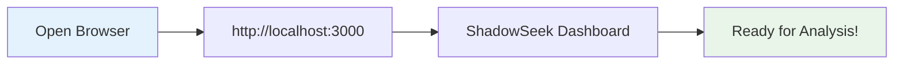
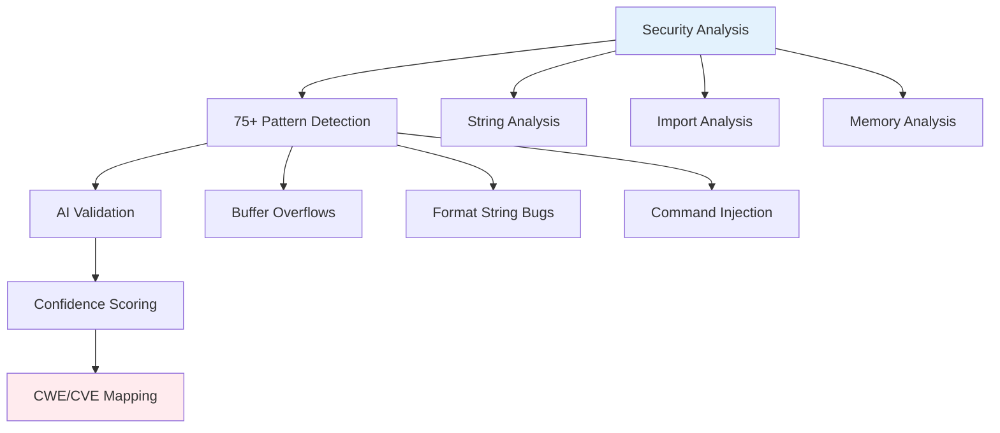
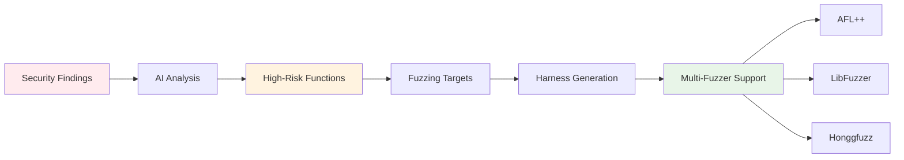
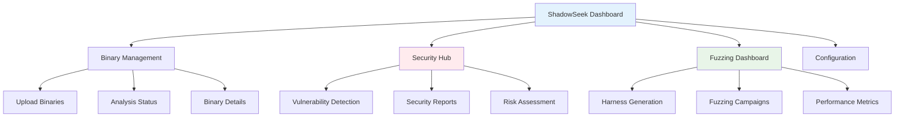
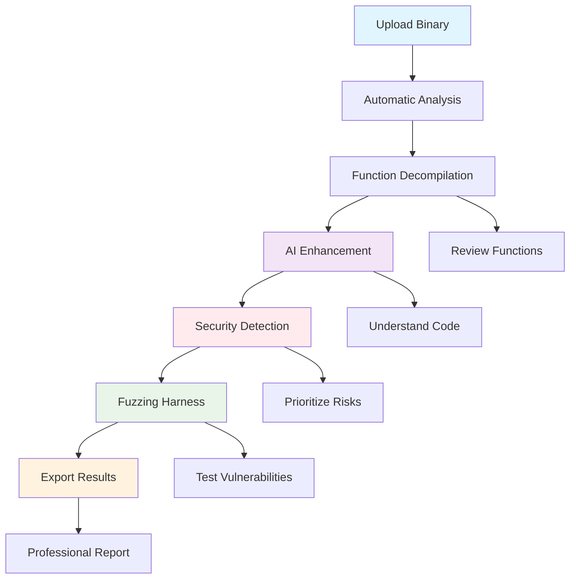

# Quick Start Guide

## 🚀 Get Started with ShadowSeek in 5 Minutes

Welcome to ShadowSeek! This guide will get you from zero to analyzing binaries with AI-powered security insights in just a few minutes.

---

## ✅ **Prerequisites Check**

Ensure you have ShadowSeek installed:

- ✅ **Installation Complete**: Follow the [Installation Guide](installation.md) if needed
- ✅ **System Running**: All components started via `start_all.bat` or `setup-shadowseek.py --auto`
- ✅ **Web Access**: Can access http://localhost:3000

**Not installed yet?** Run: `python setup-shadowseek.py --auto`

---

## 🎯 **Your First Binary Analysis (5 Minutes)**

### **Step 1: Access ShadowSeek (30 seconds)**



1. **Open your web browser**
2. **Navigate to**: `http://localhost:3000`
3. **Verify**: You see the ShadowSeek dashboard

### **Step 2: Upload Your First Binary (1 minute)**

1. **Click "Upload"** in the navigation bar
2. **Choose a test binary**:
   - **Windows**: `calc.exe`, `notepad.exe`, or any `.exe` file
   - **Linux**: `/bin/ls`, `/usr/bin/cat`, or any executable
   - **macOS**: `/bin/ls`, `/usr/bin/grep`, or any binary

3. **Drag and drop** the file or click to browse
4. **Watch automatic analysis begin** immediately

**Expected Timeline:**
- **Upload**: Instant
- **Initial Analysis**: 30-60 seconds  
- **Function Decompilation**: 2-3 minutes
- **Full Analysis**: 3-5 minutes total

### **Step 3: Monitor Analysis Progress (2 minutes)**

1. **Dashboard View**: Watch real-time progress updates
2. **Analysis Stages**:
   - ✅ **Binary Upload** - File received and validated
   - ✅ **Ghidra Analysis** - Function extraction and decompilation  
   - ✅ **Data Extraction** - Strings, symbols, imports/exports
   - ✅ **Analysis Complete** - Ready for AI enhancement

**Progress Indicators:**
```
🔄 Analyzing binary...
📊 Extracting functions (45/67 complete)
🎯 Decompiling functions (23/45 complete)  
✅ Analysis complete! 67 functions found
```

### **Step 4: Explore Your Results (1 minute)**

1. **Click your binary name** in the dashboard
2. **Navigate through tabs**:
   - **Functions**: See all decompiled functions
   - **Strings**: Discovered text strings
   - **Symbols**: Function and variable names
   - **Imports/Exports**: Library dependencies

### **Step 5: Try AI Analysis (1 minute)**

1. **Go to Functions tab**
2. **Click "AI Explain All"** button  
3. **Watch AI generate explanations** for each function
4. **Review results**: Plain English explanations of what each function does

**AI Analysis Example:**
```
Function: validateUserInput
AI Explanation: This function validates user input for a login 
form. It checks password length and complexity but contains 
a buffer overflow vulnerability when processing usernames 
longer than 64 characters. Risk Score: 85/100
```

---

## 🛡️ **Your First Security Analysis (3 Minutes)**

### **Step 1: Access Security Features**

1. **Click "Security Hub"** in the navigation
2. **Select your analyzed binary**
3. **Click "Analyze Security"** button

### **Step 2: Review Security Findings**



**Typical Security Findings:**
- **🔴 High Risk**: Buffer overflows, format string vulnerabilities
- **🟡 Medium Risk**: Weak cryptography, information disclosure  
- **🟢 Low Risk**: Minor security practices, hardening opportunities

### **Step 3: Understand the Results**

**Sample Security Report:**
```json
{
  "vulnerability": "Buffer Overflow in processCommand()",
  "risk_score": 92,
  "confidence": 94.2,
  "cwe": "CWE-120",
  "evidence": "strcpy() used without bounds checking",
  "ai_explanation": "Function copies user input to fixed buffer 
                     without length validation, enabling stack 
                     buffer overflow attacks."
}
```

---

## 🎯 **Generate Your First Fuzzing Harness (2 Minutes)**

### **Step 1: Access Fuzzing Dashboard**

1. **Click "Fuzzing"** in navigation
2. **Select your binary**
3. **Click "Generate Harness"**

### **Step 2: Review Fuzzing Setup**

**AI Target Selection Process:**


**Generated Harness Example:**
```c
// Auto-generated fuzzing harness for processCommand()
#include "target_binary.h"

int LLVMFuzzerTestOneInput(const uint8_t *data, size_t size) {
    if (size < 4 || size > 1024) return 0;
    
    // Target the vulnerable processCommand function
    char buffer[1024];
    memcpy(buffer, data, size);
    buffer[size] = '\0';
    
    processCommand(buffer);
    return 0;
}
```

### **Step 3: Export and Use**

1. **Download harness** files (C code + Makefile)
2. **Copy to your fuzzing environment**
3. **Compile and run** with your preferred fuzzer

---

## 📊 **Understanding Your Dashboard**

### **Main Dashboard Overview**



### **Key Interface Elements**

| Section | Purpose | Key Features |
|---------|---------|--------------|
| **📊 Dashboard** | Binary management and overview | Upload, status, analysis progress |
| **🛡️ Security Hub** | Vulnerability detection and analysis | 75+ patterns, AI validation, CWE mapping |
| **🎯 Fuzzing** | Harness generation and campaigns | Multi-fuzzer support, AI targeting |
| **⚙️ Configuration** | System settings and AI providers | API keys, Ghidra paths, preferences |

---

## 🔧 **Configure AI Services (Optional)**

### **Step 1: Get OpenAI API Key**

1. **Visit**: https://platform.openai.com/api-keys
2. **Create account** and billing setup
3. **Generate API key** (starts with `sk-...`)

### **Step 2: Configure in ShadowSeek**

1. **Click "Configuration"** in navigation
2. **Enter API key** in OpenAI section
3. **Select model**: `gpt-4o-mini` (recommended for cost/performance)
4. **Save configuration**

### **Step 3: Test AI Connection**

1. **Click "Test Connection"** button
2. **Verify**: ✅ "Connection successful!"
3. **Return to analysis** - AI features now available

---

## 🎯 **Complete Analysis Workflow**

### **Professional Binary Analysis Process**



**Typical Timeline for Complete Analysis:**
- **Small Binary** (100 functions): 5-10 minutes
- **Medium Binary** (500 functions): 15-30 minutes  
- **Large Binary** (1000+ functions): 30-60 minutes

---

## 💡 **Pro Tips for New Users**

### **🚀 Maximize Analysis Speed**
- **Start with smaller binaries** (< 50MB) for faster results
- **Use AI selectively** - run "AI Explain All" on high-risk functions first
- **Batch upload** multiple binaries for parallel analysis

### **🎯 Focus on High-Value Targets**
- **Prioritize network-facing binaries** for security analysis
- **Target user input functions** for vulnerability hunting
- **Focus on authentication/authorization functions** for critical analysis

### **🛡️ Security Analysis Best Practices**
- **Review high-confidence findings first** (90%+ confidence)
- **Validate AI explanations** with manual code review  
- **Use fuzzing harnesses** to confirm exploitability
- **Export professional reports** for stakeholder communication

---

## 🔍 **What's Next?**

### **📚 Explore Advanced Features**
1. **[Dashboard Guide](../user-guide/dashboard.md)** - Complete interface overview
2. **[Security Analysis Deep Dive](../security-features/vulnerability-detection.md)** - Advanced vulnerability hunting
3. **[Fuzzing Campaigns](../security-features/fuzzing.md)** - Comprehensive fuzzing guide
4. **[API Integration](../api-reference/rest-api.md)** - Automate your workflow

### **🎯 Real-World Applications**
- **Malware Analysis**: Understand suspicious binaries quickly
- **Penetration Testing**: Find vulnerabilities in target applications
- **Code Review**: AI-assisted security analysis of compiled code
- **Vulnerability Research**: Discover new security issues

### **🏢 Enterprise Integration**
- **CI/CD Pipeline**: Integrate security analysis into build processes
- **Security Operations**: Automate threat analysis workflows
- **Compliance**: Generate security reports for auditing
- **Team Training**: Use AI explanations to educate junior analysts

---

## 🎉 **Congratulations!**

You've successfully completed your first ShadowSeek analysis! You now have:

✅ **Uploaded and analyzed** a binary file  
✅ **Generated AI explanations** for code functionality  
✅ **Detected security vulnerabilities** with confidence scoring  
✅ **Created fuzzing harnesses** for vulnerability testing  
✅ **Explored the professional interface** and key features

**🚀 Ready to analyze more complex binaries?** Try uploading larger executables, DLLs, or suspicious files to see ShadowSeek's full power in action.

---

## 🆘 **Need Help?**

- **📧 Quick Issues**: Check [troubleshooting guide](../administration/troubleshooting.md)
- **📖 Detailed Guides**: Browse [complete documentation](../README.md)
- **🔧 System Issues**: Run `python quick_test.py` for diagnostics
- **🤖 AI Problems**: Verify API key in Configuration page

**Happy hunting! 🕵️‍♀️🔍**

---

*ShadowSeek Quick Start Guide - Get from zero to expert in minutes, not hours.* 