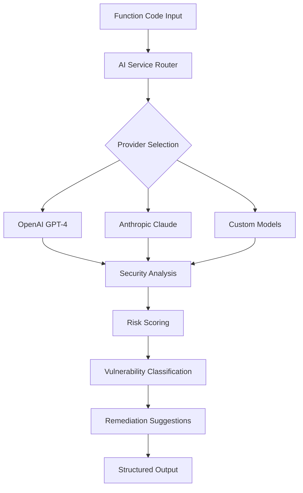
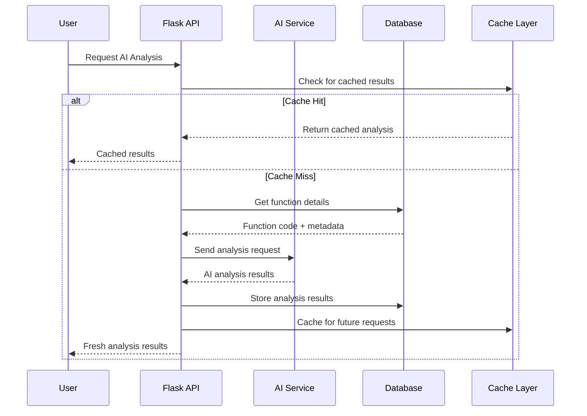

# AI-Powered Analysis

## 🧠 Intelligent Binary Security Analysis

ShadowSeek integrates cutting-edge AI technology to transform complex binary analysis into accessible, actionable security insights. Our AI-enhanced approach combines Large Language Models (LLMs) with expert-crafted security prompts to provide comprehensive function-level analysis.

---

## 🎯 **AI Analysis Overview**

### **Multi-Provider Architecture**
ShadowSeek supports multiple AI providers for flexibility and reliability:



### **Supported AI Providers**

#### **OpenAI GPT-4 (Recommended)**
- **Model**: `gpt-4` or `gpt-4-turbo`
- **Strengths**: Excellent code understanding and security analysis
- **Best For**: Production environments requiring high accuracy
- **Context Window**: 8,192+ tokens
- **Response Time**: 1-3 seconds typical

#### **Anthropic Claude**
- **Model**: `claude-3-sonnet` or `claude-3-opus`
- **Strengths**: Strong reasoning and detailed explanations
- **Best For**: Complex vulnerability analysis and detailed reports
- **Context Window**: 100,000+ tokens
- **Response Time**: 2-4 seconds typical

#### **Custom Models**
- **Local Models**: Support for local LLM deployment
- **Enterprise Models**: Integration with enterprise AI services
- **Specialized Models**: Custom security-focused models
- **Offline Support**: Air-gapped environment compatibility

---

## 🔍 **Security-Enhanced Analysis**

### **Specialized Security Prompts**
ShadowSeek uses carefully crafted prompts optimized for vulnerability detection:

```python
SECURITY_ANALYSIS_PROMPT = """
You are a cybersecurity expert analyzing decompiled C code for security vulnerabilities.

CRITICAL ANALYSIS REQUIREMENTS:
1. Focus specifically on exploitable security vulnerabilities
2. Provide concrete evidence for each finding
3. Assess real-world exploitability
4. Consider attack vectors and impact

Function Details:
- Name: {function_name}
- Address: {function_address}
- Binary: {binary_name}
- Size: {function_size} bytes

Decompiled Code:
```c
{decompiled_code}
```

ANALYZE FOR THESE VULNERABILITY CATEGORIES:

🔴 CRITICAL ISSUES:
- Buffer overflows (strcpy, strcat, sprintf, gets, memcpy without bounds)
- Format string vulnerabilities (printf family with user input)
- SQL injection (dynamic query construction)
- Command injection (system, exec calls with user input)
- Use-after-free and double-free conditions

🟡 HIGH-RISK ISSUES:
- Integer overflow/underflow leading to buffer issues
- Time-of-check-time-of-use (TOCTOU) race conditions
- Insecure cryptographic implementations
- Path traversal vulnerabilities
- Improper input validation

🟢 MEDIUM-RISK ISSUES:
- Information disclosure through error messages
- Weak random number generation
- Missing bounds checking on arrays
- Improper error handling
- Resource exhaustion vulnerabilities

RESPONSE FORMAT (JSON):
{
  "summary": "Concise security assessment in 1-2 sentences",
  "risk_score": <0-100 integer based on exploitability and impact>,
  "vulnerabilities": [
    {
      "type": "vulnerability_category",
      "severity": "CRITICAL|HIGH|MEDIUM|LOW",
      "description": "Specific vulnerability description",
      "evidence": "Code snippet or pattern that demonstrates the issue",
      "exploitability": "HIGH|MEDIUM|LOW",
      "impact": "Detailed impact description",
      "cwe_id": "CWE-XXX if applicable"
    }
  ],
  "secure_patterns": ["List any good security practices observed"],
  "recommendations": [
    "Specific remediation steps in order of priority"
  ],
  "confidence": <0-100 integer indicating analysis confidence>,
  "false_positive_risk": "LOW|MEDIUM|HIGH - likelihood this is a false positive"
}
"""
```

### **Context-Aware Analysis**
The AI system considers multiple factors for comprehensive analysis:

#### **Function Context**
- **Purpose**: Main entry points, utility functions, input handlers
- **Call Graph**: Caller-callee relationships and data flow
- **Parameters**: Input validation and sanitization patterns
- **Return Values**: Error handling and output validation

#### **Binary Context**
- **Architecture**: x86, x64, ARM-specific vulnerability patterns
- **Compilation**: Debug symbols, optimization level, security mitigations
- **Libraries**: Linked libraries and their security implications
- **File Type**: Executable, library, driver-specific risks

#### **Security Context**
- **Attack Surface**: Network-facing, local privilege escalation
- **Data Sensitivity**: User data, credentials, system information
- **Execution Context**: User mode, kernel mode, service context
- **Trust Boundaries**: Input validation at security boundaries

---

## 📊 **Risk Scoring Algorithm**

### **Multi-Factor Risk Assessment**
ShadowSeek's AI generates risk scores based on comprehensive analysis:

```python
def calculate_ai_risk_score(analysis_result):
    """Calculate comprehensive risk score from AI analysis"""
    base_score = analysis_result.get('risk_score', 0)
    
    # Vulnerability severity multipliers
    severity_weights = {
        'CRITICAL': 1.0,
        'HIGH': 0.8,
        'MEDIUM': 0.6,
        'LOW': 0.4
    }
    
    # Exploitability factors
    exploitability_weights = {
        'HIGH': 1.0,    # Remote, no auth required
        'MEDIUM': 0.7,  # Local or auth required
        'LOW': 0.4      # Complex exploitation
    }
    
    # Confidence adjustments
    confidence = analysis_result.get('confidence', 50) / 100.0
    confidence_multiplier = 0.5 + (confidence * 0.5)  # Range: 0.5-1.0
    
    # Calculate weighted score
    vulnerabilities = analysis_result.get('vulnerabilities', [])
    if vulnerabilities:
        max_severity = max(vuln.get('severity', 'LOW') for vuln in vulnerabilities)
        max_exploitability = max(vuln.get('exploitability', 'LOW') for vuln in vulnerabilities)
        
        severity_factor = severity_weights.get(max_severity, 0.4)
        exploit_factor = exploitability_weights.get(max_exploitability, 0.4)
        
        adjusted_score = base_score * severity_factor * exploit_factor * confidence_multiplier
    else:
        # No vulnerabilities found
        adjusted_score = base_score * confidence_multiplier * 0.2
    
    return min(100.0, max(0.0, adjusted_score))
```

### **Risk Score Interpretation**
- **90-100**: Critical immediate attention required
- **70-89**: High risk, should be addressed promptly
- **50-69**: Medium risk, include in next security review
- **30-49**: Low risk, monitor for changes
- **0-29**: Minimal risk, likely secure implementation

---

## 🛡️ **Vulnerability Detection Capabilities**

### **Buffer Overflow Detection**
Advanced pattern recognition for memory safety issues:

```python
# AI prompt for buffer overflow analysis
BUFFER_OVERFLOW_ANALYSIS = """
Analyze this function specifically for buffer overflow vulnerabilities:

DANGEROUS PATTERNS TO DETECT:
1. strcpy(dest, src) - No bounds checking
2. strcat(dest, src) - Destination buffer may be too small
3. sprintf(buf, fmt, ...) - Format string length unknown
4. gets(buf) - No size limit specified
5. memcpy(dest, src, n) - Size 'n' may exceed buffer

SAFE PATTERNS TO RECOGNIZE:
1. strncpy(dest, src, sizeof(dest)-1)
2. strncat(dest, src, sizeof(dest)-strlen(dest)-1)
3. snprintf(buf, sizeof(buf), fmt, ...)
4. fgets(buf, sizeof(buf), stdin)
5. memcpy with proper bounds checking

For each potentially dangerous call:
- Identify the buffer being written to
- Determine if buffer size is validated
- Assess if input size is controlled
- Calculate overflow potential
"""
```

**Example AI Analysis Output:**
```json
{
  "summary": "Function contains buffer overflow via strcpy without bounds checking",
  "risk_score": 92,
  "vulnerabilities": [
    {
      "type": "buffer_overflow",
      "severity": "CRITICAL",
      "description": "strcpy copies user input to fixed-size buffer without length validation",
      "evidence": "strcpy(buffer, user_input) at line 15",
      "exploitability": "HIGH",
      "impact": "Arbitrary code execution, system compromise",
      "cwe_id": "CWE-120"
    }
  ],
  "recommendations": [
    "Replace strcpy with strncpy and validate input length",
    "Implement bounds checking before copy operations",
    "Consider using safer string handling libraries"
  ],
  "confidence": 95
}
```

### **Format String Vulnerability Detection**
Specialized analysis for printf-family vulnerabilities:

```python
FORMAT_STRING_ANALYSIS = """
Examine this function for format string vulnerabilities:

VULNERABLE PATTERNS:
1. printf(user_input) - Direct user input as format string
2. sprintf(buf, user_controlled_format, ...)
3. fprintf(file, untrusted_format, ...)
4. snprintf with user-controlled format parameter

ATTACK VECTORS:
- %x%x%x - Memory disclosure through stack reading
- %n - Write arbitrary values to memory addresses
- %*%* - Consume arbitrary stack arguments
- Long format specifiers causing buffer overflow

SAFE PATTERNS:
- printf("%s", user_input) - User input as argument, not format
- printf(CONSTANT_FORMAT, user_input)
- Format strings from trusted sources only
"""
```

### **Input Validation Analysis**
Comprehensive input validation assessment:

```python
INPUT_VALIDATION_ANALYSIS = """
Analyze input validation and sanitization in this function:

INPUT SOURCES TO IDENTIFY:
- Function parameters from external callers
- File input (fgets, fread, etc.)
- Network input (recv, recvfrom, etc.)
- Environment variables
- Command line arguments
- Registry/configuration values

VALIDATION PATTERNS TO ASSESS:
- Length/size validation before processing
- Character filtering and sanitization
- Range checking for numeric inputs
- Format validation (regex, parsing)
- Encoding validation (UTF-8, ASCII)
- Null byte injection prevention

DANGEROUS PATTERNS:
- Direct use of input without validation
- Integer conversion without range checking
- String operations without length verification
- File path construction with user input
- SQL query construction with concatenation
"""
```

---

## 🔄 **Analysis Workflow**

### **Function-Level Analysis Process**


### **Batch Analysis Optimization**
For analyzing multiple functions efficiently:

```python
class BulkAIAnalyzer:
    def __init__(self, ai_service):
        self.ai_service = ai_service
        self.batch_size = 5  # Process 5 functions per batch
        
    def analyze_all_functions(self, binary_id):
        """Efficiently analyze all functions in a binary"""
        functions = Function.query.filter_by(
            binary_id=binary_id,
            decompiled=True,
            ai_analyzed=False
        ).all()
        
        # Process in batches to avoid rate limits
        for i in range(0, len(functions), self.batch_size):
            batch = functions[i:i + self.batch_size]
            
            # Parallel processing within batch
            with ThreadPoolExecutor(max_workers=3) as executor:
                futures = []
                for function in batch:
                    future = executor.submit(self.analyze_single_function, function)
                    futures.append(future)
                
                # Wait for batch completion
                for future in as_completed(futures):
                    try:
                        result = future.result(timeout=30)
                        logger.info(f"Completed analysis: {result}")
                    except Exception as e:
                        logger.error(f"Analysis failed: {e}")
            
            # Rate limiting between batches
            time.sleep(2)
```

---

## 📈 **Performance Optimization**

### **Caching Strategy**
Intelligent caching reduces AI API costs and improves response times:

```python
class AIAnalysisCache:
    def __init__(self):
        self.redis_client = redis.Redis(host='localhost', port=6379, db=0)
        self.cache_ttl = 86400  # 24 hours
        
    def get_cached_analysis(self, function_id, code_hash):
        """Retrieve cached AI analysis if available"""
        cache_key = f"ai_analysis:{function_id}:{code_hash}"
        cached_result = self.redis_client.get(cache_key)
        
        if cached_result:
            return json.loads(cached_result)
        return None
    
    def cache_analysis(self, function_id, code_hash, analysis_result):
        """Cache AI analysis result"""
        cache_key = f"ai_analysis:{function_id}:{code_hash}"
        serialized_result = json.dumps(analysis_result)
        self.redis_client.setex(cache_key, self.cache_ttl, serialized_result)
```

### **Cost Optimization**
Strategies to minimize AI API costs:

1. **Smart Caching**: Cache results based on function code hash
2. **Batch Processing**: Group similar functions for bulk analysis
3. **Selective Analysis**: Prioritize high-risk functions first
4. **Model Selection**: Use appropriate model size for complexity
5. **Prompt Optimization**: Minimize token usage while maintaining quality

---

## 🎯 **Advanced Features**

### **Contextual Analysis**
Enhanced analysis using binary context:

```python
def get_enhanced_context(function, binary):
    """Generate rich context for improved AI analysis"""
    context = {
        'function_metadata': {
            'name': function.name,
            'address': function.address,
            'size': function.size,
            'call_count': len(function.callers),
            'is_exported': function.is_exported
        },
        'binary_context': {
            'filename': binary.original_filename,
            'file_type': binary.mime_type,
            'architecture': binary.architecture,
            'compiler': binary.compiler_info,
            'security_mitigations': binary.security_features
        },
        'call_graph': {
            'callers': [caller.name for caller in function.callers[:5]],
            'callees': [callee.name for callee in function.callees[:5]],
            'depth': function.call_graph_depth
        },
        'data_flow': {
            'parameters': function.parameters,
            'local_variables': function.local_variables,
            'global_references': function.global_references
        }
    }
    return context
```

### **Multi-Language Support**
Analysis capabilities for different code representations:

- **C/C++ Decompilation**: Primary focus with specialized prompts
- **Assembly Analysis**: Raw disassembly when decompilation fails
- **Pseudo-code**: Ghidra's high-level representations
- **Mixed Languages**: Functions calling external libraries

### **Confidence Calibration**
Advanced confidence scoring based on analysis quality:

```python
def calibrate_confidence(ai_result, function_complexity):
    """Adjust AI confidence based on function characteristics"""
    base_confidence = ai_result.get('confidence', 50)
    
    # Complexity adjustments
    complexity_factors = {
        'very_simple': 1.1,    # Higher confidence for simple functions
        'simple': 1.05,
        'moderate': 1.0,
        'complex': 0.9,        # Lower confidence for complex functions
        'very_complex': 0.8
    }
    
    # Code quality factors
    quality_factors = {
        'high_quality_decompilation': 1.1,
        'medium_quality_decompilation': 1.0,
        'low_quality_decompilation': 0.8,
        'assembly_only': 0.6
    }
    
    complexity_factor = complexity_factors.get(function_complexity, 1.0)
    quality_factor = quality_factors.get(function.decompilation_quality, 1.0)
    
    calibrated_confidence = base_confidence * complexity_factor * quality_factor
    return min(100, max(0, calibrated_confidence))
```

---

## 🔬 **Quality Assurance**

### **Analysis Validation**
Multi-layer validation ensures analysis quality:

1. **Syntax Validation**: Ensure JSON response format compliance
2. **Semantic Validation**: Verify vulnerability classifications are appropriate
3. **Consistency Checks**: Compare with pattern-based detection results
4. **Confidence Bounds**: Validate confidence scores are reasonable
5. **Evidence Verification**: Ensure evidence supports conclusions

### **False Positive Reduction**
Strategies to minimize false positive findings:

```python
def validate_vulnerability_finding(finding, function_code):
    """Validate AI-detected vulnerability to reduce false positives"""
    
    # Check for common false positive patterns
    false_positive_indicators = [
        'bounds_check_present',      # Bounds checking detected
        'constant_size_input',       # Input size is constant
        'validated_input_source',    # Input comes from trusted source
        'error_handling_present',    # Proper error handling
        'size_validation_present'    # Size validation before operations
    ]
    
    # Pattern-based validation
    for indicator in false_positive_indicators:
        if detect_pattern(function_code, indicator):
            finding['false_positive_risk'] = 'HIGH'
            finding['validation_notes'] = f'Detected {indicator}'
            break
    
    # Cross-reference with static analysis
    static_findings = run_static_analysis(function_code)
    if not any(sf.matches(finding) for sf in static_findings):
        finding['false_positive_risk'] = 'MEDIUM'
        finding['validation_notes'] = 'No static analysis confirmation'
    
    return finding
```

---

## 📊 **Analytics and Insights**

### **Analysis Metrics**
Track AI analysis effectiveness:

```python
class AIAnalyticsTracker:
    def track_analysis_metrics(self, function_id, analysis_result):
        """Track key metrics for AI analysis performance"""
        metrics = {
            'analysis_time': analysis_result.get('processing_time'),
            'token_usage': analysis_result.get('token_count'),
            'api_cost': analysis_result.get('estimated_cost'),
            'confidence_score': analysis_result.get('confidence'),
            'vulnerabilities_found': len(analysis_result.get('vulnerabilities', [])),
            'false_positive_feedback': None  # Updated by user feedback
        }
        
        # Store metrics for analysis
        self.store_metrics(function_id, metrics)
```

### **Continuous Improvement**
Learn from analysis results to improve future performance:

- **Feedback Loop**: Incorporate user corrections to improve prompts
- **Pattern Learning**: Identify common false positive patterns
- **Model Selection**: Choose optimal models based on function types
- **Prompt Evolution**: Refine prompts based on analysis quality

---

ShadowSeek's AI-powered analysis represents the cutting edge of automated security assessment, combining the power of large language models with expert security knowledge to provide unprecedented insight into binary vulnerabilities. 